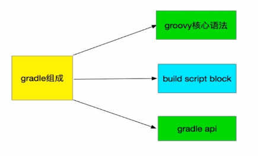
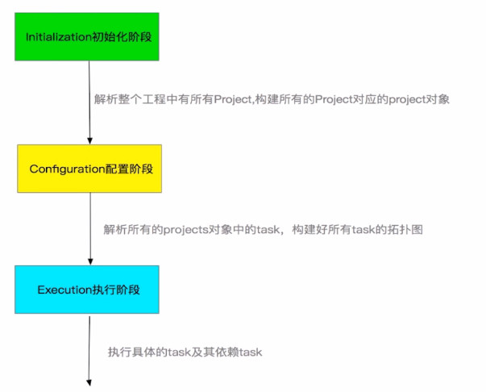
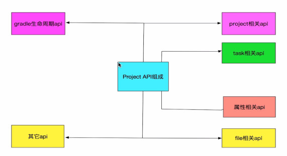
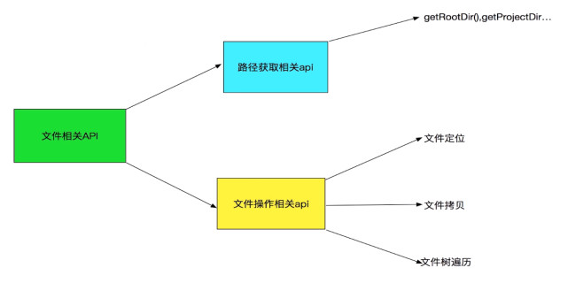
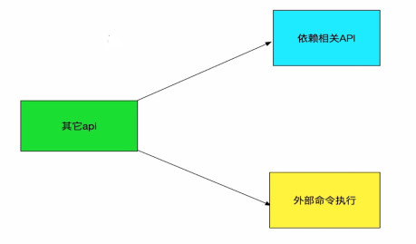
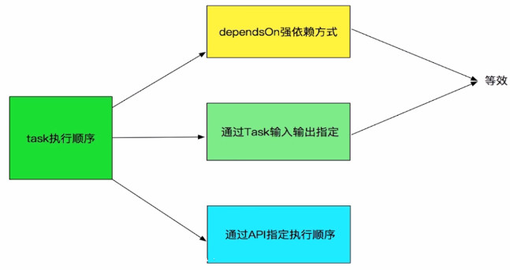
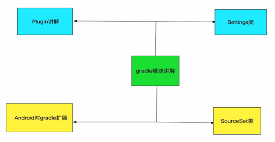
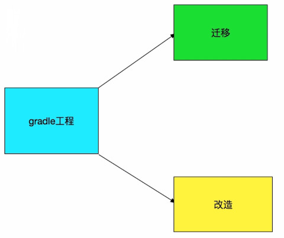
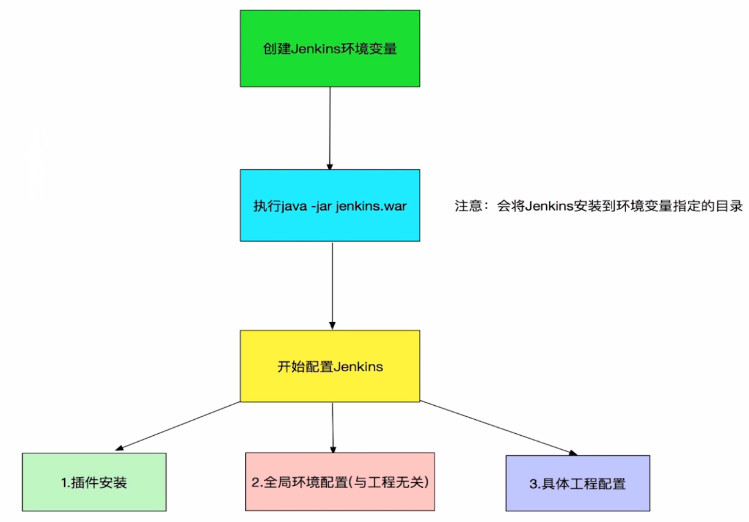

# Gradle

- gradle 组成



- gradle 执行流程（生命周期）
	- 生成阶段
	- 配置阶段
	- 执行阶段




## Project

#### 组成部分



#### project api 的例子

```
/**
 * 配置阶段开始前的回调
 */
this.beforeEvaluate {
    println '配置阶段执行前监听……'
}

/**
 * 配置阶段完成以后的回调
 */
this.afterEvaluate {
    println '配置阶段执行完毕……'
}

/**
 * gradle执行完毕后的回调监听
 */
this.gradle.buildFinished {
    println '执行阶段执行完毕……'
}

/**
 * 获取所有project
 */
this.getProjects()

def getProjects(){
    println '------------------'
    println 'Root Project'
    println '------------------'

    this.getAllprojects().eachWithIndex{ Project project, int index ->
        if (index == 0){
            println "Root project : '${project.name}'"
        }else{
            println "+--- project : '${project.name}'"
        }
    }
}

/**
 * 根 project 管理其它子 project
 */
project('app'){Project project ->
    apply plugin 'com.android.application'
    group 'com.javaxuexi'
    dependencies {

    }
}

/**
 * 配置当前节点工程和其subproject的所有project
 */
allprojects {
    group 'com.imooc'
    version '1.1.0-release'
}

/**
 * 配置当前节点下的所有subproject的所有project
 */
subprojects { Project project ->
    if (project.plugins.hasPlugin('com.android.library')){
        group 'com.taobao'
    }
}
```

---

#### 属性 api

```
// 定义扩展属性
ext {
    sdkVersion = 25
    group = 'com.tiamao'
}

// 定义扩展属性2
//gradle.properties 文件中定义
group=com.jd
isLoadTest=true
```

#### 文件相关 API



```
/**
 * 获取根工程文件夹路径
 */
println getRootDir().absolutePath
println getBuildDir().absolutePath
println getProjectDir().absolutePath

/**
 * file 相对于当前的project工程开始查找
 * files 多个文件
 * @param path
 * @return
 */
println getContent("ss.gradle")

def getContent(String path) {
    try {
        def file = file(path)
        return file.text
    } catch (GradleException e) {
        println 'file not found...'
    }
    return null
}

//
copy {
    // 来源
    from file('build/outputs/apk/')
    // 复制到哪
    into getRootProject().getBuildDir().path + '/apk/'
    // 排除哪些为念
    exclude {}
    // 对文件重命名
    rename {}
}

// 对文件树进行遍历
fileTree('build/outputs/apk/') { FileTree fileTree ->
    fileTree.visit { FileTreeElement element ->
        println 'the file name is: ' + element.file.name
        copy {
            from element.file
            into getRootProject().getBuildDir().path + '/apk/'
        }
    }
}
```

#### 其它API



- 依赖相关 api

```
buildscript { ScriptHandler scriptHandler ->

    // 配置工程的仓库地址
    scriptHandler.repositories { RepositoryHandler repositoryHandler ->
        repositoryHandler.jcenter()
        repositoryHandler.mavenLocal()
        repositoryHandler.mavenCentral()
        repositoryHandler.maven {
            name 'personal'
            url 'http://localhostL80801/nexus/repositories/'
            credentials {
                username = 'admin'
                password = 'admin123'
            }
        }
    }

    // 配置工程的"插件"依赖地址
    dependencies {
        classpath 'com.android.tools.build:gradle:2.2.2'
        classpath 'com.tencent.tinker-patch-gradle'
    }
}

// 为应用程序添加第三方库依赖
dependencies {
    compile rootProject.ext.dependence.libSupportV7
    // 依赖 library 工程
    compile project(rootProject.ext.dependence.libPullAlive)

    // 排除依赖
    compile(rootProject.ext.dependence.libPullAlive) {
        // 方式一
        exclude module: 'support-v4'
        // 方式二
        exclude group: 'com.anroid.support'

        // 传递依赖 false 禁止传递依赖
        transitive false

    }
    // 不会参与打包
    provided(rootProject.ext.dependence.libPullAlive) { changing = true }
}
```

---

- 外部命令 api

终端中执行 `gradlew apkcopy`
```
task(name: 'apkcopy') {
    doLast {
        // gradle 的执行阶段执行
        def sourcePath = this.buildDir.path + '/outputs/apk'
        def desationPath = '/Users/C/Downloads/'
        def command = "mv -f ${sourcePath} ${desationPath}"

        exec {
            try {
                executable 'bash'
                args '-C', command
                println 'the command is execute success.'
            } catch (GradleException e) {
                println 'the command is execute failed.'
            }
        }
    }
}
```

---

## Task

#### Task 定义及配置

```
// 定义一个 task
task taskName {
	println 'i am helloTask.'
}

task(helloTask,{
    println 'i am helloTask'
})

task(helloTask(group: 'imooc', description: 'task study'),{
    println 'i am helloTask'
})

// 执行
gradlew helloTask
```

```
// 通过 TaskContainer 容器创建 task
this.tasks.create(name: 'helloTask2') {
    println 'i am helloTask2'
}

this.tasks.create(name: 'helloTask2') {
    setGroup('imooc')
    setDescription('task study')
    println 'i am helloTask2'
}
```

#### Task 执行详解

```
task helloTask(group: 'imooc', description: 'task study'){
    println 'i am helloTask'
    // 要在 执行阶段 执行的代码
    doFirst {
        println 'the task grou is: ' + group
    }

    doFirst {}
}

// 外部引用时先执行外部引用的 doFirst
helloTask.doFirst {
    println 'the task description is: ' + description
}

// 创建 task 方式二
this.tasks.create(name: 'helloTask2') {
    setGroup('imooc')
    setDescription('task study')
    println 'i am helloTask2'
}

// 计算 build 执行时长
def startBuildTime, endBuildTime

// 配置阶段完成以后的回调
this.afterEvaluate { Project project ->
    // 保证要找的 task 已经配置完毕
    // 寻找最先执行的 task 'preBuild'
    def preBuildTask = project.tasks.getByName('taskName')
    preBuildTask.doFirst {
        startBuildTime = System.currentTimeMillis()
        println 'the start time is: ' + startBuildTime
    }

    def buildTask = project.tasks.getByName('build')
    buildTask.doLast {
        endBuildTime = System.currentTimeMillis()
        println "the build time is : " +  endBuildTime
    }
}
```

#### Task 的依赖和执行顺序



```
/**
 * task 依赖讲解
 */
task taskX {
    doLast {
        println 'taskX'
    }
}

task taskY {
    doLast {
        println 'taskY'
    }
}

task taskZ(dependsOn: [taskX,taskY]) {
    doLast {
        println 'taskZ'
    }
}

// 依赖方式二
taskZ.dependsOn(taskX, taskY)
```

---

```
/**
 * task 动态执行依赖
 * << 等同于 doLast{}
 */
task lib1 << { println 'lib1' }

task lib2 << { println 'lib2' }

task noLib << { println 'boLib' }
```


#### Task 类型

#### 挂接到构建生命周期

#### Task 实战

---

## Settings 类讲解


### SourceSet 类讲解

管理源码、库、资源存放的位置



---

### 工程迁移到 gradle



---

## Jenkins 持续继承

- 什么是持续继承
	- 1. 持续、自动地构建/测试软件项目。 
	- 2. 监控软件开放流程，快速问题定位及处理，提示开放效率。
	
### 环境搭建



1. 下载 Jenkins war包  

[https://jenkins.io/download/](https://jenkins.io/download/)

2. 启动 Jenkins

```
D:\Develop2\Jenkins>java -jar jenkins.war
```

3. 访问页面

[http://localhost:8080]()

- 首次启动卡在启动界面 解决办法
```
需要你进入jenkins的工作目录，打开

hudson.model.UpdateCenter.xml

把

http://updates.jenkins-ci.org/update-center.json

改成

http://mirror.xmission.com/jenkins/updates/update-center.json
```

4. 安装配置

5. 登陆配置

```
系统管理 - 全局工具配置 - 添加  maven、 git、JDK 等工具
```

6. 新建任务 配置工程