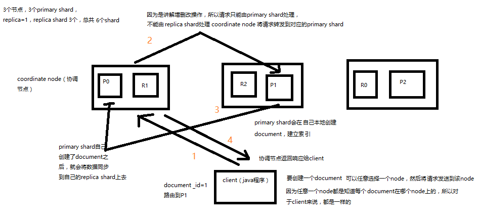

# ElasticSearch中的Document

## Document 元数据

- **_index**
- **_type**
- **_id**

```bash
{
  "_index": "test_index",
  "_type": "test_type",
  "_id": "1",
  "_version": 1,
  "found": true,
  "_source": {
    "test_content": "test test"
  }
}
```

### 1. _index 元数据

（1）代表一个 Document 存放在哪个 index 中

（2）类似的数据放在一个索引，非类似的数据放不同索引：product index（包含了所有的商品），sales index（包含了所有的商品销售数据），inventory index（包含了所有库存相关的数据）。如果你把比如 product，sales，human resource（employee），全都放在一个大的index 里面，比如说 company index，不合适的。

（3）index 中包含了很多类似的 Document：类似是什么意思，其实指的就是说，这些 Document的 fields 很大一部分是相同的，你说你放了 3 个 Document，每个 Document 的 fields 都完全不一样，这就不是类似了，就不太适合放到一个 index 里面去了。

（4）索引名称必须是小写的，不能用下划线开头，不能包含逗号：product，website，blog

### 2. _type 元数据

（1）代表 Document 属于 index 中的哪个类别（type）

（2）一个索引通常会划分为多个 type，逻辑上对 index 中有些许不同的几类数据进行分类：因为一批相同的数据，可能有很多相同的 fields，但是还是可能会有一些轻微的不同，可能会有少数 fields 是不一样的，举个例子，就比如说，商品，可能划分为电子商品，生鲜商品，日化商品，等等。

（3）type 名称可以是大写或者小写，但是同时不能用下划线开头，不能包含逗号

### 3. _id 元数据

（1）代表 Document 的唯一标识，与 index 和 type 一起，可以唯一标识和定位一个 Document

（2）我们可以手动指定 Document 的 id（`put /index/type/id`），也可以不指定，由 es 自动为我们创建一个 id

## 生成 Document ID

### 1、手动指定 document id

根据应用情况来说，是否满足手动指定 document id 的前提：

一般来说，是从某些其他的系统中，导入一些数据到 es 时，会采取这种方式，就是使用系统中已有数据的唯一标识，作为 es 中 document 的 id。举个例子，比如说，我们现在在开发一个电商网站，做搜索功能，或者是 OA 系统，做员工检索功能。这个时候，数据首先会在网站系统或者 IT 系统内部的数据库中，会先有一份，此时就肯定会有一个数据库的 primary key（自增长、UUID、或者是业务编号）。如果将数据导入到 es 中，此时就比较适合采用数据在数据库中已有的primary key。

```bash
PUT /test_index/test_type/2
```

### 2、自动生成 document id

如果说，我们是在做一个系统，这个系统主要的数据存储就是 es 一种，也就是说，数据产生出来以后，可能就没有 id，直接就放 es 一个存储，那么这个时候，可能就不太适合说手动指定 document id 的形式了，因为你也不知道 id 应该是什么，此时可以采取下面要讲解的让 es 自动生成 id 的方式。

```bash
# post /index/type

POST /test_index/test_type
{
  "test_content": "my test"
}

# 返回的消息体
{
  "_index": "test_index",
  "_type": "test_type",
  "_id": "AVp4RN0bhjxldOOnBxaE",
  "_version": 1,
  "result": "created",
  "_shards": {
    "total": 2,
    "successful": 1,
    "failed": 0
  },
  "created": true
}
```

自动生成的 id，长度为 20 个字符，URL 安全，base64 编码，GUID 分布式系统并行生成时不可能会发生冲突

## Document  `_source` 元数据

`_source` 元数据：就是说，我们在创建一个 document 的时候，使用的那个放在 request body 中的 json 串，默认情况下，在 get 的时候，会原封不动的给我们返回回来。

```bash
GET /test_index/test_type/2
{
  "_index" : "test_index",
  "_type" : "test_type",
  "_id" : "3",
  "_source" : {
    "test_field1" : "test1",
    "test_field2" : "test2",
    "test_field3" : "test3"
  }
}
```

**定制返回结果**

定制返回的结果，指定 _source 中，返回哪些 field

```bash
GET /test_index/test_type/3?_source=test_field1
{
  "_index" : "test_index",
  "_type" : "test_type",
  "_id" : "3",
  "_source" : {
    "test_field1" : "test1"
  }
}
```

## document 的全量替换、强制创建以及图解 lazy delete 机制

### 1. document 的全量替换

（1）语法与创建文档是一样的，如果 document id 不存在，那么就是创建；如果 document id 已经存在，那么就是全量替换操作，替换 document 的 json 串内容

（2）document 是不可变的，如果要修改 document 的内容，第一种方式就是全量替换，直接对 document 重新建立索引，替换里面所有的内容

（3）es 会将老的 document 标记为 deleted，然后新增我们给定的一个 document，当我们创建越来越多的 document 的时候，es 会在适当的时机在后台自动删除标记为 deleted 的 document

### 2. document 的强制创建

（1）创建文档与全量替换的语法是一样的，有时我们只是想新建文档，不想替换文档，如果强制进行创建呢？

```bash
PUT /index/type/id?op_type=create
#或者
PUT /index/type/id/_create
```

### 3. document 的删除

不会理解物理删除，只会将其标记为 deleted，当数据越来越多的时候，在后台自动删除

```bash
DELETE /index/type/id
```

### 4. upsert 操作

如果指定的 document 不存在，就执行 upsert 中的初始化这个操作

```bash
POST /test_index/test_type/11/_update
{
   "upsert": {
       "num": 0,
       "tags": []
   }
}
```

## Document 路由原理

路由算法：`shard = hash(routing) % number_of_primary_shards`

举个例子，一个 index 有 3 个 primary shard : P0 、 P1 、 P2

1. 每次增删改查一个 document 的时候，都会带过来一个 routing number，默认就是这个 document 的 _id（ routing = _id，假设 _id = 1）

2. 会将这个 routing 值，传入一个 hash 函数中，产出一个 routing 值的 hash 值，`hash(routing) = 21`

3. 然后将 hash 函数产出的值对这个 index 的 primary shard 的数量求余数，`21 % 3 = 0` 就决定了，这个 document 就放在 P0 上。

## Document 增删改内部原理

1. 客户端选择一个 node 发送请求过去，这个 node 就是 coordinating node（协调节点）

2. coordinating node，对 document 进行路由，将请求转发给对应的 node（有 primary shard）

3. 实际的 node 上的 primary shard 处理请求，然后将数据同步到 replica node

4. coordinating node，如果发现 primary node 和所有 replica node 都搞定之后，就返回响应结果给客户端



## Document 查询内部原理

1. 客户端发送请求到任意一个 node，成为 coordinate node

2. coordinate node 对 document 进行路由，将请求转发到对应的 node，此时会使用 round-robin 随机轮询算法，在 primary shard 以及其所有 replica 中随机选择一个，让读请求负载均衡

3. 接收请求的 node 返回 document 给 coordinate node

4. coordinate node 返回 document 给客户端

5. 特殊情况：document 如果还在建立索引过程中，可能只有 primary shard 有，任何一个replica shard 都没有，此时可能会导致无法读取到 document，但是 document 完成索引建立之后，primary shard 和 replica shard 就都有了


