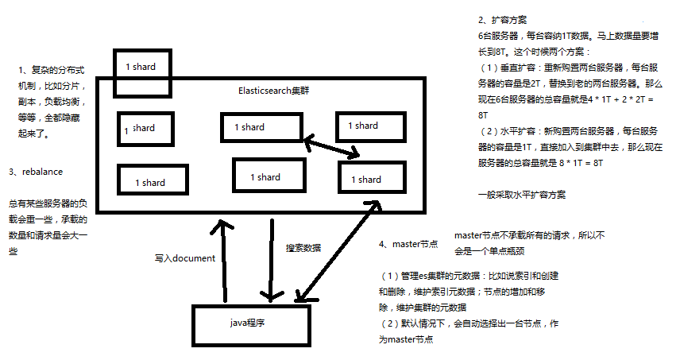
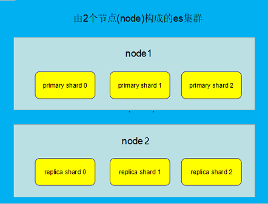
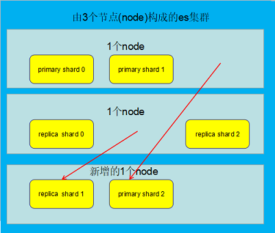
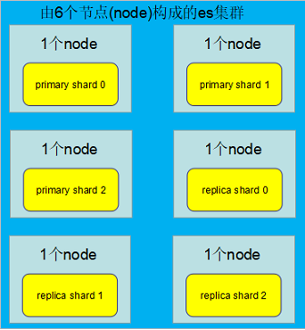
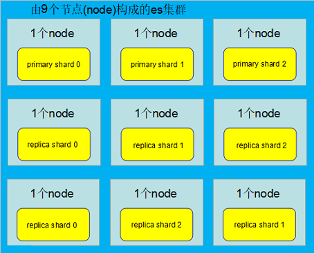
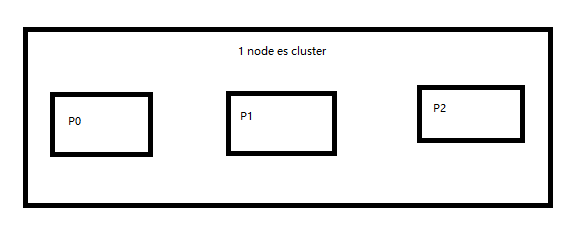
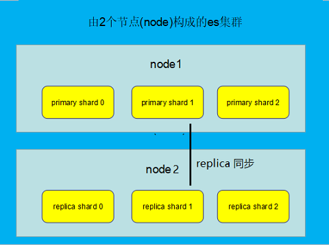
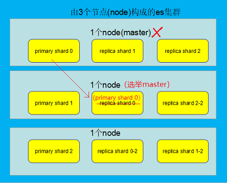

# ElasticSearch 的基础分布式架构

1. Elasticsearch 对复杂分布式机制的透明隐藏特性
2. Elasticsearch 的垂直扩容与水平扩容
3. 增减或减少节点时的数据 rebalance
4. master 节点
5. 节点对等的分布式架构

## ElasticSearch 的基础分布式架构

### 1. Elasticsearch 对复杂分布式机制的透明隐藏特性

Elasticsearch 是一套分布式的系统，分布式是为了应对大数据量，隐藏了复杂的分布式机制。

分片机制（我们之前随随便便就将一些 document 插入到 es 集群中去了，我们有没有 care 过数据怎么进行分片的，数据到哪个 shard 中去）

cluster discovery（集群发现机制，我们之前在做那个集群 status 从 yellow 转 green 的实验里，直接启动了第二个 es 进程，那个进程作为一个 node 自动就发现了集群，并且加入了进去，还接收了部分数据，replica shard）

shard 负载均衡（举例，假设现在有3个节点，总共有25个 shard 要分配到3个节点上去，es 会自动进行均匀分配，以保持每个节点的均衡的读写负载请求）

shard 副本，请求路由，集群扩容，shard 重分配



### 2. Elasticsearch 的垂直扩容与水平扩容

**垂直扩容：** 采购更强大的服务器，成本非常高昂，而且会有瓶颈，假设世界上最强大的服务器容量就是 10T ，但是当你的总数据量达到 5000T 的时候，你要采购多少台最强大的服务器啊

**水平扩容：** 业界经常采用的方案，采购越来越多的普通服务器，性能比较一般，但是很多普通服务器组织在一起，就能构成强大的计算和存储能力

扩容对应用程序的透明性

### 水平扩容

**图解横向扩容过程，如何超出扩容极限，以及如何提升容错性:**

1. primary & replica 自动负载均衡，6 个 shard，3 primary，3 replica

    

2. 每个 node 有更少的 shard，IO/CPU/Memory 资源给每个 shard 分配更多，每个 shard 性能更好

    

3. 扩容的极限，6 个 shard（3 primary，3 replica），最多扩容到 6 台机器，每个 shard 可以占用单台服务器的所有资源，性能最好

    

4. 超出扩容极限，动态修改 replica 数量，9 个 shard（3 primary，6 replica），扩容到 9 台机器，比 3 台机器时，拥有 3 倍的读吞吐量

    

5. 3 台机器下，9 个 shard（3 primary，6 replica），资源更少，但是容错性更好，最多容纳 2 台机器宕机，6 个 shard 只能容纳 1 台机器宕机

6. 这里的这些知识点，你综合起来看，就是说，一方面告诉你扩容的原理，怎么扩容，怎么提升系统整体吞吐量；另一方面要考虑到系统的容错性，怎么保证提高容错性，让尽可能多的服务器宕机，保证数据不丢失

### 3. 增减或减少节点时的数据 rebalance

增减或减少节点时自动分配 其它节点较多的 shard 到新增节点，负载均衡。

### 4. master 节点

- 创建或删除索引
- 增加或删除节点

### 5. 节点对等的分布式架构

- 节点对等，每个节点都能接收所有的请求
- 自动请求路由
- 响应收集

## shard & replica 机制再次梳理

1. index 包含多个 shard

2. 每个 shard 都是一个最小工作单元，承载部分数据，lucene实例，完整的建立索引和处理请求的能力

3. 增减节点时，shard 会自动在 nodes 中负载均衡

4. primary shard 和 replica shard，每个 document 肯定只存在于某一个 primary shard 以及其对应的 replica shard 中，不可能存在于多个 primary shard

5. replica shard 是 primary shard 的副本，负责容错，以及承担读请求负载

6. primary shard 的数量在创建索引的时候就固定了，replica shard 的数量可以随时修改

7. primary shard 的默认数量是 5，replica 默认是 1，默认有 10 个 shard，5 个 primary shard，5 个 replica shard

8. primary shard 不能和自己的 replica shard 放在同一个节点上（否则节点宕机，primary shard 和副本都丢失，起不到容错的作用），但是可以和其他 primary shard 的replica shard 放在同一个节点上

### 图解单 node 环境下创建 index 是什么样子的

```bash
PUT /test_index
{
   "settings" : {
      "number_of_shards" : 3,
      "number_of_replicas" : 1
   }
}
```



1. 单 node 环境下，创建一个 index，有 3 个 primary shard，3 个 replica shard

2. 集群 status 是 yellow

3. 这个时候，只会将 3 个 primary shard 分配到仅有的一个 node 上去，另外 3 个 replica shard 是无法分配的

4. 集群可以正常工作，但是一旦出现节点宕机，数据全部丢失，而且集群不可用，无法承接任何请求

### 图解 2 个 node环境下 replica shard 是如何分配的



1. replica shard 分配：3 个 primary shard，3 个 replica shard，1 node

2. primary ---> replica 同步

3. 读请求：primary/replica

## 图解 Elasticsearch 容错机制：master选举，replica容错，数据恢复



es 集群情况：3 个 node，9  个 shard (3 个 primary shard, 6 个 replica shard)

如果此时 master node 宕机：

1. master选举，自动选举另外一个 node 成为新的 master，承担起 master 的责任来：

2. replica 容错：新 master 将丢失的 primary shard 的某个 replica shard 提升为 primary shard，此时 cluster status 会变为 Yellow，因为所有的 primary shard 都变成了 active status，但是，少了一个 replica shard ，所以不是所有的 replica shard 都是 active

3. replica 容错：新 master 将 replica 提升为 primary shard，yellow

4. 重启宕机的node ：新 master 节点将会把缺失的副本都 copy 一份到该 node 上去，而且该 node 会使用之前已有的 shard 数据，只是同步一下宕机之后发生的改变。

此时 es cluster 的状态为 green，因为所有的 primary shard 和 replica shard 都是 active 状态。


