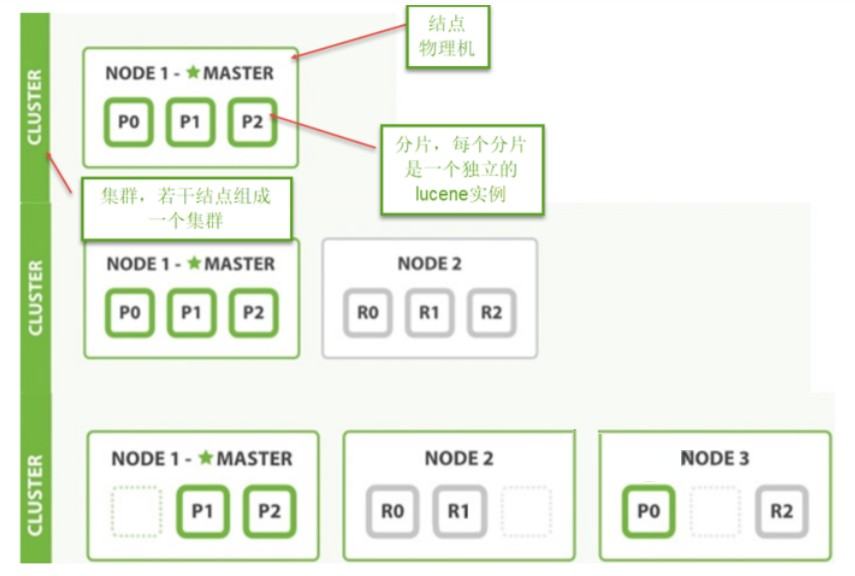
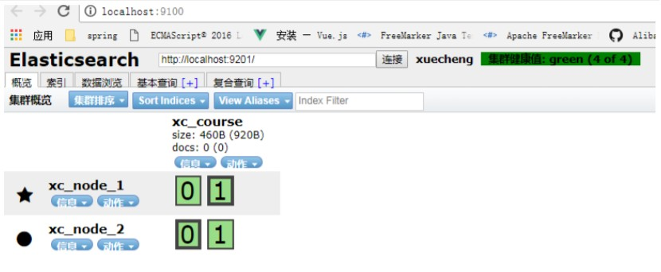
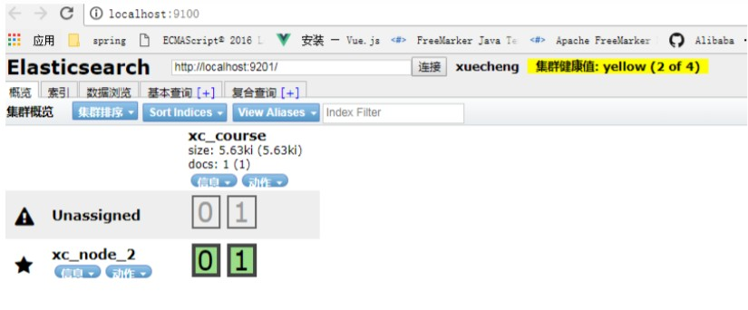
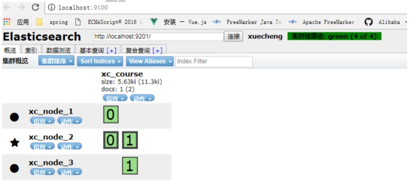

# ElasticSearch 集群

## 1. 集群结构

ES 通常以集群方式工作，这样做不仅能够提高 ES 的搜索能力还可以处理大数据搜索的能力，同时也增加了系统的容错能力及高可用，ES 可以实现 PB 级数据的搜索。

下图是 ES 集群结构的示意图：



从上图总结以下概念：

1、结点

ES 集群由多个服务器组成，每个服务器即为一个 Node 结点(该服务只部署了一个 ES 进程)。

2、分片

当我们的文档量很大时，由于内存和硬盘的限制，同时也为了提高ES的处理能力、容错能力及高可用能力，我们将索引分成若干分片，每个分片可以放在不同的服务器，这样就实现了多个服务器共同对外提供索引及搜索服务。

一个搜索请求过来，会分别从各各分片去查询，最后将查询到的数据合并返回给用户。

3、副本

为了提高 ES 的高可用同时也为了提高搜索的吞吐量，我们将分片复制一份或多份存储在其它的服务器，这样即使当前的服务器挂掉了，拥有副本的服务器照常可以提供服务。

4、主结点

一个集群中会有一个或多个主结点，主结点的作用是集群管理，比如增加节点，移除节点等，主结点挂掉后 ES 会重新选一个主结点。

5、结点转发

每个结点都知道其它结点的信息，我们可以对任意一个结点发起请求，接收请求的结点会转发给其它结点查询数据。

---

## 2. 搭建集群

下边的例子实现创建一个2结点的集群，并且索引的分片我们设置2片，每片一个副本。

### 2.1 结点的三个角色

**主结点：** master 节点主要用于集群的管理及索引 比如新增结点、分片分配、索引的新增和删除等。

**数据结点：** data 节点上保存了数据分片，它负责索引和搜索操作。 客户端结点：client 节点仅作为请求客户端存在，client 的作用也作为负载均衡器，client 节点不存数据，只是将请求均衡转发到其它结点。

通过下边两项参数来配置结点的功能：

```yml
node.master: #是否允许为主结点
node.data: #允许存储数据作为数据结点
node.ingest: #是否允许成为协调节点，
```

#### 四种组合方式：

**master=true，data=true：** 即是主结点又是数据结点

**master=false，data=true：** 仅是数据结点

**master=true，data=false：** 仅是主结点，不存储数据

**master=false，data=false：** 即不是主结点也不是数据结点，此时可设置 ingest 为 true 表示它是一个客户端。

### 2.2 创建节点1

- 解压 elasticsearch-6.2.1.zip 到 F:\devenv\elasticsearch\es-cloud-1\elasticsearch-6.2.1

- 结点1对外服务的http端口是：9200

- 集群管理端口是9300

- 配置elasticsearch.yml

- 结点名：xc_node_1

- 启动节点1

`elasticsearch.yml` 内容如下

```yml
cluster.name: xuecheng
node.name: xc_node_1
network.host: 0.0.0.0
http.port: 9200
transport.tcp.port: 9300
node.master: true
node.data: true
discovery.zen.ping.unicast.hosts: ["0.0.0.0:9300", "0.0.0.0:9301"]
discovery.zen.minimum_master_nodes: 1
node.ingest: true
node.max_local_storage_nodes: 2
path.data: D:\ElasticSearch\elasticsearch‐6.2.1‐1\data
path.logs: D:\ElasticSearch\elasticsearch‐6.2.1‐1\logs
http.cors.enabled: true
http.cors.allow‐origin: /.*/
```

### 2.3 创建节点2

- 解压 elasticsearch-6.2.1.zip 到 F:\devenv\elasticsearch\es-cloud-2\elasticsearch-6.2.1

- 结点1对外服务的http端口是：9201

- 集群管理端口是9302

- 配置elasticsearch.yml

- 结点名：xc_node_2

- 启动节点2

`elasticsearch.yml` 内容如下

```yml
cluster.name: xuecheng
node.name: xc_node_2
network.host: 0.0.0.0
http.port: 9201
transport.tcp.port: 9301
node.master: true
node.data: true
discovery.zen.ping.unicast.hosts: ["0.0.0.0:9300", "0.0.0.0:9301"]
discovery.zen.minimum_master_nodes: 1
node.ingest: true
node.max_local_storage_nodes: 2
path.data: D:\ElasticSearch\elasticsearch‐6.2.1‐2\data
path.logs: D:\ElasticSearch\elasticsearch‐6.2.1‐2\logs
http.cors.enabled: true
http.cors.allow‐origin: /.*/
```

### 2.4 创建索引库

1、使用 head 连上其中一个结点

2、创建索引库，共2个分片，每个分片一个副本。


3、创建成功，刷新 head:



上图可以看到共有4个分片，其中两个分片是副本。

### 2.5  集群的健康

通过访问 `GET /_cluster/health` 来查看 Elasticsearch 的集群健康情况。

#### 用三种颜色来展示健康状态： green 、 yellow 或者 red 。

**green：** 所有的主分片和副本分片都正常运行。 

**yellow：** 所有的主分片都正常运行，但有些副本分片运行不正常。

**red：** 存在主分片运行不正常。

Get请求：[http://localhost:9200/_cluster/health](http://localhost:9200/_cluster/health)

响应结果：

```json
{
    "cluster_name": "xuecheng",
    "status": "green",
    "timed_out": false,
    "number_of_nodes": 2,
    "number_of_data_nodes": 2,
    "active_primary_shards": 2,
    "active_shards": 4,
    "relocating_shards": 0,
    "initializing_shards": 0,
    "unassigned_shards": 0,
    "delayed_unassigned_shards": 0,
    "number_of_pending_tasks": 0,
    "number_of_in_flight_fetch": 0,
    "task_max_waiting_in_queue_millis": 0,
    "active_shards_percent_as_number": 100
}
```

## 3. 测试

### 3.1 创建映射并写入文档

连接 其中任意一台结点，创建映射写入文档。

Post http://localhost:9200/xc_course/doc/3

```json
{
    "name": "spring开发基础",
    "description": "spring 在java领域非常流行，java软件开发人员都在用。",
    "studymodel": "201001",
    "price":66.6
}
```

响应结果：

```json
{
    "_index": "xc_course",
    "_type": "doc",
    "_id": "3",
    "_version": 1,
    "result": "created",
    "_shards": {
    "total": 2,
    "successful": 2,
    "failed": 0
    },
    "_seq_no": 0,
    "_primary_term": 1
}
```

从上边的提示可看出，两个分片都保存成功。

### 3.2 搜索

向其它一个结点发起搜索请求，查询全部数据。

### 3.3 关闭一个结点

ES 会重新选中一个主结点（前提在配置结点时允许它可以为主结点）



此时向活的结点发起搜索请求，仍然正常。

### 3.4 添加一个结点

- 添加结点3，端口设置为：

- http端口是：9202

- 集群管理端口是9302

- 结点名：xc_node_3

- 此结点的配置：`node.master: false` ，`node.data: true`

启动结点3，刷新 head，下图显示 ES 将分片分在了3个结点



向结点3发起搜索请求：

Get： http://127.0.0.1:9202/xc_course/doc/_search

全部数据可被正常搜索到。
