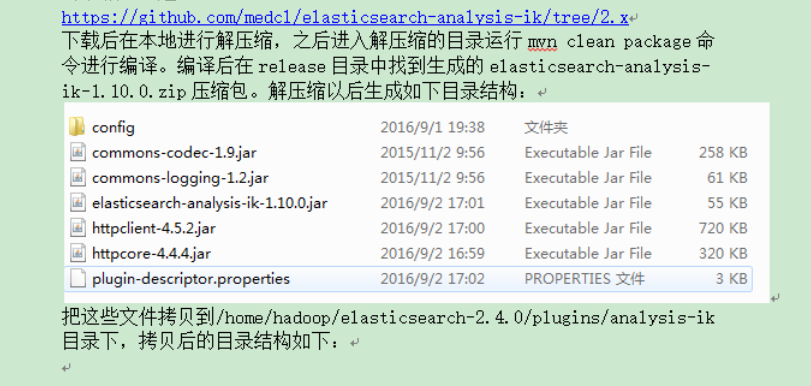

# 安装 analysis-ik 分词器

> analysis-ik 中文分词器要与 elasticsearch 版本一致

下载地址: [https://github.com/medcl/elasticsearch-analysis-ik/releases](https://github.com/medcl/elasticsearch-analysis-ik/releases)

下载 IK 分词器.zip：（Github地址：[https://github.com/medcl/elasticsearch-analysis-ik](https://github.com/medcl/elasticsearch-analysis-ik)）



## 2. elasticsearch 5.x以上版本

1. 不需要将 ik 的 `release/config` 里的文件复制到`elasticsearch/config` 目录下

2. 也不需要在 `elasticsearch.yml` 中添加 `index.analysis.analyzer.ik.type: "ik"`

**高版本的 elasticsearch 只需要将 ik 解压到 elasticsearch 的 `plugins` 目录下即可**

## 3. 两种分词模式

新版本的移除名为 ik 的 analyzer 和 tokenizer,请分别使用 `ik_smart` 和 `ik_max_word` 两种分词模式。

1、ik_max_word

会将文本做最细粒度的拆分，比如会将

```text
“中华人民共和国人民大会堂”
```

拆分为

```text
“中华人民共和国、中华人民、中华、华人、人民共和国、人民、共和国、大会堂、大会、会堂等词语。
```

2、ik_smart

会做最粗粒度的拆分，比如会将

```text
“中华人民共和国人民大会堂”
```

拆分为

```text
中华人民共和国、人民大会堂。
```

## 4. 自定义词库

iK 分词器自带一个 `main.dic` 的文件，此文件为词库文件。

如果要让分词器支持一些专有词语，可以自定义词库。

### 1. 修改 `IKAnalyzer.cfg.xml` 配置文件：

```xml
<?xml version="1.0" encoding="UTF-8"?>
<!DOCTYPE properties SYSTEM "http://java.sun.com/dtd/properties.dtd">
<properties>
	<comment>IK Analyzer 扩展配置</comment>
	<!--用户可以在这里配置自己的扩展字典 -->
	<entry key="ext_dict">my.dic</entry>
	 <!--用户可以在这里配置自己的扩展停止词字典-->
	<entry key="ext_stopwords"></entry>
	<!--用户可以在这里配置远程扩展字典 -->
	<!-- <entry key="remote_ext_dict">words_location</entry> -->
	<!--用户可以在这里配置远程扩展停止词字典-->
	<!-- <entry key="remote_ext_stopwords">words_location</entry> -->
</properties>
```

### 2. 创建自定义的文件 my.dic

创建后添加要定义的词，每个词独占一行

my.dic

```text
我之所以
我自己哦
```
