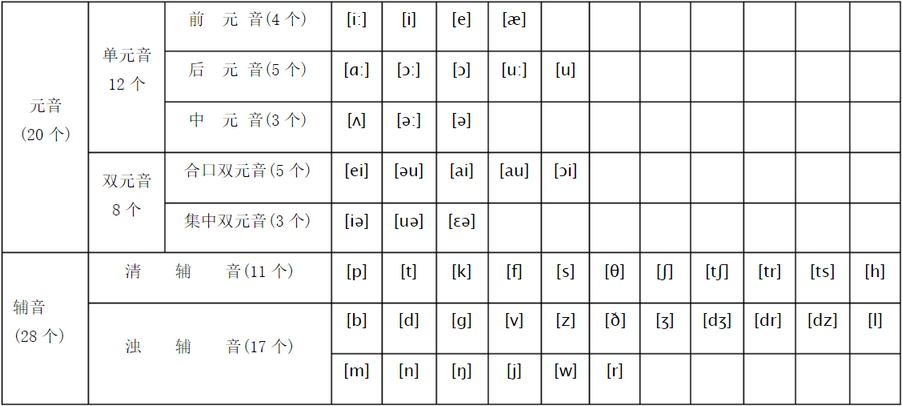

# 自然拼音

英语只要是能拼读的，就要符合**一辅一元，前辅后元**的规则。

## 英语国际标准音标

## 元音字母

元音可以有多种发音。

| 元音 | 音标 | 说明 |
| --- | --- | --- |
| A | /æ/ | bag |
| E | /e/ | egg |
| I | /i/ | city |
| O | /D/ | lot , orange, nod |
| U | /ʌ/ | cup , but , cut |

## 辅音字母

辅音通常有且只有一种发音。

| 辅音 | 音标 | 说明 |
| --- | --- | --- |
| B | /b/ | bat |
| C | /k/ 或 /s/ | 当 C 位于字母 i,e,y之前时都发音为/s/，例如：city |
| D | /d/ | dad |
| F | /f/ | fat |
| G | /g/ | get , give |
| H | /h/ | hat , him |
| I | /I/ | city , big |
| J | /dʒ/ | jet , jelly |
| K | /k/ | kill , kiss |
| L | /l/ | lot , let , girl |
| M | /m/ | man , meg , climb |
| N | /n/ | not , no , man , town |
| P | /p/ | pet , pot , laptop |
| Q | /kw/（qu组合） | quit , queen , quiet |
| R | /r/ | red , rabbit , road |
| S | /s/ | sad , bus , first |
| T | /t/ | Tom , top , tea , it |
| V | /v/ | very , Venus , van |
| W | /w/ | wit , wet , wag |
| X | /ks/ | fox , box , exit |
| Y | /j/ 或 /i/ | 半元音，字母 y 在单词最后读作 /i/ |
| Z | /z/ | zip , zigzag , Zara |

## 浊化

s + 清辅音，读作浊辅音，比如：

| 单词 | 清辅音 | 浊辅音 |
| ---- | ---- | ---- |
| sport | /p/ | /b/ |
| start | /t/ | /d/ |
| skirt | /k/ | /g/ |

