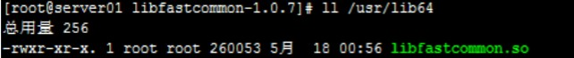

# CentOS 7.x 安装 FastDFS

使用软件的版本:

**CentOS：** `centos-release-7-5.1804.4.el7.centos.x86_64`

**FastDFS：** `V5.05` ( `tracker` 和 `storage` 使用相同的 `FastDFS` 安装包)

地址：[https://github.com/happyfish100/FastDFS](https://github.com/happyfish100/FastDFS)

```yml
wget https://github.com/happyfish100/fastdfs/archive/V5.05.tar.gz
```

**libfastcommon：** `V1.0.7`

```yml
wget https://github.com/happyfish100/libfastcommon/archive/V1.0.7.tar.gz
```

**fastdfs-nginx-module：** `V1.20`

```yml
wget https://github.com/happyfish100/fastdfs-nginx-module/archive/V1.20.tar.gz
```

**Nginx：** `V1.80`

```yml
wget https://nginx.org/download/nginx-1.8.0.tar.gz
```

## 1. FastDFS 安装环境

### 1.1 安装 gcc

安装 FastDFS 需要先将官网下载的源码进行编译，编译依赖 gcc 环境：

```bash
yum install gcc-c++
```

### 1.2 安装 libevent

FastDFS 依赖 libevent 库，需要安装：

```bash
yum -y install libevent
```

### 1.3 安装 libfastcommon

libfastcommon 是 FastDFS 官方提供的，libfastcommon 包含了 FastDFS 运行所需要的一些基础库。

#### 1.3.1 将 `libfastcommonV1.0.7.tar.gz` 拷贝至 `/usr/local/` 目录下

```bash
cp libfastcommonV1.0.7.tar.gz /usr/local/

cd /usr/local

tar -zxvf libfastcommonV1.0.7.tar.gz

cd libfastcommon-1.0.7

./make.sh

./make.sh install
```

**注意：** 运行 `./make.sh` 命令时如果遇到如下报错：

```bash
./make.sh:行99: perl: 未找到命令
./make.sh:行100: perl: 未找到命令

cc  -c -fPIC -o sockopt.lo sockopt.c  
sockopt.c: 在函数‘tcpsendfile_ex’中:
sockopt.c:1246:35: 错误：‘remain_bytes’未声明(在此函数内第一次使用)
  *total_send_bytes = file_bytes - remain_bytes;
                                   ^
sockopt.c:1246:35: 附注：每个未声明的标识符在其出现的函数内只报告一次
make: *** [sockopt.lo] 错误 1
```

**解决办法：** 未找到对应的命令，在通过查找安装相应的命令即可。

```bash
yum -y install zlib zlib-devel pcre pcre-devel gcc gcc-c++ openssl openssl-devel libevent libevent-devel perl unzip net-tools wget  
```

#### 1.3.2 `libfastcommon` 安装好后会自动将库文件拷贝至 `/usr/lib64` 下

由于 FastDFS 程序引用 `usr/lib` 目录所以需要将 `/usr/lib64` 下的库文件拷贝至 `/usr/lib` 下。要拷贝的文件如下：



```bash
cp /usr/lib64/libfastcommon.so /usr/lib
```

### 1.4 tracker 编译安装

分别在 192.168.101.3 和 192.168.101.4 上安装 tracker。

注：初次安装可只安装一台 tracker，快速体验。

#### 1.4.1 将 FastDFS_v5.05.tar.gz 拷贝至/usr/local/下

```bash
cp FastDFS_v5.05.tar.gz /usr/local/

tar -zxvf FastDFS_v5.05.tar.gz

cd FastDFS

./make.sh 编译

./make.sh install 安装
```

#### 1.4.2 安装成功将安装目录下的 `conf` 下的文件拷贝到`/etc/fdfs/` 下

```bash
cp /usr/local/FastDFS/conf/* /etc/fdfs/
```

#### 1.4.3 配置 tracker.conf

安装成功后进入 `/etc/fdfs` 目录，拷贝一份新的 tracker 文件然后配置：

```bash
cd /etc/fdfs/

cp tracker.conf.sample tracker.conf

vi tracker.conf
```

`tracker.conf` 修改内容如下：

```bash
base_path=/home/yuqing/FastDFS
# 改为
base_path=/home/FastDFS

# 配置 http 端口：
http.server_port=80
```

#### 1.4.4 启动 tracker

```bash
/usr/bin/fdfs_trackerd /etc/fdfs/tracker.conf restart
```

### 1.5 storage 安装

分别在 192.168.101.5、192.168.101.6、192.168.101.7、192.168.101.8 上安装 storage。

注：初次安装可只安装一台 storage，快速体验。

> **注意：**  `如果本服务器上已经安装过 tracker,则只需修改 storage 配置即可(因为 storage 与 tracker 使用同一个安装包),` 如果服务器上没有安装过 tracker 需用执行步骤一和 tracker 的安装步骤(不需要配置,因为不使用 tracker 的功能)

#### 1.5.1 安装 libevent

同 tracker 安装（已安装过 tracker 则无需安装，忽略此步骤）。

#### 1.5.2 安装 libfastcommon

同 tracker 安装（已安装过 tracker 则无需安装，忽略此步骤）。

#### 1.5.3 storage 编译安装

同 tracker 编译安装（已安装过 tracker 则无需安装，忽略此步骤）。

#### 1.5.4 配置 storage

安装成功后进入 `/etc/fdfs` 目录：

```bash
cd /etc/fdfs/

cp storage.conf.sample storage.conf

vi storage.conf
```

`storage.conf` 修改内容如下：

```bash
# 组名
group_name=group1


base_path=/home/yuqing/FastDFS
# 改为：
base_path=/home/FastDFS


store_path0=/home/yuqing/FastDFS
# 改为：
store_path0=/home/FastDFS/fdfs_storage
#如果有多个挂载磁盘则定义多个 store_path，如下
#store_path1=.....
#store_path2=.....


# 配置 tracker 服务器IP(例如：192.168.101.3)
tracker_server=192.168.101.3:22122
# 如果有多个则配置多个 tracker
# tracker_server=192.168.101.4:22122


# 配置 http 端口
http.server_port=80
```

#### 1.5.5 启动 storage

```bash
/usr/bin/fdfs_storaged /etc/fdfs/storage.conf restart
```

### 1.6 上传图片测试

#### 1.6.1 通过 fdfs_test 程序

FastDFS 安装成功可通过 `/usr/bin/fdfs_test` 程序来测试上传、下载等操作。

#### 1.6.2 修改 `/etc/fdfs/client.conf`

```bash
vi /etc/fdfs/client.conf
```

tracker_server 根据自己部署虚拟机的情况配置，修改内容如下：

```bash
base_path=/home/FastDFS

tracker_server=192.168.101.3:22122

tracker_server=192.168.101.4:22122
```

使用语法格式：

`/usr/bin/fdfs_test 客户端配置文件地址 upload 上传文件`

实例：比如将 `/home` 下的图片上传到 FastDFS 中

```bash
/usr/bin/fdfs_test /etc/fdfs/client.conf upload /home/测试图片.png
```

打印如下日志(关键部分)：

```bash
tracker_query_storage_store_list_without_group: 
        server 1. group_name=, ip_addr=192.168.75.128, port=23000

group_name=group1, ip_addr=192.168.75.128, port=23000
storage_upload_by_filename
group_name=group1, remote_filename=M00/00/00/wKhLgF00eRuAayy9AACVcqbr3Lw855.jpg
source ip address: 192.168.75.128
file timestamp=2019-07-21 22:39:23
file size=38258
file crc32=2800475324
example file url: http://192.168.75.128/group1/M00/00/00/wKhLgF00eRuAayy9AACVcqbr3Lw855.jpg
```

返回的 `example file url: http://192.168.75.128/group1/M00/00/00/wKhLgF00eRuAayy9AACVcqbr3Lw855.jpg` 就是文件的下载路径

---

## 2. FastDFS 整合 Nginx

### 2.1 在 Storage 上安装 nginx

在 storage server 上安装 nginx 的目的是对外通过 http 访问 storage server 上的文件。使用 nginx 的模块 FastDFS-nginx-module 的作用是通过 http 方式访问 storage 中的文件，当 storage 本机没有要找的文件时向源 storage 主机代理请求文件。

### 2.2 安装 FastDFS-nginx-module

1、解压安装

```bash
cp fastdfs-nginx-module_v1.16.tar.gz /usr/local/

cd /usr/local

tar -zxvf fastdfs-nginx-module_v1.16.tar.gz

cd fastdfs-nginx-module/src

vi config
```

2、修改 `config` 文件内容

修改 `config` 文件：将 `/usr/local/` 路径改为 `/usr/`

```bash
CORE_INCS="$CORE_INCS /usr/local/include/fastdfs /usr/include/fastcommon/"
CORE_LIBS="$CORE_LIBS -L/usr/local/lib -lfastcommon -lfdfsclient"

# 上面内容修改如下：

CORE_INCS="$CORE_INCS /usr/include/fastdfs /usr/include/fastcommon/"
CORE_LIBS="$CORE_LIBS -L/usr/lib -lfastcommon -lfdfsclient"
```

3、将 `fastdfs-nginx-module/src` 下的 `mod_FastDFS.conf` 拷贝至 `/etc/fdfs/` 下

```bash
cp /usr/local/fastdfs-nginx-module/src/mod_fastdfs.conf /etc/fdfs/
```

修改 `mod_fastdfs.conf` 文件内容

```bash
vi /etc/fdfs/mod_fastdfs.conf
```

修改内容：

```bash
base_path=/home/FastDFS

# tracker 所在服务器的IP：192.168.101.3
tracker_server=192.168.101.3:22122
tracker_server=192.168.101.4:22122

# url 中包含 group 名称
url_have_group_name=true

# 指定文件存储路径
store_path0=/home/FastDFS/fdfs_storage
#如果有多个
# store_path1=/home/FastDFS/fdfs_storage
```

4、将 `libfdfsclient.so` 拷贝至 `/usr/lib` 下

```bash
cp /usr/lib64/libfdfsclient.so /usr/lib/
```

5、创建 `nginx/client` 目录

```bash
mkdir -p /var/temp/nginx/client
```

### 2.3 Nginx 安装

#### 2.3.1 安装

`nginx-1.8.0.tar.gz` 安装包安装：

```bash
cp nginx-1.8.0.tar.gz /usr/local/

cd /usr/local/

tar -zxvf nginx-1.8.0.tar.gz

cd nginx-1.8.0

# 进入 nginx-1.8.0 ，执行如下命令，复制一次性执行这些
# --- start ---
./configure \
--prefix=/usr/local/nginx \
--pid-path=/var/run/nginx/nginx.pid \
--lock-path=/var/lock/nginx.lock \
--error-log-path=/var/log/nginx/error.log \
--http-log-path=/var/log/nginx/access.log \
--with-http_gzip_static_module \
--http-client-body-temp-path=/var/temp/nginx/client \
--http-proxy-temp-path=/var/temp/nginx/proxy \
--http-fastcgi-temp-path=/var/temp/nginx/fastcgi \
--http-uwsgi-temp-path=/var/temp/nginx/uwsgi \
--http-scgi-temp-path=/var/temp/nginx/scgi \
--add-module=/usr/local/fastdfs-nginx-module/src
# --- end ---

# 编译
make

# 安装
make install
```

#### 2.3.2 Nginx 配置文件

`conf` 目录下新建一个 nginx 配置文件 `nginx-fdfs.conf`

```bash
vi nginx-fdfs.conf
```

`nginx-fdfs.conf` 内容如下：

```bash
#user  nobody;
worker_processes  1;

#error_log  logs/error.log;
#error_log  logs/error.log  notice;
#error_log  logs/error.log  info;

#pid        logs/nginx.pid;

events {
    worker_connections  1024;
}

http {
    include       mime.types;
    default_type  application/octet-stream;

    sendfile        on;

    #keepalive_timeout  0;
    keepalive_timeout  65;

	server {

	  listen 80;
	  server_name 192.168.101.65;;
	  location /group1/M00/ {
		root /home/FastDFS/fdfs_storage/data;
		ngx_fastdfs_module;
	  }

	}

}
```

**说明：** 

`server_name：` 指定本机 ip

`location /group1/M00/：` 其中 `group1` 为 nginx 服务 FastDFS 的分组名称，`M00` 是 FastDFS 自动生成编号，对应 store_path0=/home/FastDFS/fdfs_storage，如果 FastDFS 定义 store_path1，这里就是 `M01`

### 2.4 测试

通过 java 客户端上传文件，使用浏览器 http 访问文件，这里访问上传图片测试的文件：

**访问 storage：**

http://192.168.101.5/group1/M00/00/00/wKhlBVVY2M-AM_9DAAAT7-0xdqM485_big.png

ip 地址改为 192.168.101.6 也可以访问到文件，因为同一个分组的 storage 文件互相同步。

**访问 tracker：**

http://192.168.101.3/group1/M00/00/00/wKhlBVVY2M-AM_9DAAAT7-0xdqM485_big.png

ip 地址改为 192.168.101.4 也可以访问到文件。

**使用域名访问 (推荐)：**

nginx 对外由 vip 提供服务，使用域名访问如下：

比如 vip 对应的域名为 img.test.com：http://img.test.com/group1/M00/00/00/wKhlBVVY2M-AM_9DAAAT7-0xdqM485_big.png

### 2.5 Nginx 代理

本机中安装。

单独安装 nginx 代理服务，它的作用是代理访问 storage 上的文件，实现负载均衡。nginx 的安装细节参考 nginx 文档，这里使用单机 nginx，也可以使用两台 nginx 组成高可用或者采用 lvs+nginx 访问 Storage 上的 nginx。

#### 2.5.1 创建 nginx-fdfs.conf 配置文件

```bash

#user  nobody;
worker_processes  1;


events {
    worker_connections  1024;
}

http {
    include       mime.types;
    default_type  application/octet-stream;
    sendfile        on;
    keepalive_timeout  65;

	#storage 群 group1 组
	upstream storage_server_group1 {
		server 192.168.75.128:80 weight=10;
		server 192.168.101.6:80 weight=10;
	}

	#storage 群 group2 组
	upstream storage_server_group2 {
		server 192.168.75.128:80 weight=10;
		server 192.168.101.8:80 weight=10;
	}

    server {
		listen 80;
		server_name ccc.test.com;
		location /group1 {
			proxy_redirect off;
			proxy_set_header Host $host;
			proxy_set_header X-Real-IP $remote_addr;
			proxy_set_header X-Forwarded-For $proxy_add_x_forwarded_for;
			proxy_pass http://storage_server_group1;
		}
		
		location /group2 {
			proxy_redirect off;
			proxy_set_header Host $host;
			proxy_set_header X-Real-IP $remote_addr;
			proxy_set_header X-Forwarded-For $proxy_add_x_forwarded_for;
			proxy_pass http://storage_server_group2;
		}

	}

}
```
