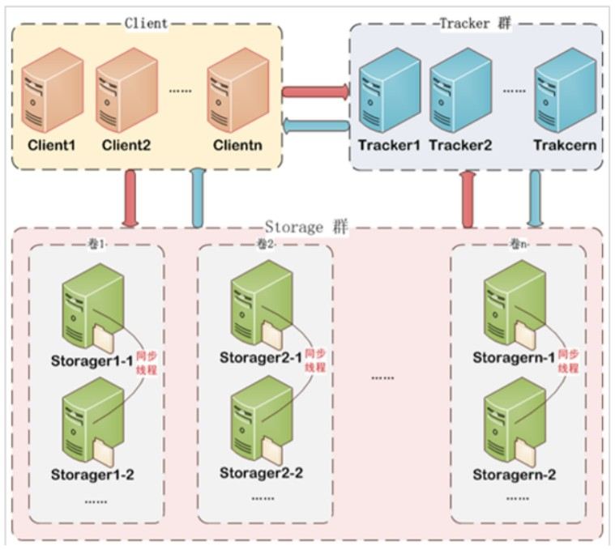
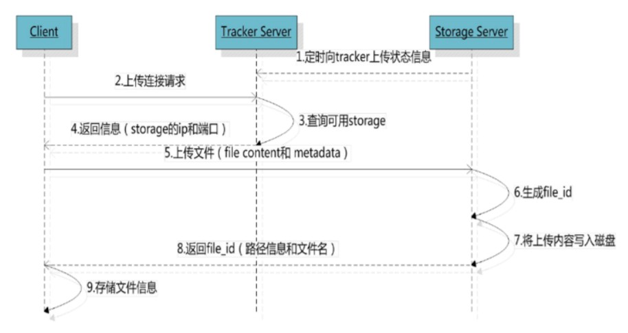
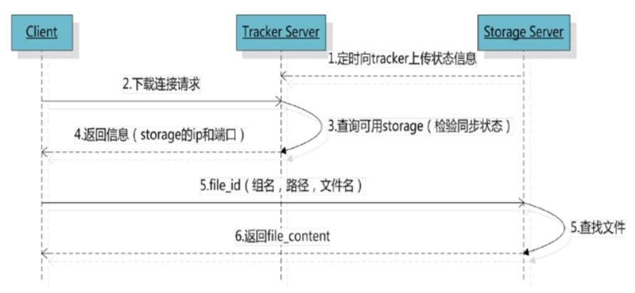

# FastDFS介绍

**什么是 fastDFS ?**

FastDFS 是用 c 语言编写的一款开源的分布式文件系统，它是由淘宝资深架构师余庆编写并开源。FastDFS 专为互联网量身定制，充分考虑了冗余备份、负载均衡、线性扩容等机制，并注重高可用、高性能等指标，使用 FastDFS 很容易搭建一套高性能的文件服务器集群提供文件上传、下载等服务。

**为什么要使用 fastDFS 呢 ?**

像 NFS、GFS 都是通用的分布式文件系统，通用的分布式文件系统的优点的是开发体验好，但是系统复杂性高、性能一般，而专用的分布式文件系统虽然开发体验性差，但是系统复杂性低并且性能高。fastDFS 非常适合存储图片等那些小文件，fastDFS 不对文件进行分块，所以它就没有分块合并的开销，fastDFS 网络通信采用 socket，通信速度很快。

## fastDSF 工作原理

### fastDFS 架构

FastDFS 架构包括 `Tracker server` 和 `Storage server`。客户端请求 `Tracker server` 进行文件上传、下载，通过 `Tracker server` 调度最终由 `Storage server` 完成文件上传和下载。



#### Tracker

Tracker Server 作用是负载均衡和调度，通过 Tracker server 在文件上传时可以根据一些策略找到 Storage server 提
供文件上传服务。可以将 tracker 称为追踪服务器或调度服务器。

FastDFS 集群中的 Tracker server 可以有多台，Tracker server 之间是相互平等关系同时提供服务，Tracker server 不存在单点故障。客户端请求 Tracker server 采用轮询方式，如果请求的 tracker 无法提供服务则换另一个 tracker。

#### Storage

Storage Server 作用是文件存储，客户端上传的文件最终存储在 Storage 服务器上，Storage server 没有实现自己的文件系统而是使用操作系统的文件系统来管理文件。可以将 storage 称为存储服务器。

Storage 集群采用了分组存储方式。storage 集群由一个或多个组构成，集群存储总容量为集群中所有组的存储容量之和。一个组由一台或多台存储服务器组成，组内的 Storage server 之间是平等关系，不同组的 Storage server 之间不会相互通信，同组内的 Storage server 之间会相互连接进行文件同步，从而保证同组内每个 storage 上的文件完全一致的。一个组的存储容量为该组内的存储服务器容量最小的那个，由此可见组内存储服务器的软硬件配置最好是一致的。

采用分组存储方式的好处是灵活、可控性较强。比如上传文件时，可以由客户端直接指定上传到的组也可以由 tracker 进行调度选择。一个分组的存储服务器访问压力较大时，可以在该组增加存储服务器来扩充服务能力（纵向扩容）。当系统容量不足时，可以增加组来扩充存储容量（横向扩容）。

#### Storage 状态收集

Storage server 会连接集群中所有的 Tracker server，定时向他们报告自己的状态，包括磁盘剩余空间、文件同步状况、文件上传下载次数等统计信息。

---

### 文件上传流程



客户端上传文件后存储服务器将文件ID返回给客户端，此文件ID用于以后访问该文件的索引信息。文件索引信息包括：

`组名/虚拟磁盘路径/数据两级目录/文件名`

对应数据格式：

```yml
group1/M00/00/00/wKhLgF00eRuAayy9AACVcqbr3Lw855.jpg
```

- `组名：`文件上传后所在的 storag 组名称，在文件上传成功后有 storage 服务器返回，需要客户端自行保存。

- `虚拟磁盘路径：`storage 配置的虚拟路径，与磁盘选项 store_path* 对应。如果配置了 store_path0 则是 M00，如果配置了 store_path1 则是 M01，以此类推。

- `数据两级目录：`storage 服务器在每个虚拟磁盘路径下创建的两级目录，用于存储数据文件。

- `文件名：`与文件上传时不同。是由存储服务器根据特定信息生成，文件名包含：源存储服务器IP地址、文件创建时间戳、文件大小、随机数和文件拓展名等信息。

### 文件下载流程



tracker 根据请求的文件路径即文件 ID 来快速定义文件。

```yml
group1/M00/00/00/wKhLgF00eRuAayy9AACVcqbr3Lw855.jpg
```

1、通过组名 tracker 能够很快的定位到客户端需要访问的存储服务器组 group1，并选择合适的存储服务器提供客户端访问。

2、存储服务器根据 “文件存储虚拟磁盘路径” 和 “数据文件两级目录” 可以很快定位到文件所在目录，并根据文件名找到客户端需要访问的文件。


