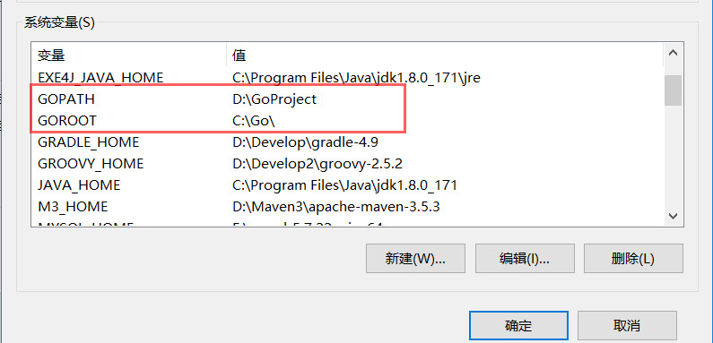

## Go 下载与安装

---

## 配置环境变量

#### 配置 GOROOT 和 GOPATH

---

#### GOROOT 配置

- Go 语言安装包的安装路径

- 放置 Go 的标准库和工具链

---

#### GOPATH 配置

- 放置第三方代码和自己的工具链（可自己创建目录位置并配置上）

- 自己开发的代码需要放在 GOPATH 下的 src 目录

---

#### GOPATH 下需要创建3个子目录

  - src 目录主要存放 Go 的源文件（项目的源代码）

  - bin 目录主要存放可执行文件

  - pkg 目录存放编译好的库文件，主要是 *.a 文件

---

#### go get 命令

`go get` 命令用于下载 Go 依赖的第三方插件和库

`go get` 依赖 Git ，所以需要安装 **Git**

---

#### Go 的常用开发工具

  - [Goland](https://www.jetbrains.com/go/download)
  - [IDEA](https://www.jetbrains.com/idea)（安装 Go 插件）
  - eclipse（安装 Go 插件）
  - VS Code
  - liteIDE
  - sublime

---

上一篇: [Go语言简介](01_Go语言简介.md)   &emsp;&emsp;&emsp;&emsp;&emsp;&emsp; 下一篇: [GO语言第一个应用程序](03_GO语言第一个应用程序.md)
