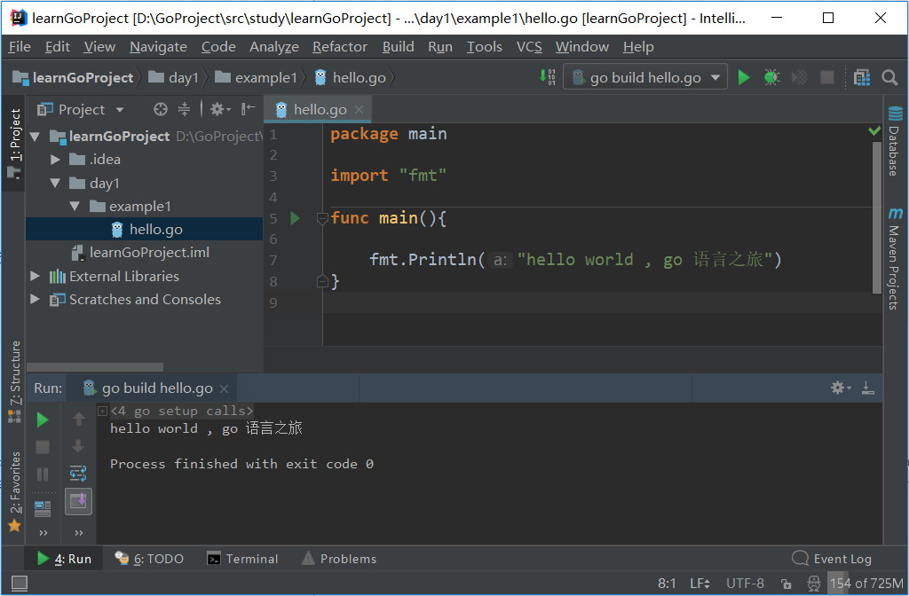
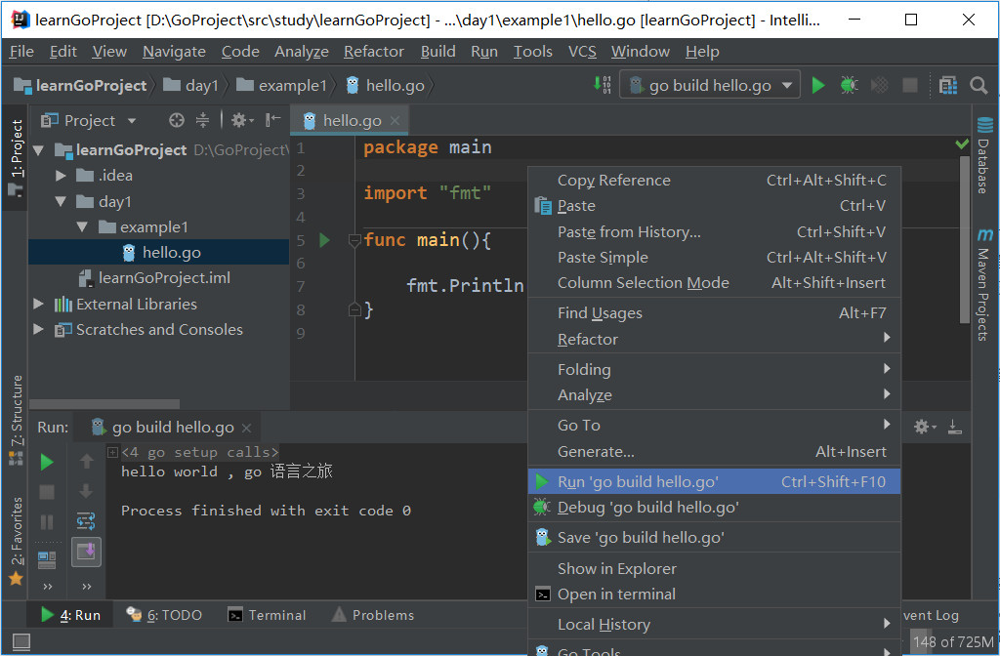
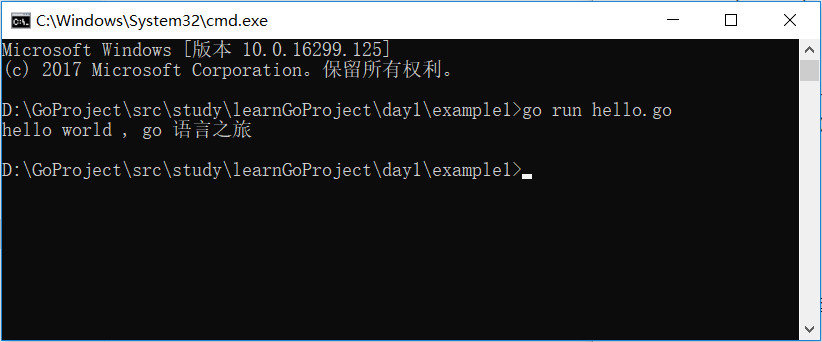
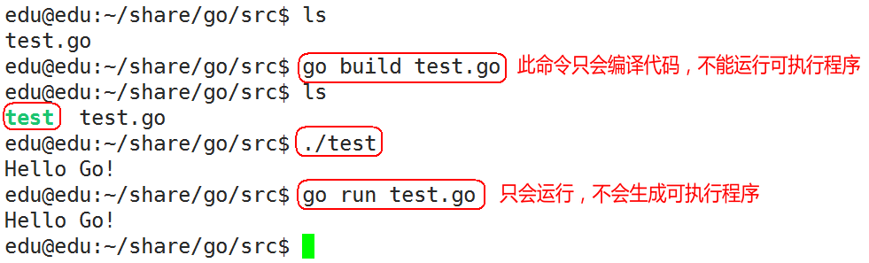

## GO 语言第一个应用程序



```
package main

import "fmt"

func main(){
	fmt.Println("hello world , go 语言之旅")
}
```

## 语法解析

#### `package main`

定义了包名。你必须在源文件中非注释的第一行指明这个文件属于哪个包，如：package main。package main表示一个可独立执行的程序，每个 Go 应用程序都包含一个名为 main 的包。

#### ` import "fmt"`

告诉 Go 编译器这个程序需要使用 fmt 包（的函数，或其他元素），fmt 包实现了格式化 IO（输入/输出）的函数。

#### `func main()`

`main()` 是程序开始执行的函数。main 函数是每一个可执行程序所必须包含的，一般来说都是在启动后第一个执行的函数（如果有 init() 函数则会先执行该函数）

#### `fmt.Println(...)`

可以将字符串输出到控制台，并在最后自动增加换行字符 \n。  

```
fmt.Print("hello, world\n")
```
可以得到相同的结果。  

`Print` 和 `Println` 这两个函数也支持使用变量，如：`fmt.Println(arr)`。如果没有特别指定，它们会以默认的打印格式将变量 arr 输出到控制台。

---

## 运行程序

### 方式一：IDE 中运行



### 方式二 ：CMD 命令运行

1. 点击进入 “ GOPATH ”目录下 -> src -> 文件所在工程目录

2. 执行 `go run hello.go`





---

上一篇: [Go语言的安装与开发环境](02_Go语言的安装与开发环境.md)   &emsp;&emsp;&emsp;&emsp;&emsp;&emsp; 下一篇: [go build命令](04_Go_build命令.md)
