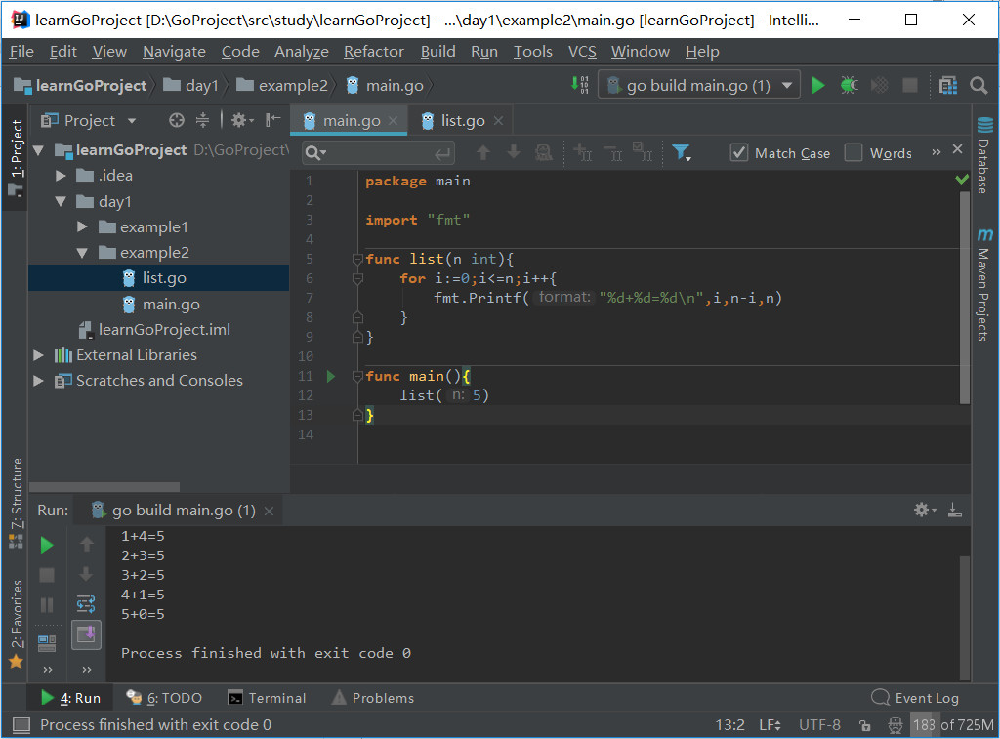
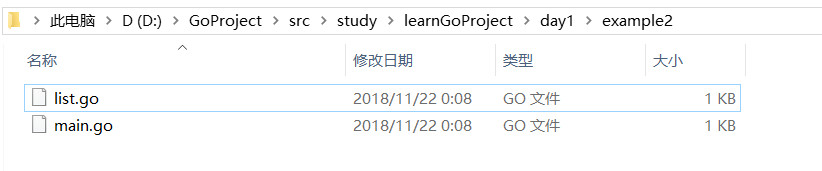
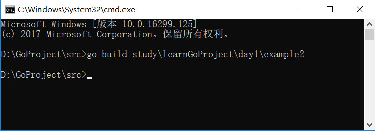
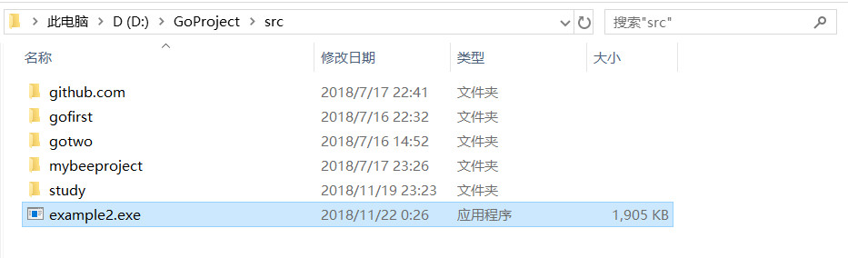
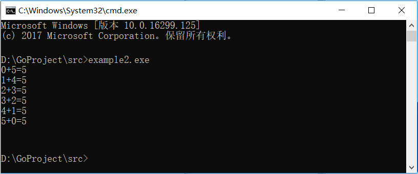

## go build 命令

> 当代码在一个文件中时可以直接在 IDE中 run 或命令行窗口 go run 运行

> 当代码在多个文件中时无法直接运行，需要使用 go build

---

## go build 命令编译

go build 命令要在 GOPATH 或 GOROOT 的  src 目录下开始

### CMD 命令行

文件所在目录：

执行 go build 命令：

%GOPATH% > src 目录下生成文件：

运行生成的文件：

---

上一篇: [GO语言第一个应用程序](03_GO语言第一个应用程序.md)   &emsp;&emsp;&emsp;&emsp;&emsp;&emsp; 下一篇: [GO基础知识](05_GO基础知识.md)
