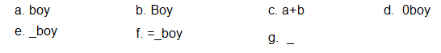

## Go 基础知识


#### Go 语言中的命名

Go 语言中的函数名、变量名、常量名、类型名、语句标号和包名等所有的命名，都遵循一个简单的命名规则：一个名字必须以一个字母（ Unicode 字母）或下划线开头，后面可以跟任意数量的字母、数字或下划线。大写字母和小写字母是不同的：heapSort 和 Heapsort 是两个不同的名字。

#### 关键字

| break        | default         | func       | interface     | select     |
| :------:     | :------:        | :------:   | :------:      | :------:   |
| **case**     | **defer**       | **go**     | **map**       | **struct** |
| **chan**     | **else**        | **goto**   | **package**   | **switch** |
| **const**    | **fallthrough** | **if**     | **range**     | **type**   |
| **continue** | **for**         | **import** | **return**    | **var**    |

Go 语言中类似 `if` 和 `switch` 的关键字有25个(均为小写)。关键字不能用于自定义名字，只能在特定语法结构中使用。

---

#### 内建的常量、类型和函数

> 内建常量

```
true  false  iota  nil
```

> 内建类型

```
int	  |  int8	 |  int16	  |  int32	 |  int64    |
uint     |  uint8    |  uint16     |  uint32    |  uint64   |  uintptr
float32  |  float64  |  complex128 |  complex64 |           |
bool     |  byte     |  rune       |  string    |  error    |
```

> 内建函数

```
make     |  len      |  cap  | new  |  append  |  copy  |  close  |  delete
complex  |  real     |  imag |      |          |        |         |        
panic    |  recover  |       |      |          |        |         |  
```

---

#### Go 标记

Go 程序可以由多个标记组成，可以使关键字，标识符，常量，字符串，符号

---

#### 行分隔符

在 Go 程序中，一行代表一个语句结束。每个语句不需要像 C 家族中的其它语言一样以分号 `;` 结尾，因为这些工作都将由 Go 编译器自动完成。

---

#### Go 文件名

所有 Go 源码文件以 `.go` 结尾

---

#### 标识符

- 标识符以字母或下划线开头，大小写敏感

- `_` 下划线是特殊标识符，用来忽略结果

**例如：**



---

## Go 程序的一般结构


```
package main

import "fmt"

func main(){
	fmt.Println("hello world , go 语言之旅")
}
```

1. Go 程序是通过 `package` 来组织的，只有 `package` 名称为 main 的包可以包含 `main()` 函数，一个可执行的程序 有且只有一个 `main` 包

2. 任何一个代码文件隶属于一个包

3. 通过 `import` 关键字来导入其它非 main 包

  ```
  import("fmt")
  import("os")

  通常写成：
  import(
      "fmt"
      "os"
    )
  ```

4. 通过 `func` 关键字声明函数
  - 同一个包中函数，直接调用
  - 不同包中函数，通过 “包名 + 点 + 函数名调用”

  ```
  func main(){
    fmt.Println("hello world , go 语言之旅")
  }
  ```

5. 通过 `const` 关键字来进行常量定义

6. 通过在函数体外使用 `var` 关键字来进行全局变量的声明和赋值

7. 通过 `type` 关键字来进行结构体和接口声明

8. 包访问权限规则：

  - 函数名首字符大写即为：**public**
  - 函数名首字符小写即为：**private** ，包外包不能访问

---

上一篇: [go build命令](04_Go_build命令.md) &emsp;&emsp;&emsp;&emsp;&emsp;&emsp; 下一篇: [GO基本类型](06_GO基本类型.md)
