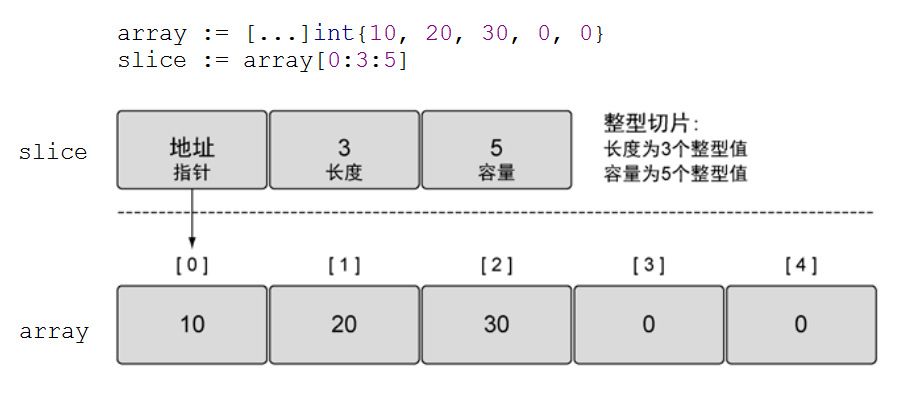
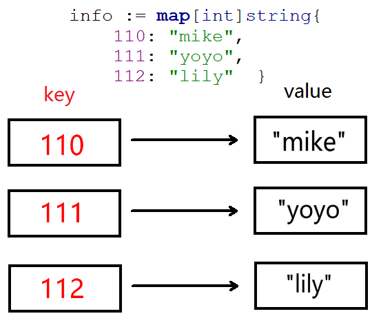
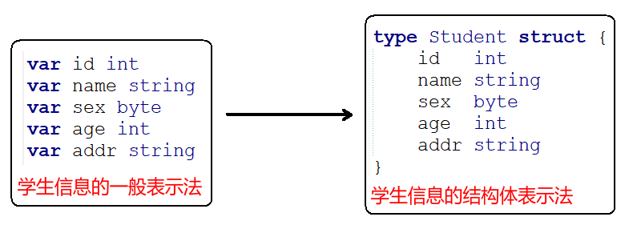
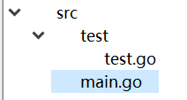

# 复合类型

## 分类

 | 类型 | 名称 | 长度 | 默认值 | 说明 |
 | ---- | ---- | ---- | ---- | ---- |
 | pointer	| 指针		| | nil	| |
 | array	  | 数组		| | 0	  | |
 | slice	  | 切片 		| | nil	| 引⽤类型 |
 | map	    | 字典		| | nil	| 引⽤类型 |
 | struct	  | 结构体	 | | | &ensp; |

---

 ## 指针

 指针是一个代表着某个内存地址的值。这个内存地址往往是在内存中存储的另一个变量的值的起始位置。Go 语言对指针的支持介于 Java 语言和 C/C++ 语言之间，它既没有想 Java 语言那样取消了代码对指针的直接操作的能力，也避免了 C/C++ 语言中由于对指针的滥用而造成的安全和可靠性问题。


 #### 基本操作

Go语言虽然保留了指针，但与其它编程语言不同的是：

- 默认值 `nil`，没有 `NULL` 常量

- 操作符 "`&`" 取变量地址， "`*`" 通过指针访问目标对象

- 不支持指针运算，不支持 "`->`" 运算符，直接⽤ "`.`" 访问目标成员

```
func main() {
    var a int = 10              //声明一个变量，同时初始化
    fmt.Printf("&a = %p\n", &a) //操作符 "&" 取变量地址

    var p *int = nil            //声明一个变量p, 类型为 *int, 指针类型
    p = &a
    fmt.Printf("p = %p\n", p)
    fmt.Printf("a = %d, *p = %d\n", a, *p)

    *p = 111                    //*p操作指针所指向的内存，即为a
    fmt.Printf("a = %d, *p = %d\n", a, *p)
}
```


#### new 函数

表达式 `new(T)` 将创建一个 `T` 类型的匿名变量，所做的是为 `T` 类型的新值分配并清零一块内存空间，然后将这块内存空间的地址作为结果返回，而这个结果就是指向这个新的 `T` 类型值的指针值，返回的指针类型为 `*T`。

```
func main() {
    var p1 *int
    p1 = new(int)              //p1为*int 类型, 指向匿名的int变量
    fmt.Println("*p1 = ", *p1) //*p1 =  0

    p2 := new(int) //p2为*int 类型, 指向匿名的int变量
    *p2 = 111
    fmt.Println("*p2 = ", *p2) //*p1 =  111
}
```

我们只需使用 `new()` 函数，无需担心其内存的生命周期或怎样将其删除，因为 Go 语言的内存管理系统会帮我们打理一切。


#### 指针做函数参数

```
func swap01(a, b int) {
    a, b = b, a
    fmt.Printf("swap01 a = %d, b = %d\n", a, b)
}

func swap02(x, y *int) {
    *x, *y = *y, *x
}

func main() {
    a := 10
    b := 20

    //swap01(a, b) //值传递
    swap02(&a, &b) //变量地址传递
    fmt.Printf("a = %d, b = %d\n", a, b)
}
```

---

## 数组

数组是指一系列同一类型数据的集合。数组中包含的每个数据被称为数组元素（element），一个数组包含的元素个数被称为数组的长度。

数组⻓度必须是常量，且是类型的组成部分。 [2]int 和 [3]int 是不同类型。

```
var n int = 10
var a [n]int  //err, non-constant array bound n
var b [10]int //ok
```

#### 操作数组

数组的每个元素可以通过索引下标来访问，索引下标的范围是从0开始到数组长度减1的位置。

```
var a [10]int
for i := 0; i < 10; i++ {
    a[i] = i + 1
    fmt.Printf("a[%d] = %d\n", i, a[i])
}

//range具有两个返回值，第一个返回值是元素的数组下标，第二个返回值是元素的值
for i, v := range a {
    fmt.Println("a[", i, "]=", v)
}
```

内置函数 len(长度) 和 cap(容量) 都返回数组⻓度 (元素数量)：

```
a := [10]int{}
fmt.Println(len(a), cap(a))//10 10
```

初始化：

```
a := [3]int{1, 2}           // 未初始化元素值为 0
b := [...]int{1, 2, 3}      // 通过初始化值确定数组长度
c := [5]int{2: 100, 4: 200} // 通过索引号初始化元素，未初始化元素值为 0
fmt.Println(a, b, c)        //[1 2 0] [1 2 3] [0 0 100 0 200]

//支持多维数组
d := [4][2]int{{10, 11}, {20, 21}, {30, 31}, {40, 41}}
e := [...][2]int{{10, 11}, {20, 21}, {30, 31}, {40, 41}} //第二维不能写"..."
f := [4][2]int{1: {20, 21}, 3: {40, 41}}
g := [4][2]int{1: {0: 20}, 3: {1: 41}}
fmt.Println(d, e, f, g)
```

相同类型的数组之间可以使用 == 或 != 进行比较，但不可以使用 < 或 >，也可以相互赋值：

```
a := [3]int{1, 2, 3}
b := [3]int{1, 2, 3}
c := [3]int{1, 2}
fmt.Println(a == b, b == c) //true false

var d [3]int
d = a
fmt.Println(d) //[1 2 3]
```

#### 在函数间传递数组

根据内存和性能来看，在函数间传递数组是一个开销很大的操作。在函数之间传递变量时，总是以值的方式传递的。如果这个变量是一个数组，意味着整个数组，不管有多长，都会完整复制，并传递给函数。

```
func modify(array [5]int) {
    array[0] = 10 // 试图修改数组的第一个元素
    //In modify(), array values: [10 2 3 4 5]
    fmt.Println("In modify(), array values:", array)
}

func main() {
    array := [5]int{1, 2, 3, 4, 5} // 定义并初始化一个数组
    modify(array)                  // 传递给一个函数，并试图在函数体内修改这个数组内容
    //In main(), array values: [1 2 3 4 5]
    fmt.Println("In main(), array values:", array)
}
```

> **数组指针做函数参数：**

```
func modify(array *[5]int) {
    (*array)[0] = 10
    //In modify(), array values: [10 2 3 4 5]
    fmt.Println("In modify(), array values:", *array)
}

func main() {
    array := [5]int{1, 2, 3, 4, 5} // 定义并初始化一个数组
    modify(&array)                 // 数组指针
    //In main(), array values: [10 2 3 4 5]
    fmt.Println("In main(), array values:", array)
}
```

---

## slice 切片

数组的长度在定义之后无法再次修改；数组是值类型，每次传递都将产生一份副本。显然这种数据结构无法完全满足开发者的真实需求。Go 语言提供了数组切片（slice）来弥补数组的不足。

切片并不是数组或数组指针，它通过内部指针和相关属性引⽤数组⽚段，以实现变⻓⽅案。

slice 并不是真正意义上的动态数组，而是一个引用类型。slice 总是指向一个底层 array，slice 的声明也可以像 array 一样，只是不需要长度。



#### 切片的创建和初始化

slice 和数组的区别：声明数组时，方括号内写明了数组的长度或使用`...`自动计算长度，而声明 slice 时，方括号内没有任何字符。

```
var s1 []int //声明切片和声明array一样，只是少了长度，此为空(nil)切片
s2 := []int{}

//make([]T, length, capacity) //capacity省略，则和length的值相同
var s3 []int = make([]int, 0)
s4 := make([]int, 0, 0)

s5 := []int{1, 2, 3} //创建切片并初始化
```

**<font color=red>注意：</font>** make 只能创建 slice、map 和 channel，并且返回一个有初始值(非零)。

---

### 切片的操作

#### 切片截取

| 操作 | 含义 |
| :----: | ----|
| **s[n]**	     | 切片s中索引位置为n的项 |
| **s[:]**	     | 从切片s的索引位置0到len(s)-1处所获得的切片 |
| **s[low:]**	    | 从切片s的索引位置low到len(s)-1处所获得的切片 |
| **s[:high]**	 | 从切片s的索引位置0到high处所获得的切片，len=high |
| **s[low:high]**	| 从切片s的索引位置low到high处所获得的切片，len=high-low
| **s[low:high:max]**	| 从切片s的索引位置low到high处所获得的切片，len=high-low，cap=max-low
| **len(s)**	| 切片s的长度，总是<=cap(s) |
| **cap(s)**	| 切片s的容量，总是>=len(s) |

---

> 示例说明：

```
array := []int{0, 1, 2, 3, 4, 5, 6, 7, 8, 9}
```

```
操作         |    结果                  | len	| cap	|  说明
---------------------------------------------------------------------------
array[:6:8]  |  [0 1 2 3 4 5]          |  6	 |  8	 |  省略 low
array[5:]    |  [5 6 7 8 9]            |  5	 |  5	 |  省略 high、 max
array[:3]    |  [0 1 2]                |  3	 |  10	|  省略 high、 max
array[:]     |  [0 1 2 3 4 5 6 7 8 9]  |  10    |  10	|  全部省略
```

#### 切片和底层数组关系

```
s := []int{0, 1, 2, 3, 4, 5, 6, 7, 8, 9}

s1 := s[2:5]       //[2 3 4]
s1[2] = 100        //修改切片某个元素改变底层数组
fmt.Println(s1, s) //[2 3 100] [0 1 2 3 100 5 6 7 8 9]

s2 := s1[2:6]   // 新切片依旧指向原底层数组 [100 5 6 7]
s2[3] = 200
fmt.Println(s2) //[100 5 6 200]

fmt.Println(s)  //[0 1 2 3 100 5 6 200 8 9]
```

#### 内建函数

> **append 函数**

append 函数向 slice 尾部添加数据，返回新的 slice 对象：

```
var s1 []int             //创建nil切换
//s1 := make([]int, 0)
s1 = append(s1, 1)       //追加1个元素
s1 = append(s1, 2, 3)    //追加2个元素
s1 = append(s1, 4, 5, 6) //追加3个元素
fmt.Println(s1)          //[1 2 3 4 5 6]

s2 := make([]int, 5)
s2 = append(s2, 6)
fmt.Println(s2)          //[0 0 0 0 0 6]

s3 := []int{1, 2, 3}
s3 = append(s3, 4, 5)
fmt.Println(s3)          //[1 2 3 4 5]
```

append 函数会智能地底层数组的容量增长，一旦超过原底层数组容量，通常以2倍容量重新分配底层数组，并复制原来的数据：

```
func main() {
    s := make([]int, 0, 1)
    c := cap(s)
    for i := 0; i < 50; i++ {
        s = append(s, i)
        if n := cap(s); n > c {
            fmt.Printf("cap: %d -> %d\n", c, n)
            c = n
        }
    }
    /*
        cap: 1 -> 2
        cap: 2 -> 4
        cap: 4 -> 8
        cap: 8 -> 16
        cap: 16 -> 32
        cap: 32 -> 64
    */
}
```

> **copy 函数**

函数 copy 在两个 slice 间复制数据，复制⻓度以 len 小的为准，两个 slice 可指向同⼀底层数组。

```
data := [...]int{0, 1, 2, 3, 4, 5, 6, 7, 8, 9}
s1 := data[8:]    //{8, 9}
s2 := data[:5]    //{0, 1, 2, 3, 4}
copy(s2, s1)      // dst:s2, src:s1

fmt.Println(s2)   //[8 9 2 3 4]
fmt.Println(data) //[8 9 2 3 4 5 6 7 8 9]
```

#### 切片做函数参数

```
func test(s []int) { //切片做函数参数
    s[0] = -1
    fmt.Println("test : ")
    for i, v := range s {
        fmt.Printf("s[%d]=%d, ", i, v)
        //s[0]=-1, s[1]=1, s[2]=2, s[3]=3, s[4]=4, s[5]=5, s[6]=6, s[7]=7, s[8]=8, s[9]=9,
    }
    fmt.Println("\n")
}

func main() {
    slice := []int{0, 1, 2, 3, 4, 5, 6, 7, 8, 9}
    test(slice)

    fmt.Println("main : ")
    for i, v := range slice {
        fmt.Printf("slice[%d]=%d, ", i, v)
        //slice[0]=-1, slice[1]=1, slice[2]=2, slice[3]=3, slice[4]=4, slice[5]=5, slice[6]=6, slice[7]=7, slice[8]=8, slice[9]=9,
    }
    fmt.Println("\n")
}
```

---

## map

Go 语言中的 map (映射、字典)是一种内置的数据结构，它是一个无序的 key—value 对的集合，比如以身份证号作为唯一键来标识一个人的信息。



map格式为：

```
map[keyType]valueType
```

在一个 map 里所有的键都是唯一的，而且必须是支持 == 和 != 操作符的类型，切片、函数以及包含切片的结构类型这些类型由于具有引用语义，不能作为映射的键，使用这些类型会造成编译错误：

map 值可以是任意类型，没有限制。map 里所有键的数据类型必须是相同的，值也必须如何，但键和值的数据类型可以不相同。

<font color=red>注意：</font> map 是无序的，我们无法决定它的返回顺序，所以，每次打印结果的顺利有可能不同。

#### map 的创建

```
var m1 map[int]string  //只是声明一个map，没有初始化, 此为空(nil)map
fmt.Println(m1 == nil) //true
//m1[1] = "mike" //err, panic: assignment to entry in nil map

//m2, m3的创建方法是等价的
m2 := map[int]string{}
m3 := make(map[int]string)
fmt.Println(m2, m3)            //map[] map[]

m4 := make(map[int]string, 10) //第2个参数指定容量
fmt.Println(m4)                //map[]
```

#### 初始化

```
//1、定义同时初始化
var m1 map[int]string = map[int]string{1: "mike", 2: "yoyo"}
fmt.Println(m1)  //map[1:mike 2:yoyo]

//2、自动推导类型 :=
m2 := map[int]string{1: "mike", 2: "yoyo"}
fmt.Println(m2)
```

#### 常用操作

> 赋值

```
m1 := map[int]string{1: "mike", 2: "yoyo"}
m1[1] = "xxx"   //修改
m1[3] = "lily"  //追加， go底层会自动为map分配空间
fmt.Println(m1) //map[1:xxx 2:yoyo 3:lily]

m2 := make(map[int]string, 10) //创建map
m2[0] = "aaa"
m2[1] = "bbb"
fmt.Println(m2)           //map[0:aaa 1:bbb]
fmt.Println(m2[0], m2[1]) //aaa bbb
```

> 遍历

```
m1 := map[int]string{1: "mike", 2: "yoyo"}
//迭代遍历1，第一个返回值是key，第二个返回值是value
for k, v := range m1 {
    fmt.Printf("%d ----> %s\n", k, v)
    //1 ----> mike
    //2 ----> yoyo
}

//迭代遍历2，第一个返回值是key，第二个返回值是value（可省略）
for k := range m1 {
    fmt.Printf("%d ----> %s\n", k, m1[k])
    //1 ----> mike
    //2 ----> yoyo
}

//判断某个key所对应的value是否存在, 第一个返回值是value(如果存在的话)
value, ok := m1[1]
fmt.Println("value = ", value, ", ok = ", ok) //value =  mike , ok =  true

value2, ok2 := m1[3]
fmt.Println("value2 = ", value2, ", ok2 = ", ok2) //value2 =   , ok2 =  false
```

> 删除

```
m1 := map[int]string{1: "mike", 2: "yoyo", 3: "lily"}
//迭代遍历1，第一个返回值是key，第二个返回值是value
for k, v := range m1 {
    fmt.Printf("%d ----> %s\n", k, v)
    //1 ----> mike
    //2 ----> yoyo
    //3 ----> lily
}

delete(m1, 2) //删除key值为2的map

for k, v := range m1 {
    fmt.Printf("%d ----> %s\n", k, v)
    //1 ----> mike
    //3 ----> lily
}
```

#### map 做函数参数

在函数间传递映射并不会制造出该映射的一个副本，不是值传递，而是<font color=red>引用传递</font>：

```
func DeleteMap(m map[int]string, key int) {
    delete(m, key) //删除key值为3的map

    for k, v := range m {
        fmt.Printf("len(m)=%d, %d ----> %s\n", len(m), k, v)
        //len(m)=2, 1 ----> mike
        //len(m)=2, 3 ----> lily
    }
}

func main() {
    m := map[int]string{1: "mike", 2: "yoyo", 3: "lily"}

    DeleteMap(m, 2) //删除key值为3的map

    for k, v := range m {
        fmt.Printf("len(m)=%d, %d ----> %s\n", len(m), k, v)
        //len(m)=2, 1 ----> mike
        //len(m)=2, 3 ----> lily
    }
}
```

---

## struct 结构体

#### 结构体类型

有时我们需要将不同类型的数据组合成一个有机的整体，如：一个学生有学号/姓名/性别/年龄/地址等属性。显然单独定义以上变量比较繁琐，数据不便于管理。



结构体是一种聚合的数据类型，它是由一系列具有相同类型或不同类型的数据构成的数据集合。每个数据称为结构体的成员。

#### 结构体初始化

> 普通变量

```
type Student struct {
    id   int
    name string
    sex  byte
    age  int
    addr string
}

func main() {
    //1、顺序初始化，必须每个成员都初始化
    var s1 Student = Student{1, "mike", 'm', 18, "sz"}
    s2 := Student{2, "yoyo", 'f', 20, "sz"}
    //s3 := Student{2, "tom", 'm', 20} //err, too few values in struct initializer

    //2、指定初始化某个成员，没有初始化的成员为零值
    s4 := Student{id: 2, name: "lily"}
}
```

> 指针变量

```
type Student struct {
    id   int
    name string
    sex  byte
    age  int
    addr string
}

func main() {
    var s5 *Student = &Student{3, "xiaoming", 'm', 16, "bj"}
    s6 := &Student{4, "rocco", 'm', 3, "sh"}
}
```

#### 结构体成员的使用

> 普通变量

```
//===============结构体变量为普通变量
//1、打印成员
var s1 Student = Student{1, "mike", 'm', 18, "sz"}
//结果：id = 1, name = mike, sex = m, age = 18, addr = sz
fmt.Printf("id = %d, name = %s, sex = %c, age = %d, addr = %s\n", s1.id, s1.name, s1.sex, s1.age, s1.addr)

//2、成员变量赋值
var s2 Student
s2.id = 2
s2.name = "yoyo"
s2.sex = 'f'
s2.age = 16
s2.addr = "guangzhou"
fmt.Println(s2) //{2 yoyo 102 16 guangzhou}
```

#### 指针变量

```
//===============结构体变量为指针变量
//3、先分配空间，再赋值
s3 := new(Student)
s3.id = 3
s3.name = "xxx"
fmt.Println(s3) //&{3 xxx 0 0 }

//4、普通变量和指针变量类型打印
var s4 Student = Student{4, "yyy", 'm', 18, "sz"}
fmt.Printf("s4 = %v, &s4 = %v\n", s4, &s4) //s4 = {4 yyy 109 18 sz}, &s4 = &{4 yyy 109 18 sz}

var p *Student = &s4
//p.成员 和(*p).成员 操作是等价的
p.id = 5
(*p).name = "zzz"
fmt.Println(p, *p, s4) //&{5 zzz 109 18 sz} {5 zzz 109 18 sz} {5 zzz 109 18 sz}
```

#### 结构体比较

如果结构体的全部成员都是可以比较的，那么结构体也是可以比较的，那样的话两个结构体将可以使用 == 或 != 运算符进行比较，但不支持 > 或 < 。

```
func main() {
    s1 := Student{1, "mike", 'm', 18, "sz"}
    s2 := Student{1, "mike", 'm', 18, "sz"}

    fmt.Println("s1 == s2", s1 == s2) //s1 == s2 true
    fmt.Println("s1 != s2", s1 != s2) //s1 != s2 false
}
```

#### 结构体作为函数参数

> 值传递

```
func printStudentValue(tmp Student) {
    tmp.id = 250
    //printStudentValue tmp =  {250 mike 109 18 sz}
    fmt.Println("printStudentValue tmp = ", tmp)
}

func main() {
var s Student = Student{1, "mike", 'm', 18, "sz"}

    printStudentValue(s)        //值传递，形参的修改不会影响到实参
    fmt.Println("main s = ", s) //main s =  {1 mike 109 18 sz}
}
```

> 引用传递

```
func printStudentPointer(p *Student) {
    p.id = 250
    //printStudentPointer p =  &{250 mike 109 18 sz}
    fmt.Println("printStudentPointer p = ", p)
}

func main() {
    var s Student = Student{1, "mike", 'm', 18, "sz"}

    printStudentPointer(&s)     //引用(地址)传递，形参的修改会影响到实参
    fmt.Println("main s = ", s) //main s =  {250 mike 109 18 sz}
}
```

---

#### 可见性

Go 语言对关键字的增加非常吝啬，其中没有 private、 protected、 public 这样的关键字。

要使某个符号对其他包（package）可见（即可以访问），需要将该符号定义为以 大写字母开头。

目录结构：



> test.go 示例代码如下：

```
//test.go
package test

//student01只能在本文件件引用，因为首字母小写
type student01 struct {
    Id   int
    Name string
}

//Student02可以在任意文件引用，因为首字母大写
type Student02 struct {
    Id   int
    name string
}
```

> main.go 示例代码如下：

```
// main.go
package main

import (
    "fmt"
    "test" //导入test包
)

func main() {
    //s1 := test.student01{1, "mike"} //err, cannot refer to unexported name test.student01

    //err, implicit assignment of unexported field 'name' in test.Student02 literal
    //s2 := test.Student02{2, "yoyo"}
    //fmt.Println(s2)

    var s3 test.Student02 //声明变量
    s3.Id = 1             //ok
    //s3.name = "mike"  //err, s3.name undefined (cannot refer to unexported field or method name)
    fmt.Println(s3)
}
```


---


上一篇: [GO](10_工作空间.md)   &emsp;&emsp;&emsp;&emsp;&emsp;&emsp; 下一篇: [GO](12_面向对象编程.md)
