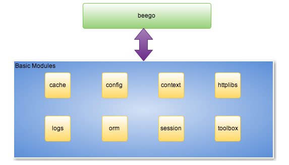
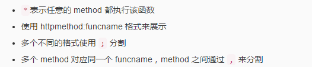
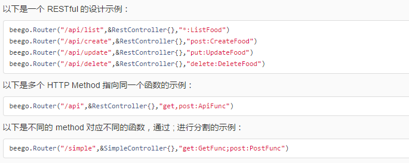
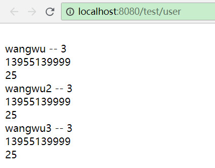

# Beego 框架

## 1. Beego 简介

beego 是一个快速开发 Go 应用的 HTTP 框架，他可以用来快速开发 API、Web 及后端服务等各种应用，是一个 RESTful 的框架，主要设计灵感来源于 tornado、sinatra 和 flask 这三个框架，但是结合了 Go 本身的一些特性（interface、struct 嵌入等）而设计的一个框架。

### 1.1 Beego 的架构



### 1.2 Beego 的执行逻辑

beego 是基于这些模块构建的，那么他的执行逻辑是怎么样的呢？beego 是一个典型的 MVC 架构，他的执行逻辑如下图所示：


### 1.3 beego 项目结构

一般的 beego 项目的目录如下所示：

```
  ├─conf        配置
  ├─controllers 控制层(C)
  ├── main.go   入口文件
  ├─models      模型层(M)
  ├─routers     路由
  ├─static      静态资源
  │  ├─css
  │  ├─img
  │  └─js
  ├─tests       测试
  └─views       视图层(V)
```

---

## 2. beego 快速开发

### 2.1 beego 的安装

##### 1. 前期准备工作

- go环境安装好 （goroot，gopath）

- 本地git安装好

- goland vscode 工具

##### 2. beego 框架的源码

```
go get github.com/astaxie/beego
```

beego 工具

```
 go get github.com/beego/bee
```

安装完之后，bee 可执行文件默认存放在 `$GOPATH/bin` 里面，所以您需要把 `$GOPATH/bin` 添加到您的环境变量中.

##### 3. 把bee 添加到系统环境变量里面 path

---

### 2.2 new 命令

new 命令是新建一个 Web 项目，我们在命令行下执行 `bee new <项目名>` 就可以创建一个新的项目。但是注意该命令必须在 `$GOPATH/src` 下执行

```
bee new myproject
```

---

### 2.3 api 命令

上面的 new 命令是用来新建 Web 项目，不过很多用户使用 beego 来开发 API 应用。所以这个 api 命令就是用来创建 API 应用

```
bee api apiproject
```

> api 项目结构

```
├─conf
├─controllers
├─models
├─routers
└─tests
```

---

### 2.4 run 命令

我们在开发 Go 项目的时候最大的问题是经常需要自己手动去编译再运行，`bee run` 命令是监控 beego 的项目，通过 fsnotify 监控文件系统

> 在 beego 项目的目录下执行此命令

```
bee run
```

---

## 3. beego 的控制层

### 3.1 参数配置

beego 默认会解析当前应用下的 `conf/app.conf` 文件。

> beego 的系统应用配置

```
appname = myproject
httpport = 8080
runmode = dev prod test
```

直接通过 `beego.BConfig.AppName="beepkg"` 这样来修改，和上面的配置效果一样，只是一个在代码里面写死了，而配置文件就会显得更加灵活。

> beego 的应用参数配置

```
mysqluser = "root"
mysqlpass = "rootpass"
mysqlurls = "127.0.0.1"
mysqldb   = "beego"
```

应用配置 `beego.AppConfig.String("mysqluser")`

> beego 动态选择

```
[dev]
httpport = 8080
[test]
httpport = 8081
[prod]
httpport = 8082
```

---

### 3.2 beego 的路由配置

##### 固定路由

固定路由也就是全匹配的路由，如下所示

```
beego.Router("/", &controllers.MainController{})
beego.Router("/admin", &admin.UserController{})
beego.Router("/admin/index", &admin.ArticleController{})
beego.Router("/admin/addpkg", &admin.AddController{})
```

##### 基础路由

基本 GET 路由

```
beego.Get("/",func(ctx *context.Context){
     ctx.Output.Body([]byte("hello world"))
})
```

基本 POST 路由

```
beego.Post("/alice",func(ctx *context.Context){
     ctx.Output.Body([]byte("bob"))
})
```

注册一个可以响应任何 HTTP 的路由

```
beego.Any("/foo",func(ctx *context.Context){
     ctx.Output.Body([]byte("bar"))
})
```

##### 自定义方法及 RESTful 规则

（请求的 method 和函数名一致，例如 GET 请求执行 Get 函数，POST 请求执行 Post 函数），如果用户期望自定义函数名，那么可以使用如下方式：

```
beego.Router("/",&IndexController{},"*:Index")
```





##### 测试：

```
func (c *MainController) Post(){
  c.Ctx.WriteString("this is method post!")
}

curl -d "a=1" "http://127.0.0.1:8080"
```

---

### 3.3 控制器

基于 beego 的 Controller 设计，只需要匿名组合 beego.Controller 就可以了，如下所示：

```
type xxxController struct {
    beego.Controller
}
```

beego.Controller 实现了接口 beego.ControllerInterface，beego.ControllerInterface 定义了如下函数：

```
Init(ct *context.Context, childName string, app interface{})
Prepare()
Get()
Post()
Delete()
Put()
Head()
Patch()
Options()
Finish()
```

示例代码：

```
type MainController struct {
  beego.Controller
}

func (c *MainController) Get() {
  c.Data["Website"] = "beego.me"
  c.Data["Email"] = "astaxie@gmail.com"
  c.TplName = "index.tpl"
}
```

---

### 案例：自己写一个 Test 控制器，里面有 Get 方法，返回第一个 Beego 测试案例

> 写一个控制器

```
import (
  "github.com/astaxie/beego"
)

type TestController struct {
  beego.Controller
}

func (c *TestController) Get(){
  c.Ctx.WriteString("这是第一个beego 控制器小测试")
}

func (c *TestController) Post(){
  c.Ctx.WriteString("这是第一个beego 控制器Post方法")
}
```

> 写一个路由

```
func init() {
    beego.Router("/", &controllers.MainController{},"get:Get;post:Test")
    beego.Router("/test", &controllers.TestController{},"get:Get;post:Post")

}
```

> 开启

```
bee run
```

> git 的 curl 去请求

```
curl -d 'id=1' '127.0.0.1:8082/test' post

curl   '127.0.0.1:8082/test'  get
```

---

### 3.4 请求参数处理

我们经常需要获取用户传递的数据，包括 Get、POST 等方式的请求，beego 里面会自动解析这些数据，你可以通过如下方式获取数据：

```
GetString(key string) string
GetStrings(key string) []string
GetInt(key string) (int64, error)
GetBool(key string) (bool, error)
GetFloat(key string) (float64, error)
```

使用例子如下：

```
func (this *MainController) Post() {
    jsoninfo := this.GetString("jsoninfo")
    if jsoninfo == "" {
        this.Ctx.WriteString("jsoninfo is empty")
        return
    }
}
```

如果你需要的数据可能是其他类型的，例如是 int 类型而不是 int64，那么你需要这样处理：

```
func (this *MainController) Post() {
    id := this.Input().Get("id")
    intid, err := strconv.Atoi(id)
}
```

---

### 3.5 直接解析到 struct

如果要把表单里的内容赋值到一个 struct 里，除了用上面的方法一个一个获取再赋值外，beego 提供了通过另外一个更便捷的方式，就是通过 struct 的字段名或 tag 与表单字段对应直接解析到 struct。

定义 struct：

```
type user struct {
    Id    int         `form:"-"`
    Name  interface{} `form:"username"`
    Age   int         `form:"age"`
    Email string
}
```

表单：

```
<form id="user">
    名字：<input name="username" type="text" />
    年龄：<input name="age" type="text" />
    邮箱：<input name="Email" type="text" />
    <input type="submit" value="提交" />
</form>
```

Controller 里解析：

```
func (this *MainController) Post() {
    u := user{}
    if err := this.ParseForm(&u); err != nil {
        //handle error
    }
}
```

**注意：**

StructTag form 的定义和 renderform 方法 共用一个标签

定义 struct 时，字段名后如果有 form 这个 tag，则会以把 form 表单里的 name 和 tag 的名称一样的字段赋值给这个字段，否则就会把 form 表单里与字段名一样的表单内容赋值给这个字段。如上面例子中，会把表单中的 username 和 age 分别赋值给 user 里的 Name 和 Age 字段，而 Email 里的内容则会赋给 Email 这个字段。

调用 Controller ParseForm 这个方法的时候，传入的参数必须为一个 struct 的指针，否则对 struct 的赋值不会成功并返回 xx must be a struct pointer 的错误。

如果要忽略一个字段，有两种办法，一是：字段名小写开头，二是：form 标签的值设置为 `-`

---

## 4. beego 的 model 层

### 4.1 模型 Models 介绍

beego ORM 是一个强大的 Go 语言 ORM 框架。她的灵感主要来自 Django ORM 和 SQLAlchemy。

已支持数据库驱动：

```
MySQL：github.com/go-sql-driver/mysql
PostgreSQL：github.com/lib/pq
Sqlite3：github.com/mattn/go-sqlite3
```

ORM 特性：

```
支持 Go 的所有类型存储
轻松上手，采用简单的 CRUD 风格
自动 Join 关联表
跨数据库兼容查询
允许直接使用 SQL 查询／映射
严格完整的测试保证 ORM 的稳定与健壮
更多特性请在文档中自行品读。
```

安装 ORM：

```
go get github.com/astaxie/beego/orm
```

接口:

```
type Ormer interface {
Read(interface{}, …string) error
ReadOrCreate(interface{}, string, …string) (bool, int64, error)
Insert(interface{}) (int64, error)
InsertMulti(int, interface{}) (int64, error)
Update(interface{}, …string) (int64, error)
Delete(interface{}) (int64, error)
LoadRelated(interface{}, string, …interface{}) (int64, error)
QueryM2M(interface{}, string) QueryM2Mer
QueryTable(interface{}) QuerySeter
Using(string) error
Begin() error
Commit() error
Rollback() error
Raw(string, …interface{}) RawSeter
Driver() Driver
}
```

---

### 4.2 数据库的设置

将你需要使用的 driver 加入 import 中

```
import (
       _  "github.com/lib/pq"
       _  "github.com/mattn/go-sqlite3"
       _ "github.com/go-sql-driver/mysql" // import your used driver
)
```

注册:

```
orm.RegisterDataBase("default", "mysql", "username:password@tcp(127.0.0.1:3306)/db_name?charset=utf8", 30)

// register model
orm.RegisterModel(new(User))
```

注意点：

```
AuthUser ----> auth_user
Auth_User -->auth__user
DB_AuthUser -->d_b__auth_user
```

---

### 4.3 分层操作

model c  v

---

## 5. beego 的 View 层

### 5.1 简介

**基本语法: **

- go 统一使用了 `{{` 和 `}}` 作为左右标签，没有其他的标签符号。如果你想要修改为其他符号，可以修改配置文件

- 使用 `.` 来访问当前位置的上下文

- 使用 `$` 来引用当前模板根级的上下文

**简单的例子：**

> 路由 router.go

```
package routers

import (
  "mybeeproject/controllers"
  "github.com/astaxie/beego"
  _ "github.com/go-sql-driver/mysql"
)

func init() {
  beego.Router("/", &controllers.MainController{}, "get:GET;post:Test")
  beego.Router("/test/user", &controllers.TestUserController{}, "get:Get;post:Post")
}
```

> 控制层 controllers

```
package controllers

import (
  "github.com/astaxie/beego"
	"mybeeproject/models"
)

type TestUserController struct {
  beego.Controller
}

func (c *TestUserController) Get() {
  //添加对象
  //user := models.User{Name:"wangwu",Phone:"13955139999",Age:25,Sex:"男"}
  //models.AddUser(&user)
  //c.Ctx.WriteString("call model success")

  //获取所有 user 对象信息
  var users []models.User
  models.ReadUser(&users)

  c.Data["Title"] = "获取所有user信息"
  c.Data["Users"] = Users
  c.Data["len"]   = len(users)

  c.TplName = "test.tpl"
}
```

> model层

```
package models

import (
	"github.com/astaxie/beego/orm"     //操作数据库
	_ "github.com/go-sql-driver/mysql" //mysql 驱动
)

var (
  db orm.Ormer
)

type User struct {
	Id    int64
	Name  string
	Phone string
	Age   int
	Sex   string
}

func init() {
	orm.Debug = true //是否开启调试模式，调试模式下会打印出sql语句
	orm.RegisterDataBase("default", "mysql", "root:123456@tcp(127.0.0.1:3306)/test1?charset=utf8", 30)
	// register model
	orm.RegisterModel(new(User)) //创建一个user_info表 UserInfo
	db = orm.NewOrm()
}

//添加一个对象
func AddUser(user *User) (int64, error) {
	id, err := db.Insert(user)
	return id, err
}

//读取
func ReadUser(users *[]User) {
	qb, _ := orm.NewQueryBuilder("mysql")
	qb.Select("*").From("user")
	sql := qb.String()
	db.Raw(sql).QueryRows(users)
}
```

> 视图层 View

```
<html>
<header>
    <title>{{.Title}}</title>
</header>
<body>
    {{.Appname}} <br>
    {{range .Users}}
            {{.Name}} -- {{$.len}}<br>
            {{.Phone}} <br>
            {{.Age}} <br>
    {{end}}
</body>
</html>
```

> 运行项目，访问的结果



---

## 6. beego 的 config 模块

1）首先初始化一个解析器对象

```
iniconf, err := NewConfig("ini", "testini.conf")
if err != nil {
    t.Fatal(err)
}
```

2）然后通过对象获取数据

```
iniconf.String("appname")
```

##### 解析器对象支持的函数有如下：

```
Set(key, val string) error
String(key string) string
Int(key string) (int, error)
Int64(key string) (int64, error)
Bool(key string) (bool, error)
Float(key string) (float64, error)
DIY(key string) (interface{}, error)
```

---
