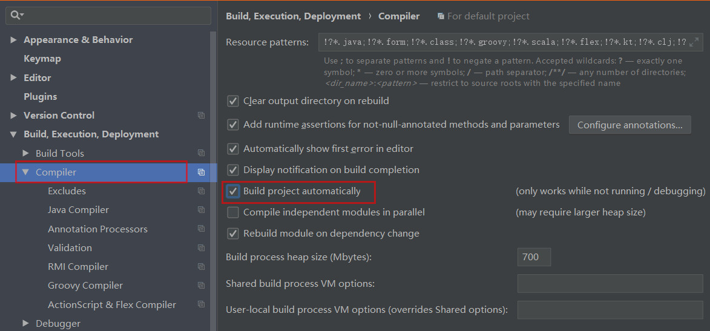
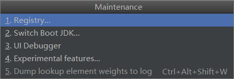
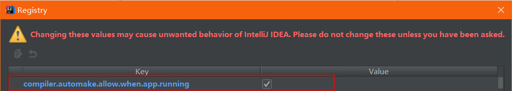

## IDEA 配置

1. 配置 Spring Boot 热部署
2. 配置 Spring Boot 触发热部署

---

### 配置 Spring Boot 热部署

1. pom.xml 添加依赖

```
<dependency>
  <groupId>org.springframework.boot</groupId>
  <artifactId>spring-boot-devtools</artifactId>
</dependency>
```

2. 勾选 `Build project automatically` 配置项



3. 按住快捷键 ctrl + alt + shit + /
4. 选择 Registry 项
5. 勾选 `compiler.automake.allow.when.app.running` 选项





---

### 配置 Spring Boot 触发热部署

> 方式一:

  1. 新建触发文件（任意名字，必须在META-INF文件夹中）

  `resources/META-INF/.trigger`

  2. 修改 Spring Boot 全局配置文件 `application.properties`

    ```
    #热部署触发文件
    spring.devtools.restart.trigger-file=.trigger
    ```

> 经验证 修改文件不在 META-INF文件夹中也能有效，只要在 resources/ 根目录下

---
