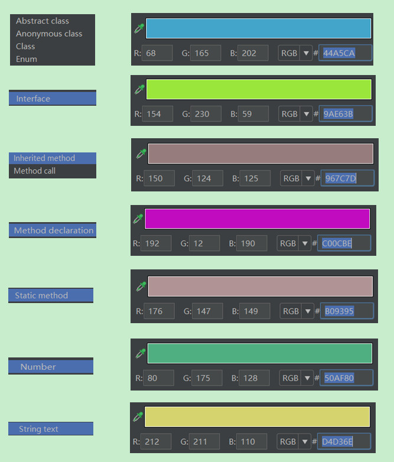

> class fields -> instance field = #31c8c8

instance field

> class fields -> static field = #31c8c8

static field

> methods -> method call = #ff66cc

method call

> variables -> local variable

local variable
