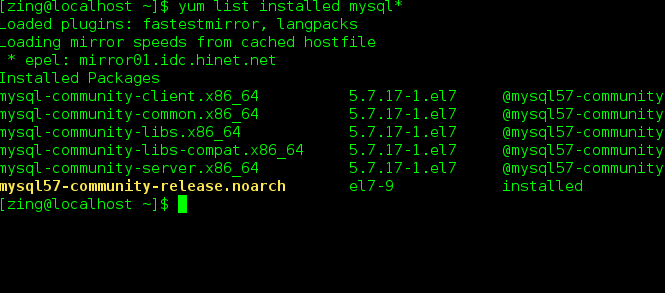

# CentOS7安装MySQL5.7

## 1. 卸载

安装前检测是否安装过 mysql，可以选择是否进行卸载

#### 1.1 yum 方式

```bash
#查看yum是否安装过mysql
yum list installed mysql*
```

如或显示了列表，说明系统中有 MySQL：



yum 根据列表上的名字卸载：

```bash
yum remove mysql-community-client mysql-community-common mysql-community-libs mysql-community-libs-compat mysql-community-server mysql57-community-release

rm -rf /var/lib/mysql  
rm /etc/my.cnf
```

#### 1.2 rpm 方式

rpm 查看安装

```bash
rpm -qa | grep -i mysql
```

rpm 卸载：

```bash
#普通删除模式
rpm -e mysql

#强力删除模式，使用上面命令删除提示有依赖的其它文件，则用该命令进行强力删除
rpm -e --nodeps mysql
```

进行卸载

```bash
rpm -e mysql57-community-release-el7-9.noarch
省略....
rpm -e mysql-community-client-5.7.17-1.el7.x86_64

cd /var/lib/  
rm -rf mysql/
```

#### 1.3 清除卸载残留项

```bash
#查询
whereis mysql

#结果
mysql: /usr/bin/mysql /usr/lib64/mysql /usr/local/mysql /usr/share/mysql /usr/share/man/man1/mysql.1.gz

#删除上面的文件夹
rm -rf /usr/bin/mysql
....
```

#### 1.4 删除配置

```bash
rm –rf /usr/my.cnf
rm -rf /root/.mysql_sercret
```

剩余配置检查，列表显示有则删除

```bash
chkconfig --list | grep -i mysql
chkconfig --del mysqld
```

---

## 2. 安装MySQL

#### 2.1 获取 mysql yum 源

进入 mysql 官网获取 RPM 包下载地址：[https://dev.mysql.com/downloads/repo/yum/](https://dev.mysql.com/downloads/repo/yum/)

或者使用 `wget` 命令获取

```h
wget https://dev.mysql.com/get/mysql57-community-release-el7-11.noarch.rpm
```

#### 2.2 安装软件源

```css
sudo rpm -Uvh platform-and-version-specific-package-name.rpm
```


