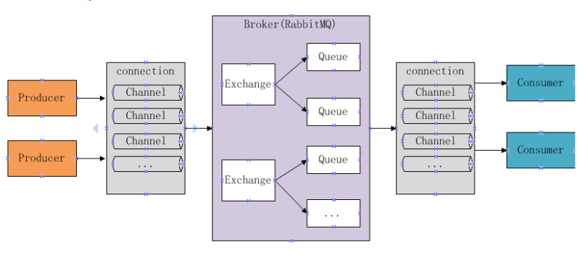

# RabbitMQ 介绍

## 1. RabbitMQ介绍

MQ 全称为 MessageQueue，即消息队列，RabbitMQ 是由 erlang 语言开发，基于AMQP（AdvancedMessageQueue高级消息队列协议）协议实现的消息队列，它是一种应用程序之间的通信方法，消息队列在分布式系统开发中应用非常广泛。

### 开发中消息队列通常有如下应用场景：

1、任务异步处理

将不需要同步处理的并且耗时长的操作由消息队列通知消息接收方进行异步处理。提高了应用程序的响应时间。

2、应用程序解耦合

MQ 相当于一个中介，生产方通过 MQ 与消费方交互，它将应用程序进行解耦合。

市场上还有哪些消息队列？

ActiveMQ，RabbitMQ，ZeroMQ，Kafka，MetaMQ，RocketMQ、Redis。

### 为什么使用RabbitMQ呢？

1、使得简单，功能强大。

2、基于 AMQP 协议。

3、社区活跃，文档完善。

4、高并发性能好，这主要得益于 Erlang 语言。

5、SpringBoot 默认已集成 RabbitMQ

## 2. 相关知识介绍

### AMQP是什么？

AMQP，即 Advanced Message Queuing Protocol,一个提供统一消息服务的应用层标准高级消息队列协议,是应用层协议的一个开放标准,为面向消息的中间件设计。基于此协议的客户端与消息中间件可传递消息，并不受客户端/中间件不同产品，不同的开发语言等条件的限制。Erlang 中的实现有 RabbitMQ 等。

### AMQP核心概念

**Server：** 又称 Broker，接收客户端的连接，实现 AMQP 实体服务

**Connection：** 连接应用程序与 Broker 的网络连接

**Channel：** 网络信道，几乎所有的操作都在 Channel 中进行，Channel 是进行消息读写的通道。客户端可建立多个 Channel，每个 Channel 代表一个会话任务

**Message：** 消息，服务器和应用程序之间传送的数据，由 Properties 和 Body 组成。Properties 可以对消息进行修饰，比如消息的优先级、延迟等高级特性；Body 则就是消息体内容

**Virtual Host：** 虚拟地址，用于进行逻辑隔离，最上层的消息路由。一个 Virtual Host 里面可以由若干个 Exchange 和 Queue，同一个 Virtual Host 里面不能由相同名称的 Exchange 或 Queue

**Exchange：** 交换机，接收消息，根据路由键转发消息到绑定的队列

**Binding：** Exchang 和 Queue 之间的虚拟连接，Binding 中可以包含 routing key

**Routing key：** 一个路由规则，虚拟机可用它来确定如何路由一个特定消息

**Queue：** 也成为 Message Queue，消息队列，保存消息并将他们转发给消费者

### JMS是什么？

JMS 即 Java 消息服务（Java Message Service）应用程序接口，是一个 Java 平台中关于面向消息中间件（MOM）的 API，用于在两个应用程序之间，或分布式系统中发送消息，进行异步通信。Java 消息服务是一个与具体平台无关的 API，绝大多数 MOM 提供商都对 JMS 提供支持。

JMS 是一种与厂商无关的 API，用来访问收发系统消息，它类似于 JDBC(Java Database Connectivity)。这里，JDBC 是可以用来访问许多不同关系数据库的 API，而 JMS 则提供同样与厂商无关的访问方法，以访问消息收发服务。许多厂商都支持 JMS，包括 IBM 的 MQSeries、BEA 的 Weblogic JMS service 和 Progress 的 SonicMQ。 JMS 使您能够通过消息收发服务（有时称为消息中介程序或路由器）从一个 JMS 客户机向另一个 JMS 客户机发送消息。消息是 JMS 中的一种类型对象，由两部分组成：报头和消息主体。报头由路由信息以及有关该消息的元数据组成。消息主体则携带着应用程序的数据或有效负载。根据有效负载的类型来划分，可以将消息分为几种类型，它们分别携带：简单文本(TextMessage)、可序列化的对象 (ObjectMessage)、属性集合 (MapMessage)、字节流 (BytesMessage)、原始值流 (StreamMessage)，还有无有效负载的消息 (Message)。

## 3. RabbitMQ的工作原理

下图是 RabbitMQ 的基本结构：

### 组成部分说明如下：

- Broker：消息队列服务进程，此进程包括两个部分：Exchange 和 Queue。

- Exchange：消息队列交换机，按一定的规则将消息路由转发到某个队列，对消息进行过虑。

- Queue：消息队列，存储消息的队列，消息到达队列并转发给指定的消费方。

- Producer：消息生产者，即生产方客户端，生产方客户端将消息发送到 MQ。

- Consumer：消息消费者，即消费方客户端，接收 MQ 转发的消息。

### 消息发布接收流程：

> -----发送消息-----

1、生产者和 Broker 建立 TCP 连接。

2、生产者和 Broker 建立通道。

3、生产者通过通道消息发送给 Broker，由 Exchange 将消息进行转发。

4、Exchange 将消息转发到指定的 Queue（队列）

> ----接收消息-----

1、消费者和 Broker 建立 TCP 连接

2、消费者和 Broker 建立通道

3、消费者监听指定的 Queue（队列）

4、当有消息到达 Queue 时 Broker 默认将消息推送给消费者。

5、消费者接收到消息。
