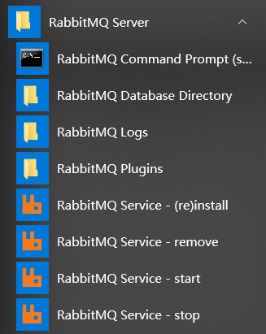

# RabbitMQ下载与安装

## 1. 下载安装 Erlang/OTP

RabbitMQ 由 Erlang 语言开发，Erlang 语言用于并发及分布式系统的开发，在电信领域应用广泛，OTP（OpenTelecomPlatform）作为 Erlang 语言的一部分，包含了很多基于 Erlang 开发的中间件及工具库，`安装 RabbitMQ 需要安装 Erlang/OTP，并保持版本匹配（RabbitMQ的版本需要安装对应版本的Erlang/OTP）`。

对照版本地址：[https://www.rabbitmq.com/which-erlang.html](https://www.rabbitmq.com/which-erlang.html)

1、erlang 下载地址：[http://erlang.org/download/otp_win64_22.0.exe](http://erlang.org/download/otp_win64_22.0.exe)

2、以管理员方式运行安装，默认点击 `下一步` 完成所有安装

3、安装完成，配置 erlang 环境变量：`ERLANG_HOME=D:\ProgramFiles\erl9.3` 在 path 中添加 `%ERLANG_HOME%\bin`

## 2. 下载安装 RabbitMQ

1、下载地址：[https://github.com/rabbitmq/rabbitmq-server/releases/download/v3.7.16/rabbitmq-server-3.7.16.exe](https://github.com/rabbitmq/rabbitmq-server/releases/download/v3.7.16/rabbitmq-server-3.7.16.exe)

2、以管理员方式运行安装，默认点击 `下一步` 完成所有安装

3、启动：安装成功后会自动创建RabbitMQ服务并且启动。

> 启动方式一

完成在开始菜单找到 RabbitMQ 的菜单：



RabbitMQService-install：安装服务

RabbitMQService-remove：删除服务

RabbitMQService-start：启动服务

RabbitMQService-stop：关闭服务

> 启动方式二

如果没有开始菜单则进入安装目录下 sbin 目录 cmd 模式手动启动：

`rabbitmq-service.bat install`：安装服务

`rabbitmq-service.bat stop`：停止服务

`rabbitmq-service.bat start`：启动服务

## 3. 安装 RabbitMQ 插件

安装 rabbitMQ 的管理插件，方便在浏览器端管理 RabbitMQ

管理员身份运行 cmd : 

```shell
rabbitmq-plugins.bat enable rabbitmq_management
```

## 4. 登录RabbitMQ

进入浏览器，输入：[http://localhost:15672](http://localhost:15672)

初始账号和密码：guest 和 guest

## 5. 注意事项

1、安装 erlang 和 rabbitMQ 以管理员身份运行。

2、当卸载重新安装时会出现 RabbitMQ 服务注册失败，此时需要进入注册表清理 erlang 搜索 RabbitMQ、ErlSrv，将对应的项全部删除。
