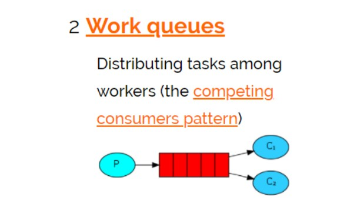

# Work Queues 工作队列模式



work queues（工作队列模式）与入门程序相比，多了一个消费端，两个消费端共同消费同一个队列中的消息。

应用场景：对于任务过重或任务较多情况使用工作队列可以提高任务处理的速度。

测试：

1、使用入门程序，启动多个消费者。

2、生产者发送多个消息。

结果：

1、一条消息只会被一个消费者接收；

2、rabbit采用轮询的方式将消息是平均发送给消费者的；

3、消费者在处理完某条消息后，才会收到下一条消息

## 生产者工程

```java
import com.rabbitmq.client.Channel;
import com.rabbitmq.client.Connection;
import com.rabbitmq.client.ConnectionFactory;

import java.io.IOException;

public class ProDucerTest {
    //队列名称
    private static final String QUEUE = "helloworld";

    public static void main(String[] args) {
        Connection connection = null;
        Channel channel = null;
        try {
            ConnectionFactory factory = new ConnectionFactory();
            factory.setHost("localhost");
            factory.setPort(5672);
            factory.setUsername("guest");
            factory.setPassword("guest");
            factory.setVirtualHost("/");
            connection = factory.newConnection();
            //创建与Exchange的通道，每个连接可以创建多个通道，每个通道代表一个会话任务
            channel = connection.createChannel();
            /**
             * 声明队列，如果Rabbit中没有此队列将自动创建
             * param1:队列名称
             * param2:是否持久化
             * param3:队列是否独占此连接
             * param4:队列不再使用时是否自动删除此队列
             * param5:队列参数
             */
            channel.queueDeclare(QUEUE, true, false, false, null);
            String message = "helloworld 小明 " + System.currentTimeMillis();
            /**
             * 消息发布方法
             * param1：Exchange的名称，如果没有指定，则使用Default Exchange
             * param2:routingKey,消息的路由Key，是用于Exchange（交换机）将消息转发到指定的消息队列
             * param3:消息包含的属性
             * param4：消息体
             * 这里没有指定交换机，消息将发送给默认交换机，
             * 每个队列也会绑定那个默认的交换机，但是不能显示绑定或解除绑定
             * 默认的交换机，routingKey等于队列名称
             */
            channel.basicPublish("", QUEUE, null, message.getBytes("UTF-8"));
            System.out.println("Send Message is: " + message);

        } catch (Exception e) {
            e.printStackTrace();
        } finally {
            if (channel != null) {
                try {
                    channel.close();
                } catch (Exception e) {
                    e.printStackTrace();
                }
            }
            if (connection != null){
                try {
                    connection.close();
                } catch (IOException e) {
                    e.printStackTrace();
                }
            }
        }
    }
}
```

## 消费者工程

```java
import com.rabbitmq.client.*;

import java.io.IOException;
import java.util.concurrent.TimeoutException;

public class ConsumerTest {
    private static final String QUEUE = "helloworld";

    public static void main(String[] args) throws IOException, TimeoutException {
        ConnectionFactory factory = new ConnectionFactory();
        factory.setHost("127.0.0.1");
        factory.setPort(5672);
        Connection connection = factory.newConnection();
        Channel channel = connection.createChannel();
        //声明队列
        channel.queueDeclare(QUEUE, true, false, false, null);
        //定义消费方法
        DefaultConsumer consumer = new DefaultConsumer(channel) {
            /**
             * 消费者接收消息调用此方法
             * @param consumerTag 消费者的标签，在channel.basicConsume()去指定
             * @param envelope 消息包的内容，可从中获取消息id，消息routingkey，交换机，消息和重传标志(收到消息失败后是否需要重新发送)
             * */
            @Override
            public void handleDelivery(String consumerTag, Envelope envelope, AMQP.BasicProperties properties, byte[] body) throws IOException {
                java.lang.String exchange = envelope.getExchange();
                java.lang.String routingKey = envelope.getRoutingKey();
                long deliveryTag = envelope.getDeliveryTag();
                String msg = new String(body, "UTF-8");
                System.out.println("receive message: " + msg);
            }
        };
        /**
         * 监听队列String queue, boolean autoAck,Consumer callback
         * 参数明细
         * 1、队列名称
         * 2、是否自动回复，设置为true为表示消息接收到自动向mq回复接收到了，mq接收到回复会删除消息，设置为false则需要手动回复
         * 3、消费消息的方法，消费者接收到消息后调用此方法
         */
         channel.basicConsume(QUEUE, true, consumer);
    }
}
```

> 运行两个测试文件，查看测试结果

1、发送端操作流程

- 创建连接 -> 创建通道 -> 声明队列 -> 发送消息

2、接收端操作流程

- 创建连接 -> 创建通道 -> 声明队列 -> 监听队列 -> 接收消息

队列模式可以将接收端多开几个运行，测试的 ConsumerTest 类多次执行 `run` 方法
