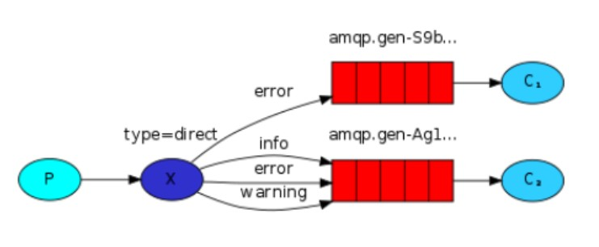

# Routing路由模式



路由模式：

1、每个消费者监听自己的队列，并且设置 routingkey。

2、生产者将消息发给交换机，由交换机根据 routingkey 来转发消息到指定的队列。

## 生产者

- 声明 exchange_routing_inform 交换机。

- 声明两个队列并且绑定到此交换机，绑定时需要指定 routingkey

- 发送消息时需要指定 routingkey

```java
import com.rabbitmq.client.BuiltinExchangeType;
import com.rabbitmq.client.Channel;
import com.rabbitmq.client.Connection;
import com.rabbitmq.client.ConnectionFactory;

import java.io.IOException;

public class Producer_routing {
    private static final String QUEUE_INFORM_EMAIL = "queue_inform_email";
    private static final String QUEUE_INFORM_SMS = "queue_inform_sms";
    private static final String EXCHANGE_ROUTING_INFORM = "exchange_routing_inform";

    public static void main(String[] args) {
        Connection connection = null;
        Channel channel = null;
        try {
            ConnectionFactory factory = new ConnectionFactory();
            factory.setHost("127.0.0.1");
            factory.setPort(5672);
            factory.setUsername("guest");
            factory.setPassword("guest");
            factory.setVirtualHost("/");
            connection = factory.newConnection();
            channel = connection.createChannel();
            channel.exchangeDeclare(EXCHANGE_ROUTING_INFORM, BuiltinExchangeType.DIRECT);
            channel.queueDeclare(QUEUE_INFORM_EMAIL, true, false, false, null);
            channel.queueDeclare(QUEUE_INFORM_SMS, true, false, false, null);
            channel.queueBind(QUEUE_INFORM_SMS, EXCHANGE_ROUTING_INFORM, "sms");
            channel.queueBind(QUEUE_INFORM_SMS, EXCHANGE_ROUTING_INFORM, "inform");
            channel.queueBind(QUEUE_INFORM_EMAIL, EXCHANGE_ROUTING_INFORM, "email");
            channel.queueBind(QUEUE_INFORM_EMAIL, EXCHANGE_ROUTING_INFORM, "inform");
            for (int i = 0; i < 5; i++) {
                String emailMsg = "email inform to user " + i;
                String smsMsg = "sms inform to user " + i;
                String informMsg = "inform inform to user " + i;
                channel.basicPublish(EXCHANGE_ROUTING_INFORM, "email", null, emailMsg.getBytes("utf-8"));
                channel.basicPublish(EXCHANGE_ROUTING_INFORM, "sms", null, smsMsg.getBytes("utf-8"));
                channel.basicPublish(EXCHANGE_ROUTING_INFORM, "inform", null, informMsg.getBytes("utf-8"));
                System.out.println("Send emailMsg is: " + emailMsg);
                System.out.println("Send smsMsg is: " + smsMsg);
                System.out.println("Send informMsg is: " + informMsg);
            }

        } catch (Exception e) {
            e.printStackTrace();
        } finally {
            if (channel != null) {
                try {
                    channel.close();
                } catch (Exception e) {
                    e.printStackTrace();
                }
            }
            if (connection != null) {
                try {
                    connection.close();
                } catch (IOException e) {
                    e.printStackTrace();
                }
            }
        }
    }

}
```

## 邮件消费者

```java
import com.rabbitmq.client.*;

import java.io.IOException;
import java.util.concurrent.TimeoutException;

public class Consumer_routing_email {
    private static final String QUEUE_INFORM_EMAIL = "queue_inform_email";
    private static final String EXCHANGE_ROUTING_INFORM = "exchange_routing_inform";

    public static void main(String[] args) throws IOException, TimeoutException {
        ConnectionFactory factory = new ConnectionFactory();
        factory.setHost("127.0.0.1");
        factory.setPort(5672);
        factory.setUsername("guest");
        factory.setPassword("guest");
        factory.setVirtualHost("/");
        Connection connection = factory.newConnection();
        Channel channel = connection.createChannel();
        channel.exchangeDeclare(EXCHANGE_ROUTING_INFORM, BuiltinExchangeType.DIRECT);
        channel.queueDeclare(QUEUE_INFORM_EMAIL, true, false, false, null);
        channel.queueBind(QUEUE_INFORM_EMAIL, EXCHANGE_ROUTING_INFORM, "email");
        channel.queueBind(QUEUE_INFORM_EMAIL, EXCHANGE_ROUTING_INFORM, "inform");
        DefaultConsumer consumer = new DefaultConsumer(channel) {
            @Override
            public void handleDelivery(String consumerTag, Envelope envelope, AMQP.BasicProperties properties, byte[] body) throws IOException {
                long deliveryTag = envelope.getDeliveryTag();
                String exchange = envelope.getExchange();
                String message = new String(body, "utf-8");
                System.out.println(message);
            }
        };
        channel.basicConsume(QUEUE_INFORM_EMAIL,true, consumer);
    }

}
```

## 短信消费者

```java
import com.rabbitmq.client.*;

import java.io.IOException;
import java.util.concurrent.TimeoutException;

public class Consumer_routing_sms {
    private static final String QUEUE_INFORM_SMS = "queue_inform_sms";
    private static final String EXCHANGE_ROUTING_INFORM = "exchange_routing_inform";

    public static void main(String[] args) throws IOException, TimeoutException {
        ConnectionFactory factory = new ConnectionFactory();
        factory.setHost("127.0.0.1");
        factory.setPort(5672);
        factory.setUsername("guest");
        factory.setPassword("guest");
        factory.setVirtualHost("/");
        Connection connection = factory.newConnection();
        Channel channel = connection.createChannel();
        channel.exchangeDeclare(EXCHANGE_ROUTING_INFORM, BuiltinExchangeType.DIRECT);
        channel.queueDeclare(QUEUE_INFORM_SMS, true, false, false, null);
        channel.queueBind(QUEUE_INFORM_SMS, EXCHANGE_ROUTING_INFORM, "sms");
        channel.queueBind(QUEUE_INFORM_SMS, EXCHANGE_ROUTING_INFORM, "inform");
        DefaultConsumer consumer = new DefaultConsumer(channel) {
            @Override
            public void handleDelivery(String consumerTag, Envelope envelope, AMQP.BasicProperties properties, byte[] body) throws IOException {
                long deliveryTag = envelope.getDeliveryTag();
                String exchange = envelope.getExchange();
                String message = new String(body, "utf-8");
                System.out.println(message);
            }
        };
        channel.basicConsume(QUEUE_INFORM_SMS,true, consumer);
    }

}
```

使用生产者发送若干条消息，交换机根据 routingkey 转发消息到指定的队列
