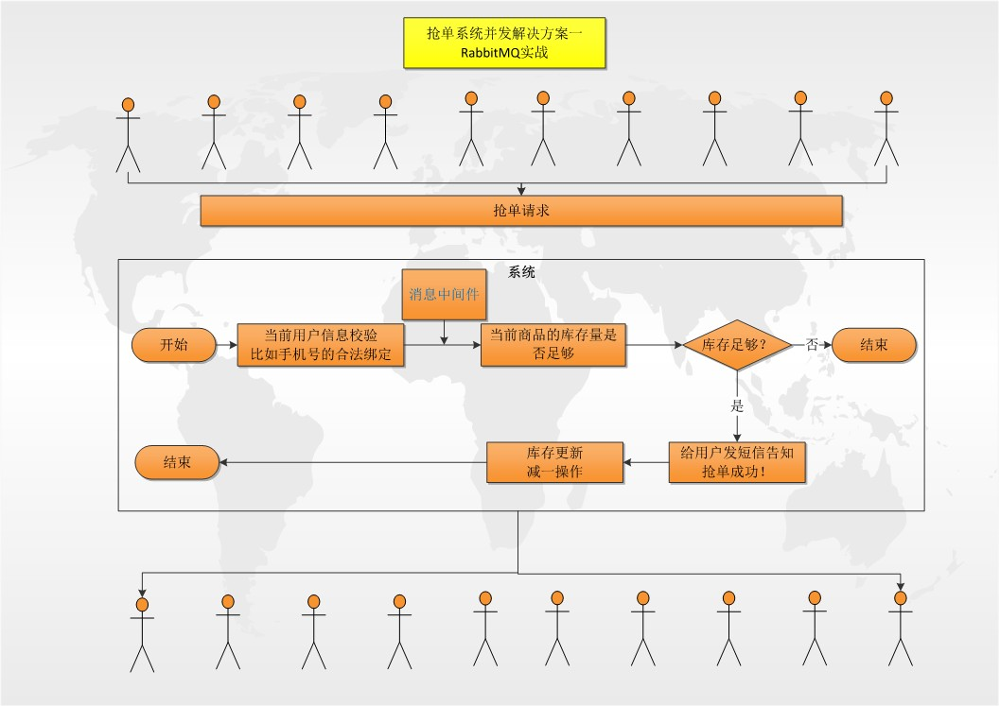

# SpringBoot整合RabbitMQ（用户商城抢单并发实战）



配置使用：`SpringBoot整合RabbitMQ（方式二）`中内容

## Queue、Exhcange配置

```java
@Autowired
private Environment env;

//TODO:商品抢单消息模型
@Bean
public Queue robbingQueue() {
    return new Queue(env.getProperty("product.robbing.mq.queue.name"), true);
}

@Bean
public DirectExchange robbingExchange() {
    return new DirectExchange(env.getProperty("product.robbing.mq.exchange.name"), true, false);
}

@Bean
public Binding robbingBinding() {
    return BindingBuilder.bind(robbingQueue()).to(robbingExchange()).with(env.getProperty("product.robbing.mq.routing.key.name"));
}

@Autowired
private RobbingListener robbingListener;

@Bean(name = "simpleContainer")
public SimpleMessageListenerContainer simpleContainer() {

    SimpleMessageListenerContainer container = new SimpleMessageListenerContainer(connectionFactory);

    //TODO：并发配置
    container.setConcurrentConsumers(env.getProperty("spring.rabbitmq.listener.concurrency", int.class));
    container.setMaxConcurrentConsumers(env.getProperty("spring.rabbitmq.listener.max-concurrency", int.class));
    container.setPrefetchCount(env.getProperty("spring.rabbitmq.listener.prefetch", int.class));

    //TODO：消息确认-确认机制种类
    container.setAcknowledgeMode(AcknowledgeMode.MANUAL);
    container.setQueues(robbingQueue());
    container.setMessageListener(userOrderListener);

    return container;
}
```

## 消费端

### 监听消费

```java
@Component("robbingListener")
public class RobbingListener implements ChannelAwareMessageListener {

    private static final Logger log = LoggerFactory.getLogger(RobbingListener.class);

    @Autowired
    ConcurrencyService concurrencyService;

    @Override
    public void onMessage(Message message, Channel channel) throws Exception {
        long tag = message.getMessageProperties().getDeliveryTag();
        try {
            String mobile = new String(message.getBody(), "utf-8");
            log.info("监听到抢单手机号：{}", mobile);

            //处理抢单
            concurrencyService.manageRobbing(mobile);

            channel.basicAck(tag, false); //确认消费
        } catch (Exception e) {
            e.printStackTrace();
            channel.basicReject(tag, false); //消费失败，false 不重回队列
        }
    }

}
```

### 处理抢单

```java
@Service
public class ConcurrencyService {

    private static final Logger log= LoggerFactory.getLogger(ConcurrencyService.class);

    /**
     * 注意：测试前要将表中改编号的商品的 total 字段数值改成（抢单限量的个数：比如限量抢100个）
     */
    private static final String ProductNo="product_10010"; //抢单商品的编号

    @Autowired
    private ProductMapper productMapper
    @Autowired
    private ProductRobbingRecordMapper productRobbingRecordMapper;

    /**
     * 处理抢单
     * @param mobile 抢单手机号
     */
    public void manageRobbing(String mobile){
        try {
            /**
            * 抢单请求处理逻辑
            * 1. 判断是否还有库存,如果有
            * 2. 减库存后，能更新成功时保存抢单记录
            * 3. 异步发送通知给用户抢单成功（此处代码略）
            */
            Product product=productMapper.selectByProductNo(ProductNo);
            if (product!=null && product.getTotal()>0){
                int result=productMapper.updateTotal(product);
                if (result>0) {
                    //抢单成功，保存到商品抢单记录
                    ProductRobbingRecord entity=new ProductRobbingRecord();
                    entity.setMobile(mobile);
                    entity.setProductId(product.getId());
                    productRobbingRecordMapper.insertSelective(entity);
                }
            }
        }catch (Exception e){
            log.error("处理抢单发生异常：mobile={} ",mobile);
        }
    }

}
```

## 生产端

### controller代码

```java
@RestController
public class ConcurrencyController {

    private static final Logger log = LoggerFactory.getLogger(ConcurrencyController.class);
    private static final String prefix = "concurrency";

    @Autowired
    private InitService initService;

    @RequestMapping(value = prefix + "/robbing/thread", method = RequestMethod.GET)
    public BaseResponse robbingThread() {
        BaseResponse response = new BaseResponse(StatusCode.Success);
        //采用 CountDownLatch 模拟产生高并发时的多线程请求
        initService.generateMultiThread();

        return response;
    }

}
```

### 模拟多线程抢单请求

```java
import java.util.concurrent.CountDownLatch;

@Service
public class InitService {
    private static final Logger log = LoggerFactory.getLogger(InitService.class);

    public static final int ThreadNum = 200; //请求个数
    private static int mobile = 0; //模拟手机号

    @Autowired
    private ConcurrencyService concurrencyService;

    @Autowired
    private CommonMqService commonMqService;

    public void generateMultiThread() {
        log.info("开始初始化线程数----> ");

        try {
            CountDownLatch countDownLatch = new CountDownLatch(1);
            for (int i = 0; i < ThreadNum; i++) {
                new Thread(new RunThread(countDownLatch)).start();
            }

            //TODO：启动多个线程
            countDownLatch.countDown();
        } catch (Exception e) {
            e.printStackTrace();
        }
    }

    private class RunThread implements Runnable {
        private final CountDownLatch startLatch;

        public RunThread(CountDownLatch startLatch) {
            this.startLatch = startLatch;
        }

        public void run() {
            try {
                //TODO：线程等待
                startLatch.await();
                mobile += 1;

                //发送抢单信息入队列
                commonMqService.sendRobbingMsg(String.valueOf(mobile));
            } catch (Exception e) {
                e.printStackTrace();
            }
        }
    }

}
```

### 发送抢单信息入队列

```java
@Service
public class CommonMqService {

    private static final Logger log = LoggerFactory.getLogger(ConcurrencyService.class);

    @Autowired
    private RabbitTemplate rabbitTemplate;
    @Autowired
    private Environment env;

    /**
     * 发送抢单信息入队列
     * @param mobile
     */
    public void sendRobbingMsg(String mobile) {
        try {
            rabbitTemplate.setExchange(env.getProperty("product.robbing.mq.exchange.name"));
            rabbitTemplate.setRoutingKey(env.getProperty("product.robbing.mq.routing.key.name"));

            Message message = MessageBuilder.withBody(mobile.getBytes("UTF-8")).setDeliveryMode(MessageDeliveryMode.PERSISTENT)
                    .build();

            rabbitTemplate.send(message);

        } catch (Exception e) {
            log.error("发送抢单信息入队列 发生异常： mobile={} ", mobile);
        }
    }

}
```

**注意：** 测试前要将表中改编号的商品的 total 字段数值改成（抢单限量的个数：比如限量抢100个）

最后访问 controller 请求测试
