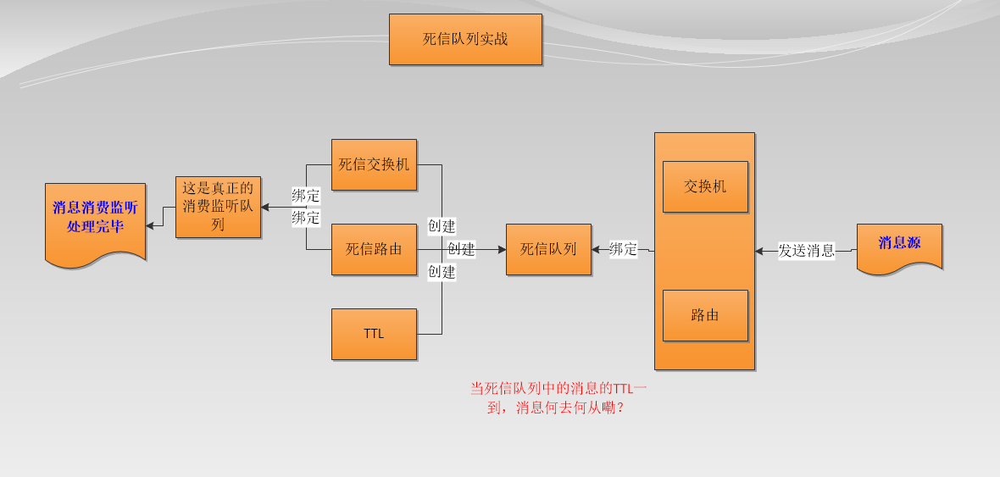

# SpringBoot整合RabbitMQ（用户下单超时没支付自动失效实战）



配置使用：`SpringBoot整合RabbitMQ（方式二）`中内容

## 队列模型属性值

```yml
user.order.dead.queue.name=${mq.env}.user.order.dead.queue
user.order.dead.exchange.name=${mq.env}.user.order.dead.exchange
user.order.dead.routing.key.name=${mq.env}.user.order.dead.routing.key

user.order.dead.produce.exchange.name=${mq.env}.user.order.dead.produce.exchange
user.order.dead.produce.routing.key.name=${mq.env}.user.order.dead.produce.routing.key
user.order.dead.real.queue.name=${mq.env}.user.order.dead.real.queue
```

## Queue、Exhcange配置

```java
//TODO：用户下单支付超时死信队列模型
@Bean
public Queue userOrderDeadQueue() {
    HashMap<String, Object> argsMap = new HashMap<>();
    argsMap.put("x-dead-letter-exchange", env.getProperty("user.order.dead.exchange.name"));
    argsMap.put("x-dead-letter-routing-key", env.getProperty("user.order.dead.routing.key.name"));
    //argsMap.put("x-message-ttl", 10000); //存活时间
    return new Queue(env.getProperty("user.order.dead.queue.name"), true, false, false, argsMap);
}

@Bean
public TopicExchange userOrderDeadExchange() {
    return new TopicExchange(env.getProperty("user.order.dead.produce.exchange.name"), true, false);
}

@Bean
public Binding userOrderDeadBinding() {
    return BindingBuilder.bind(userOrderDeadQueue()).to(userOrderDeadExchange()).with(env.getProperty("user.order.dead.produce.routing.key.name"));
}

@Bean
public Queue userOrderDeadRealQueue() {
    return new Queue(env.getProperty("user.order.dead.real.queue.name"), true);
}

@Bean
public TopicExchange userOrderDeadRealExchange() {
    return new TopicExchange(env.getProperty("user.order.dead.exchange.name"), true, false);
}

@Bean
public Binding userOrderDeadReadBinding() {
    return BindingBuilder.bind(userOrderDeadRealQueue()).to(userOrderDeadRealExchange()).with(env.getProperty("user.order.dead.routing.key.name"));
}
```

## 消费端

```java
@Component
public class UserOrderDeadListener {

    @Autowired
    private UserOrderMapper userOrderMapper;

    private static final Logger log = LoggerFactory.getLogger(UserOrderDeadListener.class);

    @RabbitListener(queues = "${user.order.dead.real.queue.name}", containerFactory = "multiListenerContainer")
    public void ConsumerMessage(@Payload Integer id) {
        //死信队列超时后操作
        try {
            log.info("死信队列-用户下单未支付超时消息：{}", id);

            UserOrder userOrder = userOrderMapper.selectByPkAndStatus(id, 1);
            if (userOrder != null) {//超时未支付
                userOrder.setStatus(3); //status参数：1=保存，2=付款，3=取消
                userOrder.setUpdateTime(new Date());
                userOrderMapper.updateByPrimaryKeySelective(userOrder);
            } else {
                //TODO：已支付-可能需要异步 减库存-异步发送其它日志消息
            }
        } catch (Exception e) {
            e.printStackTrace();
        }
    }

}
```

## 生产端

```java
@RestController
public class UserOrderController {

    private static final Logger log = LoggerFactory.getLogger(UserOrderController.class);

    @Autowired
    private RabbitTemplate rabbitTemplate;
    @Autowired
    private Environment env;
    @Autowired
    private UserOrderMapper userOrderMapper;

    /**
     * 死信队列之用户下单超时没支付自动失效
     */
    @RequestMapping(value = "user/order/push/dead/queue", method = RequestMethod.POST, consumes = MediaType.APPLICATION_JSON_UTF8_VALUE)
    public BaseResponse pushUserOrderV2(@RequestBody UserOrderDto dto) {
        UserOrder userOrder = new UserOrder();
        try {
            //获取下单记录
            BeanUtils.copyProperties(dto, userOrder);
            userOrder.setStatus(1);

            //保存下单记录
            userOrderMapper.insertSelective(userOrder);
        } catch (Exception e) {
            e.printStackTrace();
        }

        //异步将订单id发送给mq死信队列
        try {
            Integer id = userOrder.getId();
            rabbitTemplate.setMessageConverter(new Jackson2JsonMessageConverter());
            rabbitTemplate.setExchange(env.getProperty("user.order.dead.produce.exchange.name"));
            rabbitTemplate.setRoutingKey(env.getProperty("user.order.dead.produce.routing.key.name"));

            //发送消息
            rabbitTemplate.convertAndSend(id, new MessagePostProcessor() {
                @Override
                public Message postProcessMessage(Message message) throws AmqpException {
                    MessageProperties properties = message.getMessageProperties();
                    properties.setDeliveryMode(MessageDeliveryMode.PERSISTENT);
                    properties.setHeader(AbstractJavaTypeMapper.DEFAULT_CONTENT_CLASSID_FIELD_NAME, Integer.class);
                    properties.setExpiration("5000"); //死信队列动态 TTL 设置
                    return message;
                }
            });
        } catch (Exception e) {
            e.printStackTrace();
        }

        return new BaseResponse(StatusCode.Success);
    }

}
```