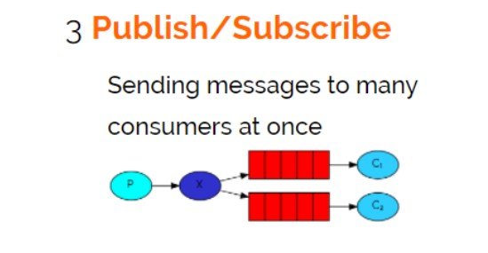

# Publish/subscribe发布订阅模式



发布订阅模式：

1、每个消费者监听自己的队列。

2、生产者将消息发给 broker，由交换机将消息转发到绑定此交换机的每个队列，每个绑定交换机的队列都将接收到消息。

## 代码案例

案例：用户通知，当用户充值成功或转账完成系统通知用户，通知方式有短信、邮件多种方法。

## 生产端

1、声明名称为 “Exchange_fanout_inform” 的交换机

2、声明两个队列并且绑定到此交换机，绑定时不需要指定 routingkey

3、发送消息时不需要指定 routingkey

```java
import com.rabbitmq.client.BuiltinExchangeType;
import com.rabbitmq.client.Channel;
import com.rabbitmq.client.Connection;
import com.rabbitmq.client.ConnectionFactory;

import java.io.IOException;

public class Producer02_publish {
    //队列名称
    private static final String QUEUE_INFORM_EMAIL = "queue_inform_email";
    private static final String QUEUE_INFORM_SMS = "queue_inform_sms";
    //交换机名称
    private static final String EXCHANGE_FANOUT_INFORM = "exchange_fanout_inform";

    public static void main(String[] args) {
        Connection connection = null;
        Channel channel = null;
        try {
            ConnectionFactory factory = new ConnectionFactory();
            factory.setHost("localhost");
            factory.setPort(5672);
            factory.setUsername("guest");
            factory.setPassword("guest");
            factory.setVirtualHost("/");
            connection = factory.newConnection();
            //创建与Exchange的通道，每个连接可以创建多个通道，每个通道代表一个会话任务
            channel = connection.createChannel();
            /**
             * 声明交换机
             * 参数1、交换机名称
             * 参数2、交换机类型，fanout、topic、direct、headers
             */
            channel.exchangeDeclare(EXCHANGE_FANOUT_INFORM, BuiltinExchangeType.FANOUT);
            // 声明队列
            channel.queueDeclare(QUEUE_INFORM_EMAIL, true, false, false, null);
            channel.queueDeclare(QUEUE_INFORM_SMS, true, false, false, null);
            /**
             * 交换机和队列绑定
             * 参数1、队列名称
             * 参数2、交换机名称
             * 参数3、路由key
             */
            channel.queueBind(QUEUE_INFORM_SMS, EXCHANGE_FANOUT_INFORM, "");
            channel.queueBind(QUEUE_INFORM_EMAIL, EXCHANGE_FANOUT_INFORM, "");
            //发送消息
            for (int i = 0; i < 5; i++) {
                String message = "inform to user " + i;
                //向交换机发送消息
                channel.basicPublish(EXCHANGE_FANOUT_INFORM, "", null, message.getBytes("utf-8"));
                System.out.println("send Message is: " + message);
            }

        } catch (Exception e) {
            e.printStackTrace();
        } finally {
            if (channel != null) {
                try {
                    channel.close();
                } catch (Exception e) {
                    e.printStackTrace();
                }
            }
            if (connection != null) {
                try {
                    connection.close();
                } catch (IOException e) {
                    e.printStackTrace();
                }
            }
        }
    }

}
```

## 邮件发送消费端

```java
import com.rabbitmq.client.*;

import java.io.IOException;
import java.util.concurrent.TimeoutException;

public class Consumer_subscribe_email {
    //队列名称
    private static final String QUEUE_INFORM_EMAIL = "queue_inform_email";
    //交换机名称
    private static final String EXCHANGE_FANOUT_INFORM = "exchange_fanout_inform";

    public static void main(String[] args) throws IOException, TimeoutException {
        ConnectionFactory factory = new ConnectionFactory();
        factory.setHost("localhost");
        factory.setPort(5672);
        factory.setUsername("guest");
        factory.setPassword("guest");
        factory.setVirtualHost("/");
        Connection connection = factory.newConnection();
        //创建与Exchange的通道，每个连接可以创建多个通道，每个通道代表一个会话任务
        Channel channel = connection.createChannel();
        //声明交换机
        channel.exchangeDeclare(EXCHANGE_FANOUT_INFORM, BuiltinExchangeType.FANOUT);
        channel.queueDeclare(QUEUE_INFORM_EMAIL, true, false, false, null);
        //交换机和队列绑定
        channel.queueBind(QUEUE_INFORM_EMAIL, EXCHANGE_FANOUT_INFORM, "");
        //定义消费方法
        DefaultConsumer consumer = new DefaultConsumer(channel) {
            @Override
            public void handleDelivery(String consumerTag, Envelope envelope, AMQP.BasicProperties properties, byte[] body) throws IOException {
                long deliveryTag = envelope.getDeliveryTag();
                String exchange = envelope.getExchange();
                //消息内容
                String message = new String(body, "utf-8");
                System.out.println(message);
            }
        };
        //监听队列
        channel.basicConsume(QUEUE_INFORM_EMAIL, true, consumer);
    }

}
```

## 短信发送消费者

```java
import com.rabbitmq.client.*;

import java.io.IOException;
import java.util.concurrent.TimeoutException;

public class Consumer_subscribe_sms {
    //队列名称
    private static final String QUEUE_INFORM_SMS = "queue_inform_sms";
    //交换机名称
    private static final String EXCHANGE_FANOUT_INFORM = "exchange_fanout_inform";

    public static void main(String[] args) throws IOException, TimeoutException {
        ConnectionFactory factory = new ConnectionFactory();
        factory.setHost("localhost");
        factory.setPort(5672);
        factory.setUsername("guest");
        factory.setPassword("guest");
        factory.setVirtualHost("/");
        Connection connection = factory.newConnection();
        //创建与Exchange的通道，每个连接可以创建多个通道，每个通道代表一个会话任务
        Channel channel = connection.createChannel();
        //声明交换机
        channel.exchangeDeclare(EXCHANGE_FANOUT_INFORM, BuiltinExchangeType.FANOUT);
        channel.queueDeclare(QUEUE_INFORM_SMS, true, false, false, null);
        //交换机和队列绑定
        channel.queueBind(QUEUE_INFORM_SMS, EXCHANGE_FANOUT_INFORM, "");
        //定义消费方法
        DefaultConsumer consumer = new DefaultConsumer(channel) {
            @Override
            public void handleDelivery(String consumerTag, Envelope envelope, AMQP.BasicProperties properties, byte[] body) throws IOException {
                long deliveryTag = envelope.getDeliveryTag();
                String exchange = envelope.getExchange();
                //消息内容
                String message = new String(body, "utf-8");
                System.out.println(message);
            }
        };
        //监听队列
        channel.basicConsume(QUEUE_INFORM_SMS, true, consumer);
    }

}
```

执行测试方法
