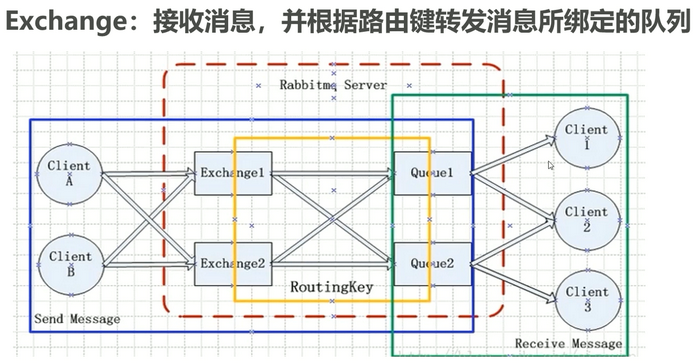
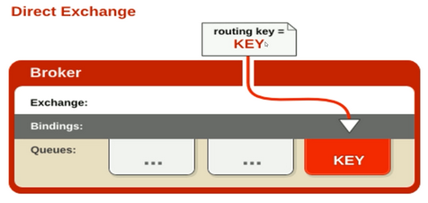
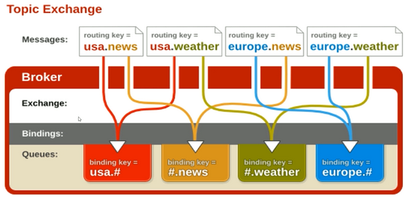
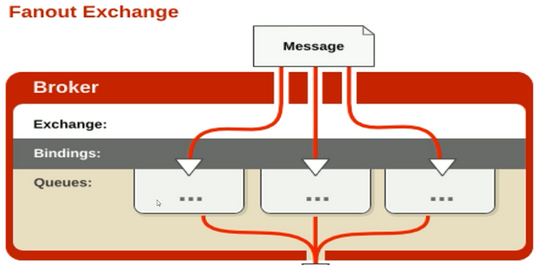

# Exchange 交换机



## Exchange 的属性

**Name：** 交换机名称

**Type：** 交换机类型 direct、topic、fanout、headers

**Durability：** 是否需要持久化，true为持久化

**Auto Delete：** 当最后一个绑定到 Exchange 上的队列删除后，自动删除该 Exchange

**Internal：** 当前 Exchange 是否用于 RabbitMQ 内部使用，默认为 false

**Arguments：** 扩展参数，用于扩展 AMQP 协议自制定化使用

## Direct Exchange

所有发送到 Direct Exchange 的消息被转发到 RouteKey 中指定的 Queue

注意：Direct 模式可以使用 RabbitMQ 自带的 Exchange (default Exchange)，所以不需要将 Exchange 进行任何绑定（binding） 操作，消息传递时，RouteKey 必须完全匹配才会被队列接收，否则该消息会被抛弃。



**生产端编码示例：**

```java
public class Producer4DirectExchange {
    public static void main(String[] args) throws IOException, TimeoutException {

        ConnectionFactory connectionFactory = new ConnectionFactory();
        connectionFactory.setVirtualHost("/");
        connectionFactory.setPort(5672);
        connectionFactory.setHost("192.168.194.151");

        Connection connection = connectionFactory.newConnection();
        Channel channel = connection.createChannel();

        //声明交换机
        String exchangeName = "test_direct_change";
        String routingKey = "test.direct";

        String msg = "Hello World RabbitMQ 4 Direct Exchange Message...";
        channel.basicPublish(exchangeName, routingKey, null, msg.getBytes());
    }
}
```

**消费端编码示例：**

```java
public class Consumer4DirectExchange {
    public static void main(String[] args) throws IOException, TimeoutException {

        ConnectionFactory connectionFactory = new ConnectionFactory();
        connectionFactory.setVirtualHost("/");
        connectionFactory.setPort(5672);
        connectionFactory.setHost("192.168.194.151");

        Connection connection = connectionFactory.newConnection();
        Channel channel = connection.createChannel();

        //声明
        String exchangeName = "test_direct_change";
        String routingKey = "test.direct";
        String queueName = "test_direct_queue";
        channel.exchangeDeclare(exchangeName, BuiltinExchangeType.DIRECT, true, false, null);
        channel.queueDeclare(queueName, false, false, false, null);
        channel.queueBind(queueName, exchangeName, routingKey);

        DefaultConsumer defaultConsumer = new DefaultConsumer(channel){
            @Override
            public void handleDelivery(String consumerTag, Envelope envelope, AMQP.BasicProperties properties, byte[] body) throws IOException {
                String msg = new String(body);
                System.out.println("接收到消息：" + msg);
            }
        };

        channel.basicConsume(queueName, true, defaultConsumer);
    }
}
```

**测试结果：**

1. 启动消费端
2. 启动生产端
3. 消费端控制台打印

    ```text
    接收到消息：Hello World RabbitMQ 4 Direct Exchange Message...
    ```

## Topic Exchange

- 所有发送到 Topic Exchange 的消息被转发到所有关心 RouteKey 中指定 Topic 的 Queue 上。

- Exchange 将 RouteKey 和某 Topic 进行模糊匹配，此时队列需要绑定一个 Topic。

> 🎈**注意：** 可以使用通配符进行模糊匹配  
> 符号 `#` 匹配一个或多歌词  
> 符号 `*` 匹配不多不少一个词  
>
> 例如：  
> `log.#` 能够匹配到 log.info.oa  
> `log.*` 能够匹配到 log.error  



**生产端代码：**

```java
public class Producer4TopicExchange {
    public static void main(String[] args) throws IOException, TimeoutException {
        ConnectionFactory connectionFactory = new ConnectionFactory();
        connectionFactory.setHost("192.168.194.151");
        connectionFactory.setPort(5672);
        connectionFactory.setVirtualHost("/");

        Connection connection = connectionFactory.newConnection();
        Channel channel = connection.createChannel();

        //声明
        String exchangeName = "test_topic_exchange";
        String routingKey1 = "user.save";
        String routingKey2 = "user.update";
        String routingKey3 = "user.delete.abc";

        String msg1 = "RabbitMQ 4 Topic Exchange Message: " + routingKey1;
        String msg2 = "RabbitMQ 4 Topic Exchange Message: " + routingKey2;
        String msg3 = "RabbitMQ 4 Topic Exchange Message: " + routingKey3;
        channel.basicPublish(exchangeName, routingKey1, null, msg1.getBytes());
        channel.basicPublish(exchangeName, routingKey2, null, msg2.getBytes());
        channel.basicPublish(exchangeName, routingKey3, null, msg3.getBytes());

        channel.close();
        connection.close();
    }
}
```

**消费端代码：**

```java
public class Consumer4TopicExchange {
    public static void main(String[] args) throws IOException, TimeoutException {
        ConnectionFactory connectionFactory = new ConnectionFactory();
        connectionFactory.setHost("192.168.194.151");
        connectionFactory.setPort(5672);
        connectionFactory.setVirtualHost("/");

        Connection connection = connectionFactory.newConnection();
        Channel channel = connection.createChannel();

        //声明
        String exchangeName = "test_topic_exchange";
        String queueName = "test_topic_queue";
        String routingKey = "user.#";
        //String routingKey = "user.*"; //分别测试2个不同的 routingKey 的结果
        channel.exchangeDeclare(exchangeName, BuiltinExchangeType.TOPIC, true, false, null);
        channel.queueDeclare(queueName, false, false, false, null);
        channel.queueBind(queueName, exchangeName, routingKey);
        //channel.queueUnbind(queueName, exchangeName, "user.#");

        DefaultConsumer defaultConsumer = new DefaultConsumer(channel) {
            @Override
            public void handleDelivery(String consumerTag, Envelope envelope, AMQP.BasicProperties properties, byte[] body) throws IOException {
                String msg = new String(body);
                System.out.println("接收到消息：" + msg);
            }
        };

        channel.basicConsume(queueName, true, defaultConsumer);
    }
}
```

**测试结果：**

使用 `routingKey = user.#` 的结果

```text
接收到消息：RabbitMQ 4 Topic Exchange Message: user.save
接收到消息：RabbitMQ 4 Topic Exchange Message: user.update
接收到消息：RabbitMQ 4 Topic Exchange Message: user.delete.abc
```

使用 `routingKey = user.*` 的结果

```text
接收到消息：RabbitMQ 4 Topic Exchange Message: user.save
接收到消息：RabbitMQ 4 Topic Exchange Message: user.update
```

## Fanout Exchange

- 不处理路由键，只需要简单的将队列绑定到交换机上

- 发送到交换机的消息都会被转发到与该交换机绑定的所有队列上

- Fanout 交换机转发消息是最快的



**生产端代码：**

```java
public class Producer4FanoutExchange {
    public static void main(String[] args) throws IOException, TimeoutException {
        ConnectionFactory connectionFactory = new ConnectionFactory();
        connectionFactory.setHost("192.168.194.151");
        connectionFactory.setPort(5672);
        connectionFactory.setVirtualHost("/");

        Connection connection = connectionFactory.newConnection();
        Channel channel = connection.createChannel();

        //声明
        String exchangeName = "test_fanout_exchange";
        String msg = "RabbitMQ 4 FANOUT Exchange Message...";
        for (int i=0; i<3; i++){
            channel.basicPublish(exchangeName, "", null, msg.getBytes());
        }
        channel.close();
        connection.close();
    }
}
```

**消费端代码：**

```java
public class Consumer4FanoutExchange {
    public static void main(String[] args) throws IOException, TimeoutException {
        ConnectionFactory connectionFactory = new ConnectionFactory();
        connectionFactory.setHost("192.168.194.151");
        connectionFactory.setPort(5672);
        connectionFactory.setVirtualHost("/");

        Connection connection = connectionFactory.newConnection();
        Channel channel = connection.createChannel();

        //声明
        String exchangeName = "test_fanout_exchange";
        String queueName1 = "test_fanout_queue1";
        String queueName2 = "test_fanout_queue2";
        channel.exchangeDeclare(exchangeName, BuiltinExchangeType.FANOUT, true, false, false, null);
        channel.queueDeclare(queueName1, false, false, false, null);
        channel.queueDeclare(queueName2, false, false, false, null);
        channel.queueBind(queueName1, exchangeName, "");
        channel.queueBind(queueName2, exchangeName, "");

        DefaultConsumer defaultConsumer1 = new DefaultConsumer(channel) {
            @Override
            public void handleDelivery(String consumerTag, Envelope envelope, AMQP.BasicProperties properties, byte[] body) throws IOException {
                String msg = new String(body);
                System.out.println("queue1接收到消息：" + msg);
            }
        };
        DefaultConsumer defaultConsumer2 = new DefaultConsumer(channel) {
            @Override
            public void handleDelivery(String consumerTag, Envelope envelope, AMQP.BasicProperties properties, byte[] body) throws IOException {
                String msg = new String(body);
                System.out.println("queue2接收到消息：" + msg);
            }
        };
        channel.basicConsume(queueName1, true, defaultConsumer1);
        channel.basicConsume(queueName2, true, defaultConsumer2);
    }
}
```

**测试结果：**

```text
queue1接收到消息：RabbitMQ 4 FANOUT Exchange Message...
queue1接收到消息：RabbitMQ 4 FANOUT Exchange Message...
queue1接收到消息：RabbitMQ 4 FANOUT Exchange Message...
queue2接收到消息：RabbitMQ 4 FANOUT Exchange Message...
queue2接收到消息：RabbitMQ 4 FANOUT Exchange Message...
queue2接收到消息：RabbitMQ 4 FANOUT Exchange Message...
```

