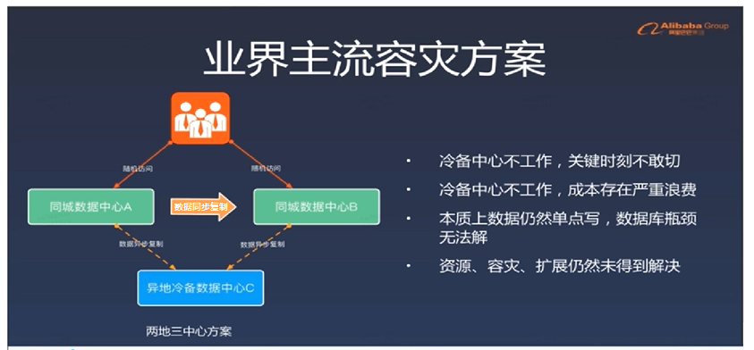
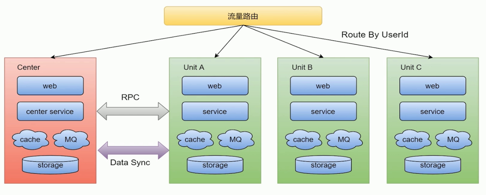
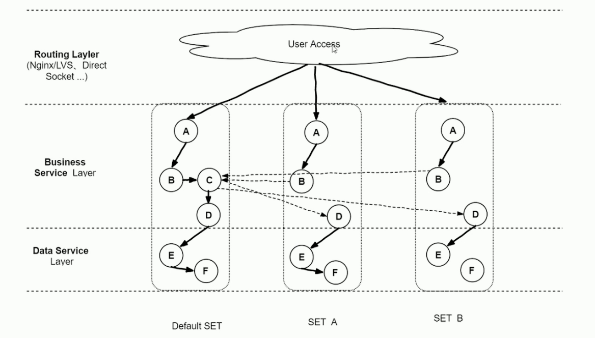
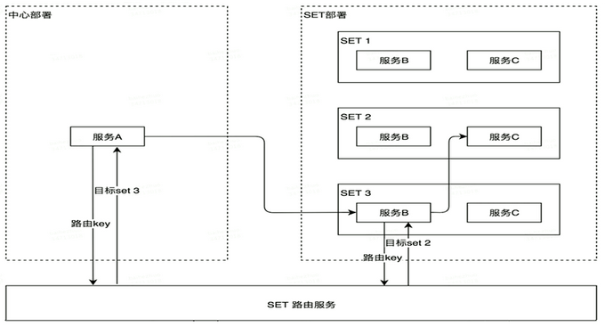
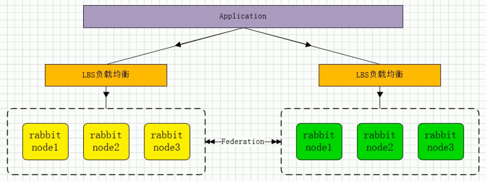
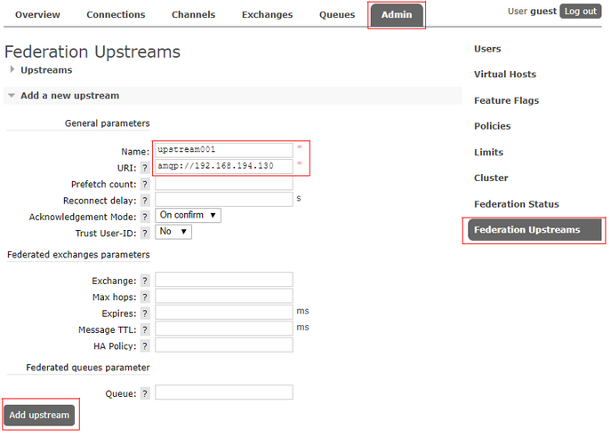
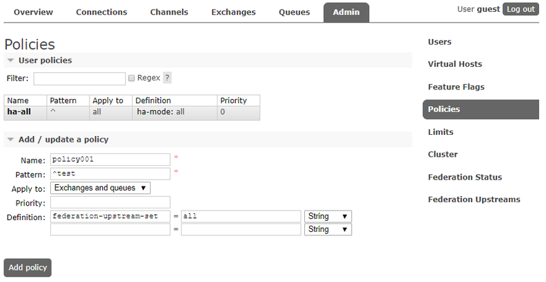
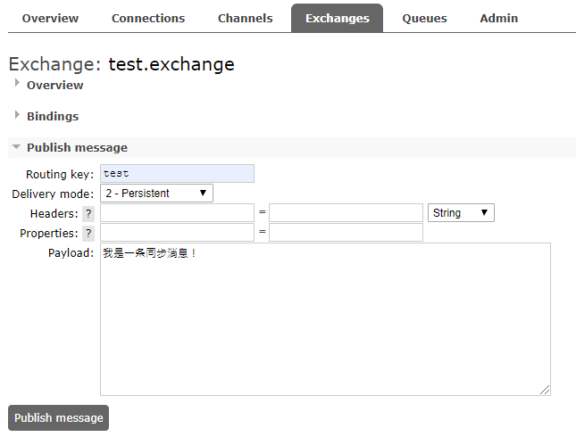

# RabbitMQ SET 化架构的搭建

**导航**

- 了解 SET 化架构的衍进
- 互联网大厂是如何进行 SET 化的
- SET 化架构的设计和解决方案
- RabbitMQ SET 化架构的搭建

## BAT/TMD大厂单元化架构设计衍变之路

随着大型互联网公司业务的多元化发展，就拿滴滴、美团等大厂来讲，如滴滴打车、单车、外卖、酒店、旅行、金融等业务持续高速增长，单个大型分布式体系的集群，通过加机器+集群内部拆分（kv、mq、Mysql等），虽然具备了一定的可扩展性。但是，随着业务量的进一步增长，这个集群规模琢渐变的巨大，从而一定会在某个点达到瓶颈，无法满足扩展性需要，并且大集群内核服务出现问题，会影响全网所有用户。

以滴滴打车、美团外卖举例来说：打车业务体量巨大，尤其在早晚高峰期。全年订单量已越10亿。外卖业务体量庞大，目前单量突破 1700w/天，对应如此庞大的单个大型分布式集群会面临以下问题：

1. 容灾问题
2. 资源扩展性问题
3. 大集群拆分问

### 容灾问题

- 核心服务（比如订单服务）挂掉，会影影响全网所有的用户，导致整个业务不可用；
- 数据库主库集中在一个 IDC，主机房挂掉，会影响全网所有用户，整个业务无法快速切换和恢复

### 资源扩展问题

- 单 IDC 的资源（机器、网络带宽等）已经没法满足，扩展 IDC 时，存在跨机房访问延时问题（增加异地机房，时延问题严重）；
- 数据库主库单点，连接数有限，不能支持应用程序的持续发展；

### 大集群拆分问题

- 核心问题：分布式集群规模扩大后，会响应的带来资源扩展、大集群拆分以及容灾问题
- 所有处于对业务扩展性以及容灾需求的考虑，我们需要一套从底层架构彻底解决问题的方案，业界主流解决方案：

## 互联网大厂是如何进行 SET 化的

### 同城 "双活" 架构介绍

目前很多大型互联网公司的业务架构可以理解为同城"双活"架构，注意这里的“双活"是加引号的，具体可以这样理解：

1. 业务层面上已经做到的真正的双活（或者多活），分别承担部分流量；
2. 存储层面比如定时任务、缓存、持久层、数据分析等都是主从架构，会有跨机房写的问题；
3. 一个数据中心故障，可以手动切换流量，部分组件可以自动切换；

### 两地三中心架构介绍

使用灾备的思想，在同城“双活”的基础上，在异地部署一套灾备数据中心，每个中心都具有完备的数据处理能力，只有当主节点故障需要容灾时才会紧急启动备用数据中心；



### SET化方案目标

1. 业务：解决业务遇到的扩展性和容灾等需求，支撑业务的高速方案
2. 通用性：架构侧形成统一通用的解决方案，方面各业务线接入使用

## SET化架构的设计和解决方案



### SET化架构策略

#### 流量路由

按照特殊的 key（通常为 userid）进行路由，判断某次请求该路由到中心集群还是单元化集群；

#### 中心集群

为进行单元化改造的服务（通常不在核心交易链路，比如供应链系统）称为中心集群，跟当前架构保持一致。

#### 单元化集群

每个单元化集群只负责本单元内的流量处理，以实现流量拆分以及故障隔离；

每个单元化集群前期只存储本单元产生的交易数据，后续会做双向数据同步，实现容灾切换需求；

#### 中间件（RPC、KV、MQ 等）

- RPC：对于 SET 服务，调用封闭在 SET 内；对于非 SET 服务，沿用现有的路由逻辑；
- KV：支持分 SET 的数据生产和查询；
- MQ：支持分 SET 的消息生产和消费；

### 数据同步

全局数据（数据量小且变化不大，比如商家的菜品数据）部署在中心集群，其他单元化集群同步全局数据到本单元化内；

未来演变为异地多活架构时，各单元化集群数据需要进行双向同步来实现容灾需要

#### 异地容灾

通过 SET 化架构的流量调度能力，将 SET 分别部署在不同地区的数据中心，实现跨地区容灾支持

#### 高效的本地化服务

利用前端位置信息采集和域名解析策略，将流量路由到最近的 SET，提供最高效的本地化服务；

比如 O2O 场景天然具有本地生产，本地消费的特点，更加需要 SET 化支持

#### 集装箱式扩展

SET 的封装性支持更灵活的部署扩展性，比如 SET 一键创建/下线，SET 一键发布等。





---

## SET化架构落地原则

### 对业务透明原则

SET 化架构的实现对业务代码透明，业务代码层面不需要关系 SET 化规则，SET 的部署等问题

### SET化切分的规则

- 理论上，切分规则有业务层面按需定制；
- 实际上，建议优先选最大的业务维度进行切分；
- 比如海量用户的 O2O 业务，按用户位置信息进行切分。此外接入层、逻辑层和数据层可以由独立的 SET 切分规则，有利于实现部署和运维成本的最优化

### 部署规范原则

一个 SET 并不一定只限制在一个机房，也可以跨机房或者跨地区部署；为保证灵活性，单个 SET 内机器数不宜过多（如不超过1000台物理机）。

## RabbitMQ-SET化架构实现

SET 化消息中间件架构实现（RabbitMQ双活）



### Federation 插件安装与配置

使用 RabbitMQ 异步消息通信插件 Federation（节点和节点、集群和集群之间通信）：

**RabbitMQ-SET化架构环境节点说明：**

| 服务器IP| HostName | 节点说明 | 端口 | 管控台地址 |
| ------- | -------- | ------- | ---- | --------- |
|192.168.194.151 | localhost151 | Downstream 下流节点 | 5672 | 192.168.194.151:15672 |
|192.168.194.130 | localhost130 | Upstream 上流节点 | 5672 | 192.168.194.130:15672 |

**安装插件**

```bash
rabbitmq-plugins enable rabbitmq_federation
rabbitmq-plugins enable rabbitmq_federation_management
```

备注：当你在一个 cluster 钟使用了 Federation 插件，所有在集群中的 nodes 都需要安装 Federation 插件

使用 RabbitMQ 通信插件 Federation：

Federation 插件是一个在不需要 cluster 进行数据同步的（选择一个 cluster 中的节点和另一个 cluster 节点同步），而 brokers 之间传输消息的高新性能插件。

Federation 插件可以在 brokers 或者 cluster 之间传输消息，链接的双方可以使用不同的 users 和 virtual hosts、或者双方的 rabbitmq 和 erlang 版本不一致，federation 插件使用 AMQP 协议通信，可以接受不连续的传输。

### Federation操作

#### 151下流节点的操作

1、创建 exchange 和 queue 并绑定

Exchange:

- Name : text.exchange
- Type: topic

Queue:

- Name : text.queue

Binding:

- Routing Key : test

2、在 151 下流节点创建 upstream



3、在 151 节点配置 Federation Policies 策略规则

设置的规则：以 `test` 字符开头命名的 Exchange 和 Queue 的都会匹配去同步



#### 130 上流节点的操作

151 节点配置好后，所有符合规则的 Exchange 和 Queue 都会在 130 节点创建好，现在在130节点的 `test.exchange` 的 Exchange 上发送一条 Message 会被同步到 151 相应的 Exchange 和 Queue 上。



### SET化配置规则

1. Federation Exchanges，可以看成 Downstream(151节点）从 Upstream（130节点）主动拉取消息，并不是拉取所有消息，必须是在 Downstream 上已经明确定义 Bindings 关系的 Exchange，也就是有实际的物理 Queue 来接收消息，才会从 Upstream 拉取消息到 Downstream。使用 AMQP 协议实施代理间通信，Downstream 会将绑定关系组合在一起，绑定/解绑命令将发送到 Upstream 交换机。

2. 经过配置后，Upstream 节点已经可以把消息直接通过 Federation Exchanges 路由给我们的 Downstream 节点，然后进行消费。

    也就是说可以实现消息的转发，接下来也可以在 Upstream 添加具体的队列去进行消费 Federation Exchanges 里的消息，我们一条消息分别发送到2个 RabbitMQ 集群并且消费，这样我们可以实现 SET 化的关键要素，就是集群间的消息同步了。

3. 可以根据自己的业务规则去规划不同的集群去监听不同的消息队列，从而达到 SET 化的手段，保障了性能、可靠性、数据一致性。


