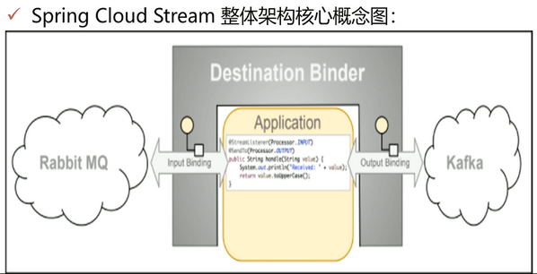
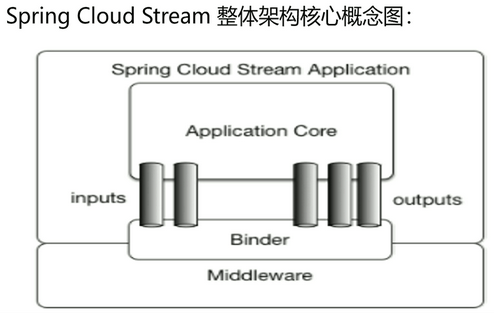
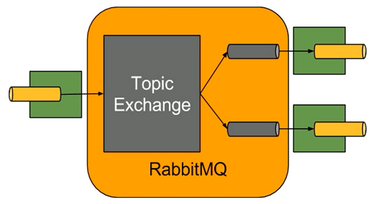

# RabbitMQ 整合 SpringCloudStream







## Barista 接口

Barista 接口： Barista 接口时定义来作为后面类的参数，这一接口定义了通道类型和通道名称，通道名称是作为配置用，通道类型则决定了 app 会使用这一通道进行发送消息还是从中接收消息

**@Output:** 输出注解，用于定义发送消息接口

**@Input:** 输入注解，用于定义消息的消费者接口

**@StringmListener:** 用户定义监听方法的注解

使用 Spring Cloud Stream 非常简单，之需要使用还这3个注解即可，在实现高性能消息的生产和消费的场景非常合适，但是使用 Spring Cloud Stream 框架有一个非常大的问题就是不可能实现可靠性的投递，也就是没法保证消息的 100% 可靠性，会存在少量消息丢失的问题。

## 生产端

### pom 依赖 和 配置文件

```xml
<dependency>
    <groupId>org.springframework.cloud</groupId>
    <artifactId>spring-cloud-starter-stream-rabbit</artifactId>
    <version>1.3.4.RELEASE</version>
</dependency>
<dependency>
    <groupId>org.springframework.boot</groupId>
    <artifactId>spring-boot-starter-actuator</artifactId>
</dependency>
<dependency>
    <groupId>org.springframework.boot</groupId>
    <artifactId>spring-boot-autoconfigure</artifactId>
</dependency>
```

```yml
server.port=8001
server.servlet.context-path=/producer

spring.application.name=producer
spring.cloud.stream.bindings.output_channel.destination=exchange-3
spring.cloud.stream.bindings.output_channel.group=queue-3
spring.cloud.stream.bindings.output_channel.binder=rabbit_cluster

spring.cloud.stream.binders.rabbit_cluster.type=rabbit
spring.cloud.stream.binders.rabbit_cluster.environment.spring.rabbitmq.addresses=192.168.11.76:5672
spring.cloud.stream.binders.rabbit_cluster.environment.spring.rabbitmq.username=guest
spring.cloud.stream.binders.rabbit_cluster.environment.spring.rabbitmq.password=guest
spring.cloud.stream.binders.rabbit_cluster.environment.spring.rabbitmq.virtual-host=/
```

### 声明 Barista 接口

```java
public interface Barista {

    //String INPUT_CHANNEL = "input_channel";
    String OUTPUT_CHANNEL = "output_channel";

    //注解@Input声明了它是一个输入类型的通道，名字是Barista.INPUT_CHANNEL，也就是position3的input_channel。这一名字与上述配置app2的配置文件中position1应该一致，表明注入了一个名字叫做input_channel的通道，它的类型是input，订阅的主题是position2处声明的mydest这个主题
    //@Input(Barista.INPUT_CHANNEL)
    //SubscribableChannel loginput ();

    //注解@Output声明了它是一个输出类型的通道，名字是output_channel。这一名字与app1中通道名一致，表明注入了一个名字为output_channel的通道，类型是output，发布的主题名为mydest。
    @Output(Barista.OUTPUT_CHANNEL)
    MessageChannel logoutput ();

    //String INPUT_BASE = "queue-1";
    //String OUTPUT_BASE = "queue-1";
    //@Input(Barista.INPUT_BASE)
    //SubscribableChannel input1 ();
    //MessageChannel output1 ();
}
```

### 启用发送

```java
@EnableBinding(Barista.class)
@Service  
public class RabbitmqSender {  
  
    @Autowired  
    private Barista barista;  

    // 发送消息
    public String sendMessage(Object message, Map<String, Object> properties) throws Exception {  
        try{
            MessageHeaders mhs = new MessageHeaders(properties);
            Message msg = MessageBuilder.createMessage(message, mhs);
            boolean sendStatus = barista.logoutput().send(msg);
            System.err.println("--------------sending -------------------");
            System.out.println("发送数据：" + message + ",sendStatus: " + sendStatus);
        }catch (Exception e){  
            System.err.println("-------------error-------------");
            e.printStackTrace();
            throw new RuntimeException(e.getMessage());

        }  
        return null;
    }  

}
```

### 发送数据

```java
@Autowired
private RabbitmqSender rabbitmqSender;


@Test
public void sendMessageTest1() {
    for(int i = 0; i < 1; i ++){
        try {
            Map<String, Object> properties = new HashMap<String, Object>();
            properties.put("SERIAL_NUMBER", "12345");
            properties.put("BANK_NUMBER", "abc");
            properties.put("PLAT_SEND_TIME", DateUtils.formatDate(new Date(), "yyyy-MM-dd HH:mm:ss.SSS"));
            rabbitmqSender.sendMessage("Hello, I am amqp sender num :" + i, properties);

        } catch (Exception e) {
            System.out.println("--------error-------");
            e.printStackTrace(); 
        }
    }
    //TimeUnit.SECONDS.sleep(Integer.MAX_VALUE);
}
```

## 消费端

### pom 依赖 和 配置文件

```yml
server.port=8002
server.context-path=/consumer

spring.application.name=consumer
spring.cloud.stream.bindings.input_channel.destination=exchange-3
spring.cloud.stream.bindings.input_channel.group=queue-3
spring.cloud.stream.bindings.input_channel.binder=rabbit_cluster
spring.cloud.stream.bindings.input_channel.consumer.concurrency=1
spring.cloud.stream.rabbit.bindings.input_channel.consumer.requeue-rejected=false
spring.cloud.stream.rabbit.bindings.input_channel.consumer.acknowledge-mode=MANUAL
spring.cloud.stream.rabbit.bindings.input_channel.consumer.recovery-interval=3000
spring.cloud.stream.rabbit.bindings.input_channel.consumer.durable-subscription=true
spring.cloud.stream.rabbit.bindings.input_channel.consumer.max-concurrency=5

spring.cloud.stream.binders.rabbit_cluster.type=rabbit
spring.cloud.stream.binders.rabbit_cluster.environment.spring.rabbitmq.addresses=192.168.11.76:5672
spring.cloud.stream.binders.rabbit_cluster.environment.spring.rabbitmq.username=guest
spring.cloud.stream.binders.rabbit_cluster.environment.spring.rabbitmq.password=guest
spring.cloud.stream.binders.rabbit_cluster.environment.spring.rabbitmq.virtual-host=/
```

### 声明 Barista 接口

```java
public interface Barista {

    String INPUT_CHANNEL = "input_channel";  

    //注解@Input声明了它是一个输入类型的通道，名字是Barista.INPUT_CHANNEL，也就是position3的input_channel。这一名字与上述配置app2的配置文件中position1应该一致，表明注入了一个名字叫做input_channel的通道，它的类型是input，订阅的主题是position2处声明的mydest这个主题  
    @Input(Barista.INPUT_CHANNEL)  
    SubscribableChannel loginput();

}  
```

### 接收数据

```java
@EnableBinding(Barista.class)
@Service
public class RabbitmqReceiver {  

    @StreamListener(Barista.INPUT_CHANNEL)  
    public void receiver(Message message) throws Exception {  
        Channel channel = (com.rabbitmq.client.Channel) message.getHeaders().get(AmqpHeaders.CHANNEL);
        Long deliveryTag = (Long) message.getHeaders().get(AmqpHeaders.DELIVERY_TAG);
        System.out.println("Input Stream 1 接受数据：" + message);
        System.out.println("消费完毕------------");
        channel.basicAck(deliveryTag, false);
    }  
}
```
