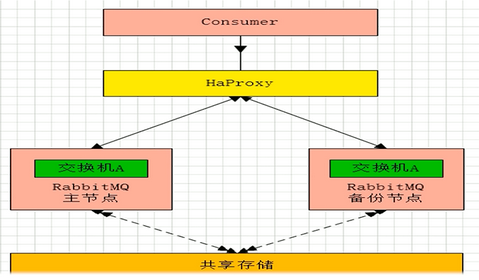
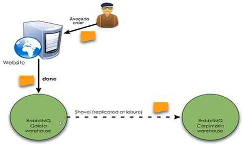
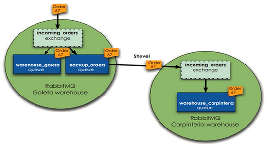
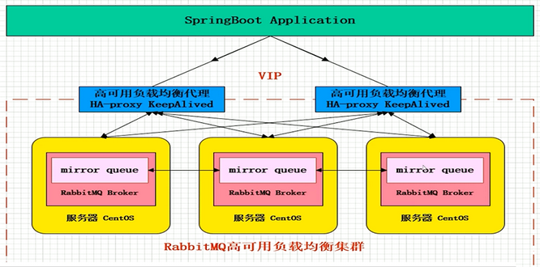
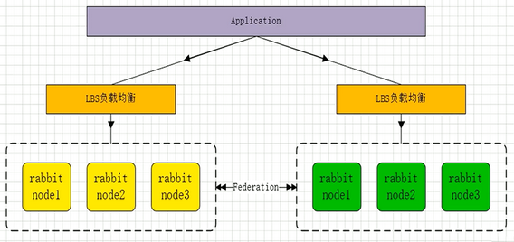
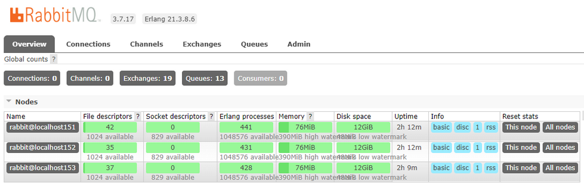
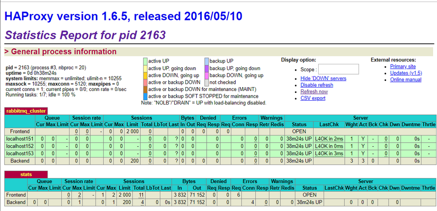

# RabbitMQ 集群与高可用镜像队列

**导航**

- 首先是了解 RabbitMQ 集群架构模式
- 接下来从零开始构建一个高可用的 RabbitMQ 集群
- 集群的配置文件与集群运维故障、失败转移讲解
- 高级插件的而是用

## RabbitMQ 集群架构模式

### 主备模式

**主备模式：** 实现 RabbitMQ 的高可用集群，一般在并发和数据量不高的情况下，这种模型非常的好用且简单。主备模式也称之为 Warren 模式。

所谓的 RabbitMQ 另外一种模式就是 warren（兔子窝），就是一个主/备方案（主节点如果挂了，从节点提供服务而已，和 activemq 利用 zookeeper 做主/备一样）



**HaProxy 配置：**

```bash
listen rabbitmq_cluster     #监听指定的集群
bind 0.0.0.0:5672           #绑定rabbitmq端口
mode tcp                    #配置TCP模式
balance roundrobin          #简单的轮询
server localhost151 192.168.194.151 check inter 5000 rise 2 fall 2  #主节点
server localhost151 192.168.194.151 backup check inter 5000 rise 2 fall 2 #备用节点

#参数 inter 5000 表示每个5秒对mq集群做健康检查，2次正确证明服务器可用，3次失败证明服务器不可用，并且配置主备机制
```

### 远程模式

**远程模式：** 远程模式可以实现双活的一种模式，简称 Shovel 模式，所谓 Shovel 就是远距离通信和复制，我们可以把消息进行不同数据中心的复制工作，我们可以跨地域的让2个 mq 集群互联。





**Shovel 集群的配置：**

启动 rabbimq 插件，命令如下：

```bash
rabbitmq-plugins enable amqp_client
rabbitmq-plugins enable rabbitmq_shovel
```

创建 rabbitmq.config 文件：

```bash
touch /etc/rabbitmq/rabbitmq.config
```

添加配置 rabbitmq.config

最后我们需要源服务器和目的地服务器都使用相同的配置文件（rabbitmq.config）

### 镜像模式

**镜像模式：** 集群模式非常经典的就是 Mirror 镜像模式，保证 100% 数据不丢失，在实际工作中也是用的最多的。并且实现集群非常的简单，一般互联网大肠都会构建这种镜像集群模式。

 Mirror 镜像队列，目的是为了保证 rabbitmq 数据的高可靠性解决方案，主要就是实现数据的同步，一般来讲是 2-3 个节点实现数据同步（对于 100% 数据可靠性解决方案一般是3节点）集群架构如下：



### 多活模式

**多活模式：** 这种模式也是实现异地数据复制的主流模式，因为 Shovel 模式配置比较复杂，所以一般来说实现异地集群都是使用这种 双活 或者 多活模型 来去实现的。这种模型需要依赖 rabbitmq 的 federation 插件，可以实现持续的可靠的 AMQP 数据通信，多活模式在实际配置与应用非常的简单。

RabbitMQ 部署架构采用双中心模式（多中心），那么在两套（或多套）数据中心中各部署一套 RabbitMQ 集群，各中心的 RabbitMQ 服务除了需要为业务提供正常的消息服务外，中心之间还需要实现部分队列消息共享。多活集群架构如下：



Federation 插件是一个不需要构建 Cluster, 而在 Brokers 之间传输消息的高性能插件， Federation 插件客户以在 Brokers 或者 Cluster 之间传输消息，连接的双方可以使用不同的 users 和 virtual hosts，双方也可以使用版本不同的 RabbitMQ 和 Erlang。Federation 插件使用 AMQP 协议通讯，可以接收不连续的传输。

Federation Exchanges, 可以看成 Downstream 从 Upstream 主动拉取消息，并不是拉取所有消息，必须是在 Downstream 上已经明确定义 Bindings 关系的 Exchange, 也就是有实际的物理 Queue 来接收消息，才会从 Upstream 拉取消息到 Downstream 。使用 AMQP 协议实施代理间通信，Downstream 会将绑定关系组合在一起，绑定/解除绑定 命令将发送到 Upstream 交换机。因此，Federation Exchange 只接收具有订阅的消息，本初贴出官方图来说明：


## RabbitMQ 集群镜像模式构建

**RabbitMQ 集群环境节点说明：**

| 服务器IP| HostName | 节点说明 | 端口 | 管控台地址 |
| ------- | -------- | ------- | ---- | --------- |
|192.168.194.151 | localhost151 | rabbitmq master | 5672 | 192.168.194.151:15672 |
|192.168.194.152 | localhost152 | rabbitmq slave | 5672 | 192.168.194.152:15672 |
|192.168.194.153 | localhost153 | rabbitmq slave | 5672 | 192.168.194.153:15672 |
|192.168.194.154 | localhost154 | haproxy + keepalived | 8100 | 192.168.194.154:8100/rabbitmq-stats |
|192.168.194.155 | localhost155 | haproxy + keepalived | 8100 | 192.168.194.155:8100/rabbitmq-stats |

### RabbitMQ 集群组成

操作对象：151, 152, 153 节点

#### 文件同步

选择 151, 152, 153 任意一个节点为Master（这里选择151为 Master），也就是说我们需要把151的Cookie文件同步到152, 153节点上去，进入 `/var/lib/rabbitmq` 目录下，把 `/var/lib/rabbitmq/.erlang.cookie`  文件的权限修改为777，原来是400；然后把 `.erlang.cookie` 文件copy 到各个节点下；最后把所有 cookie 文件权限还原为400即可。

#### 组成集群步骤

1、停止MQ服务

```bash
# 151, 152, 153 停止服务
rabbitmqctl stop
```

2、组成集群操作

PS:接下来我们就可以使用集群命令，配置151, 152, 153为集群模式，3个节点（151, 152, 153）执行启动命令，后续启动集群使用此命令即可。

```bash
# 151, 152, 153 启动集群服务
rabbitmq-server -detached
```

3、slave加入集群操作（重新加入集群也是如此，以最开始的主节点为加入节点）

>注意做这个步骤的时候：需要配置 `/etc/hosts` 必须相互能够寻址到，例如151节点：  

```bash
vim /etc/hosts

127.0.0.1   localhost localhost.localdomain localhost4 localhost4.localdomain4  
::1         localhost localhost.localdomain localhost6 localhost6.localdomain6  
192.168.194.151 localhost151  
192.168.194.152 localhost152  
192.168.194.153 localhost153  
```

操作对象：152, 153 节点

```bash
# localhost152
rabbitmqctl stop_app
# 加入151主节点集群
rabbitmqctl join_cluster --ram rabbit@localhost151
rabbitmqctl start_app

# localhost153
rabbitmqctl stop_app
# 加入151主节点集群
rabbitmqctl join_cluster rabbit@localhost151
rabbitmqctl start_app

#（删除节点操作）要移除的集群节点
rabbitmqctl forget_cluster_node rabbit@localhost159
```

4、修改集群名称

```bash
# 修改集群名称（默认为第一个node名称）：
rabbitmqctl set_cluster_name rabbitmq_cluster1
```

5、查看集群状态

```bash
# 最后在集群的任意一个节点执行命令：查看集群状态
rabbitmqctl cluster_status
```

6、管控台界面



### 配置镜像队列

设置镜像队列策略（在151, 152, 153任意一个节点上执行）

```bash
rabbitmqctl set_policy ha-all "^" '{"ha-mode":"all"}'
```

PS: 将所有队列设置为镜像队列，即队列会被复制到各个节点，各个节点状态一致，RabbitMQ 高可用集群就已经搭建好了,我们可以重启服务，查看其队列是否在从节点同步。

### Haproxy 环境搭建

- HAProxy 是一款提供高可用性、负载均衡以及基于 TCP 和 HTTP 应用的代理软件
- HAProxy 是完全免费的、借助 HAProxy 可以快速并且可靠的提供基于 TCP 和 HTTP 应用的代理解决方案。
- HAProxy 适用于那些负载较大的 web 站点，这些站点通常又需要会话保持或七层处理。
- HAProxy 可以支持数以万计的并发连接,并且 HAProxy 的运行模式使得它可以很简单安全的整合进架构中，同时可以保护 web 服务器不被暴露到网络上。

### 安装 Haproxy

操作对象：154, 155 节点

```bash
# 下载依赖包
yum install gcc vim wget

# 下载haproxy
wget http://www.haproxy.org/download/1.6/src/haproxy-1.6.5.tar.gz

# 解压
tar -zxvf haproxy-1.6.5.tar.gz -C /usr/local

# 进入目录、进行编译、安装
cd /usr/local/haproxy-1.6.5

# 编译
make TARGET=linux31 PREFIX=/usr/local/haproxy

# 安装
make install PREFIX=/usr/local/haproxy

mkdir /etc/haproxy

# 赋权
groupadd -r -g 149 haproxy
useradd -g haproxy -r -s /sbin/nologin -u 149 haproxy

# 创建haproxy配置文件
touch /etc/haproxy/haproxy.cfg
```

`haproxy.cfg` 配置文件：

```bash
#logging options
global
    log 127.0.0.1 local0 info
    maxconn 5120
    chroot /usr/local/haproxy
    uid 99
    gid 99
    daemon
    quiet
    nbproc 20
    pidfile /var/run/haproxy.pid

defaults
    log global
    #使用4层代理模式，”mode http”为7层代理模式
    mode tcp
    #if you set mode to tcp,then you nust change tcplog into httplog
    option tcplog
    option dontlognull
    retries 3
    option redispatch
    maxconn 2000
    contimeout 5s
     ##客户端空闲超时时间为 60秒 则HA 发起重连机制
     clitimeout 60s
     ##服务器端链接超时时间为 15秒 则HA 发起重连机制
     srvtimeout 15s
#front-end IP for consumers and producters

listen rabbitmq_cluster
    bind 0.0.0.0:5672
    #配置TCP模式
    mode tcp
    #balance url_param userid
    #balance url_param session_id check_post 64
    #balance hdr(User-Agent)
    #balance hdr(host)
    #balance hdr(Host) use_domain_only
    #balance rdp-cookie
    #balance leastconn
    #balance source //ip
    #简单的轮询
    balance roundrobin
    #rabbitmq集群节点配置 #inter 每隔五秒对mq集群做健康检查， 2次正确证明服务器可用，2次失败证明服务器不可用，并且配置主备机制
        server localhost151 192.168.194.151:5672 check inter 5000 rise 2 fall 2
        server localhost152 192.168.194.152:5672 check inter 5000 rise 2 fall 2
        server localhost153 192.168.194.153:5672 check inter 5000 rise 2 fall 2
#配置haproxy web监控，查看统计信息
listen stats
    # 154 节点设置为 bind 192.168.194.154:8100
    bind 192.168.194.155:8100
    mode http
    option httplog
    stats enable
    #设置haproxy监控地址为http://localhost:8100/rabbitmq-stats
    stats uri /rabbitmq-stats
    stats refresh 5s
```

启动 Haproxy:

```bash
/usr/local/haproxy/sbin/haproxy -f /etc/haproxy/haproxy.cfg

# 查看haproxy进程状态
ps -ef | grep haproxy
```

访问 Haproxy:

PS:访问如下地址可以对 rmq 节点进行监控：http://192.168.194.154:8100/rabbitmq-stats



关闭 Haproxy:

```bash
killall haproxy

ps -ef | grep haproxy
```

## KeepAlived

### Keepalived 简介

Keepalived 它是一个高性能的服务器高可用或热备解决方案，Keepalived 主要来防止服务器单点故障的发生问题，可以通过其与 Nginx、Haproxy 等反向代理的负载均衡服务器配合实现 web 服务端的高可用。Keepalived 以 VRRP 协议为实现基础，用 VRRP 协议来实现高可用性（HA）.VRRP（Virtual Router Redundancy Protocol）协议是用于实现路由器冗余的协议，VRRP 协议将两台或多台路由器设备虚拟成一个设备，对外提供虚拟路由器 IP（一个或多个）。

VRRP 协议就是为了解决静态路由单点故障的问题，通过一种竞争机制来将路由的任务交给某台 VRRP 路由器的。

**Keepalived 的三个重要功能：**

- 管理 LVS 负载均衡软件
- 实现 LVS 集群节点的健康检查
- 作为系统网络服务的高可用性（failover）

### 安装 KeepAlived

安装节点：154, 155

下载地址：[http://www.keepalived.org/download.html](http://www.keepalived.org/download.html)

**安装步骤：**

```bash
# 安装所需软件包
yum install -y openssl openssl-devel

# 下载
wget http://www.keepalived.org/software/keepalived-1.2.18.tar.gz

# 解压、编译、安装
tar -zxvf keepalived-1.2.18.tar.gz -C /usr/local/

cd keepalived-1.2.18/ && ./configure --prefix=/usr/local/keepalived

make && make install

# 将keepalived安装成Linux系统服务，因为没有使用keepalived的默认安装路径（默认路径：/usr/local）,安装完成之后，需要做一些修改工作
# 首先创建文件夹，将keepalived配置文件进行复制：
mkdir /etc/keepalived

cp /usr/local/keepalived/etc/keepalived/keepalived.conf /etc/keepalived/

# 然后复制keepalived脚本文件：
cp /usr/local/keepalived/etc/rc.d/init.d/keepalived /etc/init.d/

cp /usr/local/keepalived/etc/sysconfig/keepalived /etc/sysconfig/

# 如果提示已存在，先删除 rm -f /usr/sbin/keepalived
ln -s /usr/local/sbin/keepalived

ln -s /usr/local/keepalived/sbin/keepalived /sbin/

# 可以设置开机启动：chkconfig keepalived on，到此我们安装完毕!
chkconfig keepalived on
```

### Keepalived 配置

```bash
vim /etc/keepalived/keepalived.conf
```

**154 节点（Master）配置如下：**

```bash
! Configuration File for keepalived

global_defs {
   router_id localhost151  ##标识节点的字符串，通常为hostname

}

vrrp_script chk_haproxy {
    script "/etc/keepalived/haproxy_check.sh"  ##执行脚本位置
    interval 2  ##检测时间间隔
    weight -20  ##如果条件成立则权重减20
}

vrrp_instance VI_1 {
    state MASTER  ## 主节点为MASTER，备份节点为BACKUP
    interface ens33 ## 绑定虚拟IP的网络接口（网卡），与本机IP地址所在的网络接口相同（我这里是eth0）
    virtual_router_id 151  ## 虚拟路由ID号（主备节点一定要相同）
    mcast_src_ip 192.168.194.151 ## 本机ip地址
    priority 100  ##优先级配置（0-254的值）
    nopreempt
    advert_int 1  ## 组播信息发送间隔，俩个节点必须配置一致，默认1s
authentication {  ## 认证匹配
        auth_type PASS
        auth_pass 123456
    }

    track_script {
        chk_haproxy
    }

    virtual_ipaddress {
        192.168.194.100  ## 虚拟ip，可以指定多个
    }
}
```

**155 节点（Slave）配置如下：**

```bash
! Configuration File for keepalived

global_defs {
   router_id localhost155  ##标识节点的字符串，通常为hostname

}

vrrp_script chk_haproxy {
    script "/etc/keepalived/haproxy_check.sh"  ##执行脚本位置
    interval 2  ##检测时间间隔
    weight -20  ##如果条件成立则权重减20
}

vrrp_instance VI_1 {
    state BACKUP  ## 主节点为MASTER，备份节点为BACKUP
    interface ens33 ## 绑定虚拟IP的网络接口（网卡），与本机IP地址所在的网络接口相同（我这里是eth0）
    virtual_router_id 154  ## 虚拟路由ID号（主备节点一定要相同）
    mcast_src_ip 192.168.194.155 ## 本机ip地址
    priority 90  ##优先级配置（0-254的值）
    nopreempt
    advert_int 1  ## 组播信息发送间隔，俩个节点必须配置一致，默认1s
authentication {  ## 认证匹配
        auth_type PASS
        auth_pass 123456
    }

    track_script {
        chk_haproxy
    }

    virtual_ipaddress {
        192.168.194.100  ## 虚拟ip，可以指定多个
    }
}
```

**`haproxy_check.sh` 脚本文件：**

```bash
# 创建脚本文件
touch /etc/keepalived/haproxy_check.sh

# 设置可执行权限
chmod +x /etc/keepalived/haproxy_check.sh
```

**脚本内容：**

```bash
#!/bin/bash
COUNT=`ps -C haproxy --no-header |wc -l`
if [ $COUNT -eq 0 ];then
    /usr/local/haproxy/sbin/haproxy -f /etc/haproxy/haproxy.cfg
    sleep 2
    if [ `ps -C haproxy --no-header |wc -l` -eq 0 ];then
        killall keepalived
    fi
fi
```

**启动 Keepalived：**

当我们启动俩个 haproxy 节点以后，我们可以启动 keepalived 服务程序

```bash
# 启动两台机器的keepalived
systemctl start keepalived.service

# 查看状态
ps -ef | grep haproxy
ps -ef | grep keepalived
```

**查看节点状态：**

```bash
[root@localhost154]# ip addr

# 网卡以成功绑定虚IP，192.168.194.100/32
2: ens33: <BROADCAST,MULTICAST,UP,LOWER_UP> mtu 1500 qdisc pfifo_fast state UP group default qlen 1000
    link/ether 00:0c:29:a5:09:3f brd ff:ff:ff:ff:ff:ff
    inet 192.168.194.154/24 brd 192.168.194.255 scope global noprefixroute ens33
       valid_lft forever preferred_lft forever
    inet 192.168.194.100/32 scope global ens33
```

