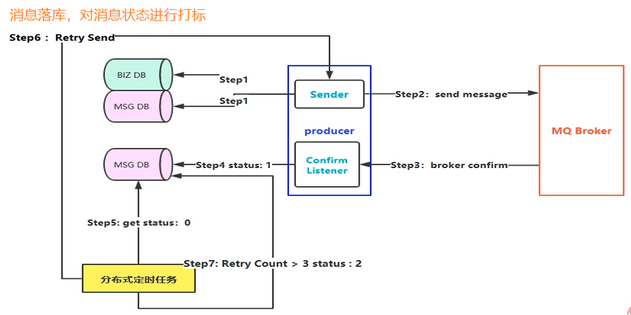
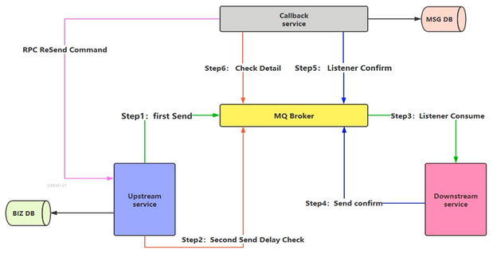
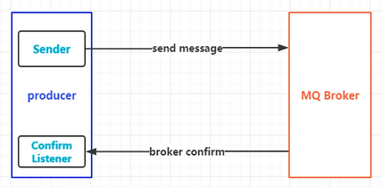
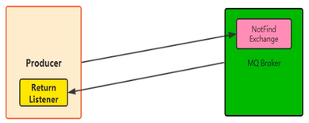
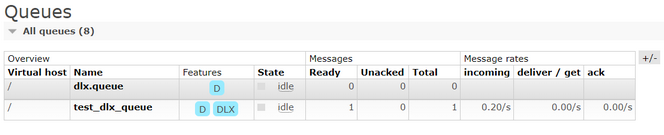

# RabbitMQ高级特性

1. 消息如何保障 100% 的投递成功
2. 幂等性概念详解
3. 在海量订单产生的业务高峰期，如何避免消息的重复消费问题
4. Confirm 确认消息，Return 返回消息
5. 自定义消费者
6. 消息的 ACK 与重回队列
7. 消息的限流
8. TTL 消息
9. 死信队列

## 1. 消息如何保障 100% 的投递成功

- 保障消息的成功发出
- 保障 MQ 节点的成功接收
- 发送端收到 MQ 节点（Broker）确认应答
- 完善的消息进行补偿机制

### 生产端可靠性投递-解决方案

1. 消息落库，对消息状态进行打标
2. 消息的延迟投递，做二次确认，回调检查

#### 消息落库，对消息状态进行打标



关注可靠性，不适合高并发的场景。

#### 消息的延迟投递，做二次确认，回调检查



关注性能，适合高并发的场景。

## 2. 幂等性概念详解

### 幂等性是什么

我们可以借鉴数据库的乐观锁机制：比如我们执行一条更新库存的 SQL 语句

```sql
update t_reps set count = count - 1, version = version + 1 where version = 1
```

### 消费端-幂等性保障

在海量订单产生的业务高峰期，如何避免消息的重复消费问题？

消费端实现幂等性，就意味着，我们的消息永远不会消费多次，即使我们收到了多条一样的消息。

主流的幂等性操作：

- 唯一ID + 指纹码 机制，利用数据库主键去重
- 利用 Redis 的原子性去实现

#### 唯一ID + 指纹码 机制

唯一ID + 指纹码 机制，利用数据库主键去重

- `select count(1) from t_order where id = 唯一ID + 指纹码`
- 好处：实现简单
- 坏处：高并发下有数据库写入的性能瓶颈
- 解决方案：跟进 ID 进行分库分表进行算法路由

#### 利用 Redis 的原子性去实现

使用 Redis 进行幂等，需要考虑的问题

1. 是否要进行数据落库，如果落库的话，关键解决的问题是数据库和缓存如何做到原子性?
2. 如果不进行落库，那么都存储到缓存中，如何设置定时同步的策略?

## 3. Confirm 确认消息

消息的确认，是指生产者投递消息后，如果 Broker 收到消息，则会给我们生产者一个应答。

生产者进行接收应答，用来确定这条消息是否正常的发送到 Broker，这种方式也是消息的可靠性投递的核心保障！



### 如何实现 Confirm 确认消息

1. 在 Channel 上开启确认模式: channel.confirmSelect()
2. 在 Channel 上添加监听: addConfirmListener，监听成功和失败的返回结果，根据具体的结果对消息进行重新发送、或记录日志等后续处理

**生产端代码：**

```java
public class Producer {
    public static void main(String[] args) throws IOException, TimeoutException {
        ConnectionFactory connectionFactory = new ConnectionFactory();
        connectionFactory.setHost("192.168.194.151");
        connectionFactory.setPort(5672);
        connectionFactory.setVirtualHost("/");
        Connection connection = connectionFactory.newConnection();
        Channel channel = connection.createChannel();
        //执行消息投递模式: 消息的确认模式
        channel.confirmSelect();

        String exchangeName = "test_confirm_exchange";
        String routingKey = "confirm.save";
        String msg = "RabbitMQ Send confirm message";
        channel.basicPublish(exchangeName, routingKey, null, msg.getBytes());

        //添加一个确认监听
        channel.addConfirmListener(new ConfirmListener() {
            @Override
            public void handleAck(long deliveryTag, boolean multiple) throws IOException {
                System.err.println("------ ack ----");
            }

            @Override
            public void handleNack(long deliveryTag, boolean multiple) throws IOException {
                System.err.println("------ no ack ----");
            }
        });
    }
}
```

**消费端代码：**

```java
public class Consumer {
    public static void main(String[] args) throws IOException, TimeoutException {
        ConnectionFactory connectionFactory = new ConnectionFactory();
        connectionFactory.setHost("192.168.194.151");
        connectionFactory.setPort(5672);
        connectionFactory.setVirtualHost("/");
        Connection connection = connectionFactory.newConnection();
        Channel channel = connection.createChannel();

        String exchangeName = "test_confirm_exchange";
        String routingKey = "confirm.*";
        String queueName = "test_confirm_queue";
        channel.exchangeDeclare(exchangeName, BuiltinExchangeType.TOPIC, true);
        channel.queueDeclare(queueName, true, false, false, null);
        channel.queueBind(queueName, exchangeName, routingKey);

        DefaultConsumer defaultConsumer = new DefaultConsumer(channel) {
            @Override
            public void handleDelivery(String consumerTag, Envelope envelope, AMQP.BasicProperties properties, byte[] body) throws IOException {
                String msg = new String(body);
                System.out.println("接收到消息：" + msg);
            }
        };
        channel.basicConsume(queueName, true, defaultConsumer);
    }
}
```

**测试结果：**

生产端控制台输出：

```text
------ ack ----
```

消费端控制台输出：

```text
接收到消息：RabbitMQ Send confirm message
```

## 4. Return 消息机制

Return Listener 用于处理一些不可路由的消息。

消息生产者，通过指定一个 Exchange 和 RoutingKey，把消息送达到某一个队列中去，然后我们的消费者监听队列，进行消费处理操作！

但是在某些情况下，如果我们在发送消息的时候，当前的 Exchange 不存在或者指定的路由 Key 路由不到，这个时候如果我们需要监听这种不可达的消息，就要使用 Return Listener。



### 基础 API 中的关键配置项

**Mandatory：** 如果为 true，则监听器会接收到路由不可达的消息，然后进行后续处理，如果为 false，那么 broker 端自动删除该消息！

**生产端代码：**

```java
public class Producer {
    public static void main(String[] args) throws IOException, TimeoutException {
        ConnectionFactory connectionFactory = new ConnectionFactory();
        connectionFactory.setHost("192.168.194.151");
        connectionFactory.setPort(5672);
        connectionFactory.setVirtualHost("/");
        Connection connection = connectionFactory.newConnection();
        Channel channel = connection.createChannel();

        String exchange = "test_return_exchange";
        String msg = "Hello RabbitMQ Return Message";
        //String routingKey = "return.save";
        //channel.basicPublish(exchange, routingKey, true, null, msg.getBytes());

        String routingKerErr = "abc.save";
        channel.basicPublish(exchange, routingKerErr, true, null, msg.getBytes());

        channel.addReturnListener(new ReturnListener() {
            @Override
            public void handleReturn(int replyCode, String replyText,
                                     String exchange, String routingKey, AMQP.BasicProperties properties, byte[] body) throws IOException {
                System.err.println("--------handle return-------");
                System.err.println("replyCode: " + replyCode);
                System.err.println("replyText: " + replyText);
                System.err.println("exchange: " + exchange);
                System.err.println("routingKey: " + routingKey);
                System.err.println("properties: " + properties);
                System.err.println("body: " + new String(body));
            }
        });
    }
}
```

**消费端代码：**

```java
public class Consumer {
    public static void main(String[] args) throws IOException, TimeoutException {
        ConnectionFactory connectionFactory = new ConnectionFactory();
        connectionFactory.setHost("192.168.194.151");
        connectionFactory.setPort(5672);
        connectionFactory.setVirtualHost("/");
        Connection connection = connectionFactory.newConnection();
        Channel channel = connection.createChannel();

        String exchange = "test_return_exchange";
        String routingKey = "return.#";
        String queue = "test_return_queue";
        channel.exchangeDeclare(exchange, BuiltinExchangeType.TOPIC, true, false, null);
        channel.queueDeclare(queue, true, false, false, null);
        channel.queueBind(queue, exchange, routingKey);

        DefaultConsumer defaultConsumer = new DefaultConsumer(channel) {
            @Override
            public void handleDelivery(String consumerTag, Envelope envelope, AMQP.BasicProperties properties, byte[] body) throws IOException {
                String msg = new String(body);
                System.err.println("接收到消息：" + msg);
            }
        };
        channel.basicConsume(queue, true, defaultConsumer);
    }
}
```

**测试结果：**

生产端控制台输出：

```text
--------handle return-------
replyCode: 312
replyText: NO_ROUTE
exchange: test_return_exchange
routingKey: abc.save
properties: #contentHeader<basic>(content-type=null, content-encoding=null, headers=null, delivery-mode=null, priority=null, correlation-id=null, reply-to=null, expiration=null, message-id=null, timestamp=null, type=null, user-id=null, app-id=null, cluster-id=null)
body: Hello RabbitMQ Return Message
```

## 5. 消费端自定义监听

创建一个类继承 DefaultConsumer 类，继承各种处理方法。

## 6. 消费端限流

### 什么是消费端的限流

假设一个场景，首先，RabbitMQ 服务器有上万条未处理的消息，我们随便打开一个消费者客户端，会出现下面的情况：

巨量的消息瞬间全部推送过来，但是单个客户端无法同时处理者么多数据！

### Qos 服务质量保证

>**注意：** RabbitMQ 必须要设置 autoAck = false 为手动回复

RabbitMQ 提供了一种 Qos (服务质量保证) 功能，即在非自动确认消息的前提下，如果一定数目的消息（通过基于 consumer 或者 channel 设置 Qos 的值）未被确认前，不进行消费新的消息。

消费端方法：`void BasicQos(uint prefetchSize, ushort prefetchCount, bool global);`

| 参数 | 说明 |
| ---- | ---- |
| prefetchSize  |  设置消息限制的大小（一般设置0）
| prefetchCount |  设置一次最多处理多少条消息;<br>一旦有 N 个消息还没有 ack，则该 consumer 将 block 掉，直到消息 ack |
| global        |  ture: 应用 channel 级别限制<br>false: 应用 consumer 级别限制 |

`prefetchCount` 在 `no_ask = false` 的情况下生效，即在自动应答的情况下这两个值是不生效的。

**生产端代码：**

```java
public class Producer {
    public static void main(String[] args) throws IOException, TimeoutException {
        ConnectionFactory connectionFactory = new ConnectionFactory();
        connectionFactory.setHost("192.168.194.151");
        connectionFactory.setPort(5672);
        connectionFactory.setVirtualHost("/");
        Connection connection = connectionFactory.newConnection();
        Channel channel = connection.createChannel();
        String exchange = "test_qos_exchange";
        String routingKey = "qos.save";
        String msg = "Hello RabbitMQ";
        for (int i = 0; i < 3; i++) {
            channel.basicPublish(exchange, routingKey, null, msg.getBytes());
        }
    }
}
```

**消费端代码：**

```java
public class Consumer {
    public static void main(String[] args) throws IOException, TimeoutException {
        ConnectionFactory connectionFactory = new ConnectionFactory();
        connectionFactory.setHost("192.168.194.151");
        connectionFactory.setPort(5672);
        connectionFactory.setVirtualHost("/");
        Connection connection = connectionFactory.newConnection();
        Channel channel = connection.createChannel();
        String exchange = "test_qos_exchange";
        String routingKey = "qos.#";
        String queue = "test_qos_queue";
        channel.exchangeDeclare(exchange, BuiltinExchangeType.TOPIC, true, false, null);
        channel.queueDeclare(queue, true, false, false, null);
        channel.queueBind(queue, exchange, routingKey);
        //QOS 服务质量保证
        channel.basicQos(0, 1, false);

        DefaultConsumer consumer = new DefaultConsumer(channel) {
            @Override
            public void handleDelivery(String consumerTag, Envelope envelope, AMQP.BasicProperties properties, byte[] body) throws IOException {
                String msg = new String(body, "UTF-8");
                System.out.println("receive message: " + msg);
                //QOS 处理，注释这段代码则没有返回处理，后面的消息不会接收去处理
                Channel chan = this.getChannel();
                chan.basicAck(envelope.getDeliveryTag(), false);
            }
        };

        //限流方式: 设置 autoACK 为 false
        channel.basicConsume(queue, false, consumer);
    }
}
```

## 7. 消费端 ACK 与重回队列

### 消费端的手工 ACK 和 NACK

消费端进行消费的时候，如果由于业务异常我们可以进行日志的记录，然后及逆行补偿。

如果由于服务器宕机等严重问题，那我们就需要手工进行 ACK 保障消费端消费成功。

### 消费端的重回队列

消费端重回队列是为了对没有处理成功的消息，把消息重新投递给 Broker。

一般我们在实际应用中，都会关闭重回队列，也就是设置为 false。

**生产端代码：**

```java
public class Producer {
    public static void main(String[] args) throws IOException, TimeoutException {
        ConnectionFactory connectionFactory = new ConnectionFactory();
        connectionFactory.setHost("192.168.194.151");
        connectionFactory.setPort(5672);
        connectionFactory.setVirtualHost("/");
        Connection connection = connectionFactory.newConnection();
        Channel channel = connection.createChannel();
        String exchange = "test_ack_exchange";
        String routingKey = "ack.save";

        for (int i = 0; i < 3; i++) {
            String msg = "ACK RabbitMQ " + i;
            HashMap<String, Object> map = new HashMap<>();
            map.put("num", i);
            AMQP.BasicProperties properties = new AMQP.BasicProperties().builder()
                    .deliveryMode(2)
                    .contentType("UTF-8")
                    .headers(map)
                    .build();
            channel.basicPublish(exchange, routingKey, properties, msg.getBytes());
        }
    }
}
```

**消费端代码：**

```java
public class Consumer {
    public static void main(String[] args) throws IOException, TimeoutException {
        ConnectionFactory connectionFactory = new ConnectionFactory();
        connectionFactory.setHost("192.168.194.151");
        connectionFactory.setPort(5672);
        connectionFactory.setVirtualHost("/");
        Connection connection = connectionFactory.newConnection();
        Channel channel = connection.createChannel();
        String exchange = "test_ack_exchange";
        String routingKey = "ack.#";
        String queue = "test_ack_queue";
        channel.exchangeDeclare(exchange, BuiltinExchangeType.TOPIC, true, false, null);
        channel.queueDeclare(queue, true, false, false, null);
        channel.queueBind(queue, exchange, routingKey);

        DefaultConsumer consumer = new DefaultConsumer(channel) {
            @Override
            public void handleDelivery(String consumerTag, Envelope envelope, AMQP.BasicProperties properties, byte[] body) throws IOException {
                String msg = new String(body, "UTF-8");
                System.out.println("body: " + msg);
                Channel chan = this.getChannel();

                try {
                    Thread.sleep(2000);
                } catch (InterruptedException e) {
                    e.printStackTrace();
                }

                if ((Integer) properties.getHeaders().get("num") == 0) {
                    //requeue 为true，重回队列
                    chan.basicNack(envelope.getDeliveryTag(), false, true);
                }else {
                    chan.basicAck(envelope.getDeliveryTag(), false);
                }
            }
        };

        //设置 autoACK 为 false
        channel.basicConsume(queue, false, consumer);
    }
}
```

**测试结果：**

`num == 0` 的消息被 Nack 并设置重回队列

```text
body: ACK RabbitMQ 0
body: ACK RabbitMQ 1
body: ACK RabbitMQ 2
body: ACK RabbitMQ 0
body: ACK RabbitMQ 0
```

## 8. TTL队列/消息

TTL 是 Time To Live 的缩写，也就是生存时间。

RabbitMQ 支持消息的过期时间，在消息发送时可以进行指定。

RabbitMQ 支持队列的过期时间，从消息入队列开始计算，只要超过了队列的超时时间配置，那么消息会自动的清楚。

## 9. 死信队列

死信队列 DLX (Dead-Letter-Exchange)

利用 DLX，当消息在一个队列中变成死信 (dead message) 之后，它能被重新 publish 到另一个 Exchange，这个 Exchange 就是 DLX。

### 消息变成死信有以下几种情况

1. 消息被拒绝 (basic.reject / basic.nack) 并且 requeue = false
2. 消息 TTL 过期
3. 队列达到最大长度

DLX 也是一个正常的 Exchange, 和一般的 Exchange 没有区别，它能在任何的队列上被指定，实际上就是设置某个队列的属性。

当这个队列中有死信时，RabbitMQ 就会自动的将这个消息重新发布到设置的 Exchange 上去，进而被路由到另一个队列。

可以监听这个队列消息做相应的处理，这个特性可以你不 RabbitMQ 3.0 以前支持的 immediate 参数的功能。

### 死信队列设置

1、首先需要设置死信队列的 exchange 和 queue, 然后进行绑定：

```css
Exchange:   dlx.exchange
Queue:      dlx.queue
RoutingKey: #
```

2、然后进行正常声明交换机、队列、绑定，只不过我们需要在队列加上一个参数即可：

```bash
# 添加参数 key: x-deda-letter-exchange  value: 队列绑定的死信交换机
arguments.put("x-deda-letter-exchange", "dlx.exchange");
```

这样消息在过期、requeue、队列在达到最大长度时，消息就可以直接路由到死信队列！

**生产端代码：**

```java
public class Producer {
    public static void main(String[] args) throws IOException, TimeoutException {
        ConnectionFactory connectionFactory = new ConnectionFactory();
        connectionFactory.setHost("192.168.194.151");
        connectionFactory.setPort(5672);
        connectionFactory.setVirtualHost("/");
        Connection connection = connectionFactory.newConnection();
        Channel channel = connection.createChannel();
        //声明正常的交换机
        String exchange = "test_dlx_exchange";
        String routingKey = "dlx.save";
        String msg = "Hello RabbitMQ DLX Message";

        AMQP.BasicProperties properties = new AMQP.BasicProperties().builder().deliveryMode(2)
                .contentType("utf-8")
                //设置消息10秒后过期
                .expiration("10000")
                .build();

        channel.basicPublish(exchange, routingKey, true, properties, msg.getBytes());
    }
}
```

**消费端代码：**

```java
public class Consumer {
    public static void main(String[] args) throws IOException, TimeoutException {
        ConnectionFactory connectionFactory = new ConnectionFactory();
        connectionFactory.setHost("192.168.194.151");
        connectionFactory.setPort(5672);
        connectionFactory.setVirtualHost("/");
        Connection connection = connectionFactory.newConnection();
        Channel channel = connection.createChannel();

        //普通交换机、队列、路由
        String exchange = "test_dlx_exchange";
        String routingKey = "dlx.#";
        String queue = "test_dlx_queue";
        channel.exchangeDeclare(exchange, BuiltinExchangeType.TOPIC, true, false, null);

        //arguments 属性，要设置到队列上
        Map<String, Object> arguments = new HashMap<>(16);
        arguments.put("x-dead-letter-exchange", "dlx.exchange");
        channel.queueDeclare(queue, true, false, false, arguments);
        channel.queueBind(queue, exchange, routingKey);

        //声明死信队列
        channel.exchangeDeclare("dlx.exchange", BuiltinExchangeType.TOPIC, true, false, null);
        channel.queueDeclare("dlx.queue", true, false, false, null);
        channel.queueBind("dlx.queue", "dlx.exchange", "#");

        //Nack 消息, requeue 设置为 false
        channel.basicNack(2, false, false);
    }
}
```

**测试结果：**

消费端 Nack 消息，没有处理



10 秒后消息过期，publish 到死信路由

