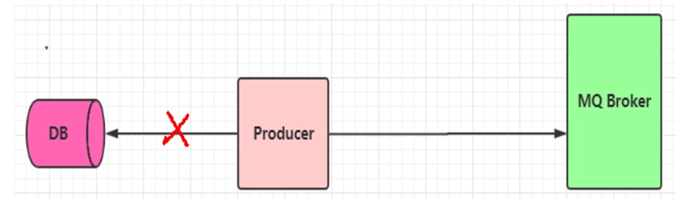
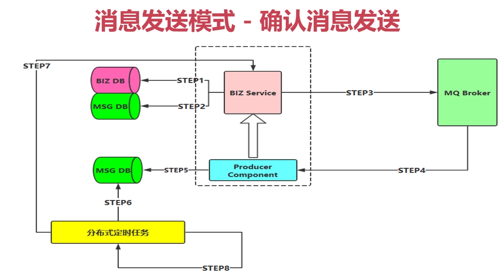
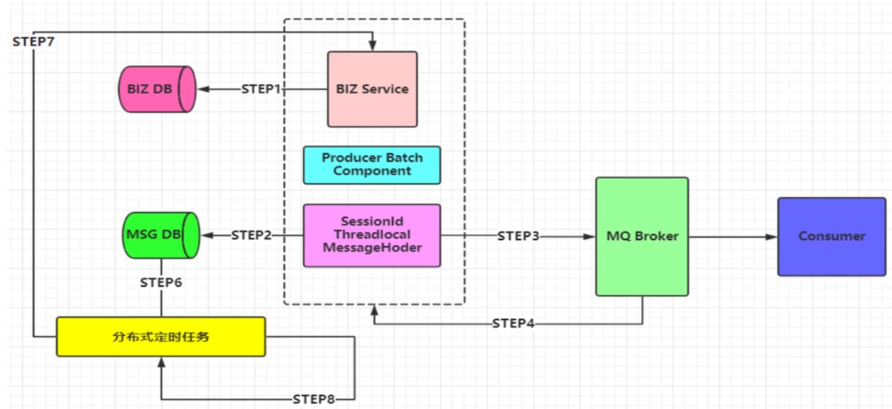
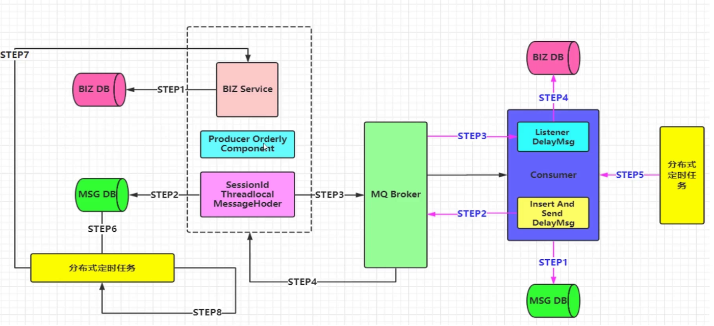
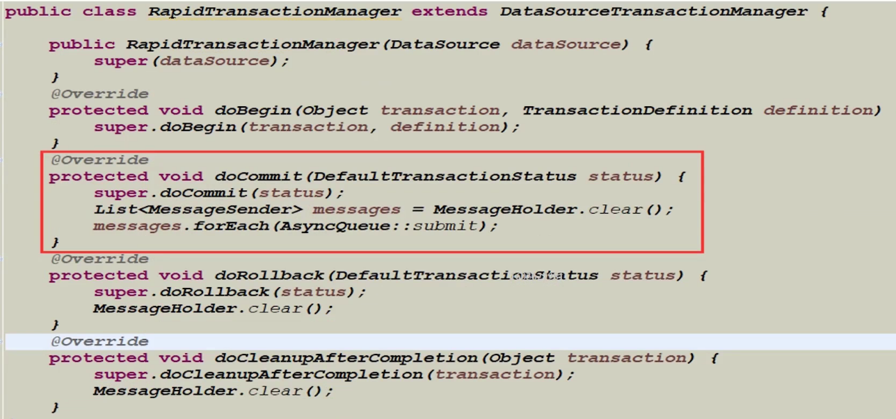
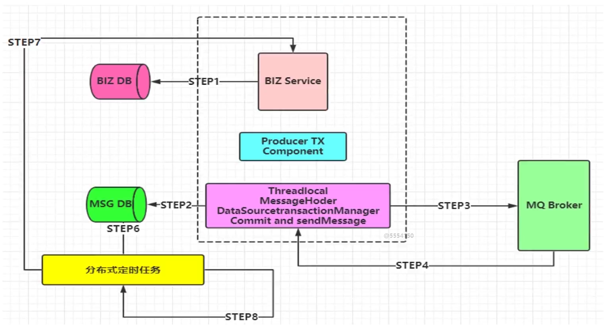
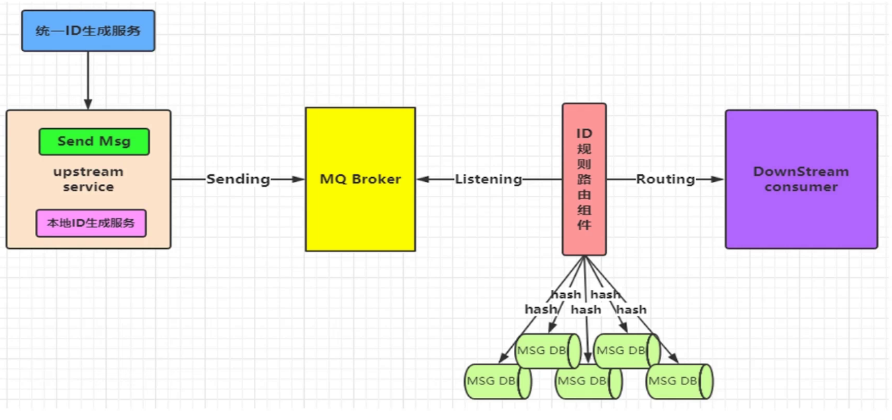

# 一线大厂的 MQ 组件实现思路和架构设计思路

## RabbitMQ 组件实现思路和架构设计思路

基础组件封装设计：

- 迅速消息发送
- 确认消息发送
- 批量消息发送
- 延迟消息发送
- 顺序消息发送
- 事务消息发送
- 消息幂等性保障-消息路由规则架构设计

 如上图所示，中间是我们的 MQ 集群架构， 在上层利用 keepalived 和 HA-Proxy， 最下面是 两个大的 MQ 集群 做一个高可用。当然了，在实际大厂里面 可能就不止 两个集群了，可以是很多个集群，然后集群之间利用 Federration 插件进行数据同步 。

上面的生产端组件：这里面可能就有很多的架构设计，比如生产端怎么对一个容器进行缓存，举个例子，我们生产端发送消息，都是利用 RabbitTemplate 进行，在高并发场景下，你每次发消息都创建一个 RabbitTemplate ， 这是影响性能的，那你的 RabbitTemplate  是不是要进行一个池化的操作，也就是 RabbitTemplateContainer， 创建一个 RabbitTemplate  后就进行缓存起来，后面再发这一 topic 主题的消息时就从 缓存里面拿。还有生产消息确认组件 RabbitTemplateConfirmCallback、 消息序列化解析器 RapidMQMessageConverter 封装我们常用的 Json 序列化方法、生产端发送处理器 RabbitBrokerProvider、消息发送客户端 ProducerClient 等等 ，还有 重试策略器、定时抓取器、失败处理器 等等，都是架构组要去封装好的，然后打成一个 jar 包提供给业务线去使用。这里面涉及到的落地技术、设计思想，都是很有必要自己去学习学习的。

消费端组件：首先就是消费者监听容器 RabbitListenerContainerFactory，用于处理和缓存一些消息监听容器。接着就是消费者 幂等性保障拦截器 IdempotentRabbitHandler ，用于做消息的幂等性处理。接着就引出了我们的 消息存储路由选择器 DBRoutingSelector，因为我们数据库是分库分表的，所以在做幂等性的时候具体落库到哪就是这里要做的。然后就是 消息异步处理器 AsyncMessageInter，意思就是消费端接收到消息了，但是我并不是马上就去处理，而是根据优先级别，这个消息可能稍后才会去处理。再接着就是 消息存储幂等服务 IdempotentMessageService ，这个就是做幂等服务的具体实现类。最后就是消费异常监听器 ConsumerFailMessageListener， 在我们消费处理时发生了异常，这时候该怎么去处理， 跟死信队列也会有一些关系，也会有一些对应的配置。这些都是一个整体打成一个 jar，然后提供给到业务线去使用

### 通过上面的架构图，我们就引出了 MQ 组件必须实现功能点

    1. 支持消息高性能的序列化转换、异步化发送消息

    2. 支持消息生产实例 与 消费实例的连接池化缓存化，提升性能

    3. 支持可靠性投递消息，保障消息的 100% 不丢失

    4. 支持消费端的幂等操作，避免消费端重复消费的问题

### MQ 组件需要拓展的功能点：

    1. 支持迅速消息发送模式，在一些 日志收集、统计分析等需求下保证高性能，超高吞吐量

    2. 支持延迟消息模式，消息可以延迟发送，指定延迟时间，用于某些延迟检查，服务限流场景

    3. 支持事务消息，且 100% 保障可靠性投递，在金融行业单笔大金额操作时会有此类需求

    4.  支持顺序消息，保证消息送达消费端的前后顺序，例如下订单 等复合型操作

    5.  支持消息补偿，重试，以及快速定位异常、失败消息

    6.  支持集群消息负载均衡，保障消息落到具体 SET 集群的负载均衡

    7.  支持消息路由策略，指定某些消息路由到指定的 SET  集群

## 消息发送模式

### 迅速消息发送

迅速消息是指消息不进行落库存储，不做可靠性的保障。在一些非核心消息、日志数据、或者统计分析等场景下比较合适。

迅速消息的优点就是性能最高，吞吐量最大

### 确认消息发送

即可靠性投递的一种方式，在业务落库后，再针对消息进行落库，最后发送消息，最后有一个响应给到生产端，确认已收到这条消息，针对超时还未响应的，利用分布式定时任务进行重发消息。

### 批量消息发送

批量消息是指 我们把消息放到一个集合里统一进行提交，这种方案设计思路是 期望消息在一个会话里，比如投掷到 threadLocal 里的集合，然后拥有相同的会话 id（即消息都是有一个共同的 父级 Id），并且带有这次提交消息的 size 等相关属性，最重要的一点是 要把这一批消息进行合并。对于 Channel 而言，就是发送一次消息。

这种方式也是希望消费端在消费的时候，可以进行批量化的消费，针对于某一原子业务的操作去处理，但是不保障可靠性，需要进行补偿机制！

如下图所示，我们第一步肯定是要对业务进行入库，之后才是利用 批量发送的接口 ProducerBatchComponent ，ProducerBatchComponent  里面包含了 会话Id SessionId ，这一批消息里面的 sessionId 都是相同的，然后就是 Threadlocal ，我们把这一批的消息放到 Threadlocal  里面，再里面就是 MessageHoder， 它可能是一个 List 集合 用于承装这一批消息，装满之后就进行消息落库，但是并不是对这一批次里面的每一条消息都落库，而是记录这个 sessionId ，记 1 条 记录就可以了。然后再投递出去，confirm 确认啊 等等操作，后续操作都和之前可靠性性投递过程类似。消费端就是接收到这条消息，然后就把它拆开，根据 size 去获取有几条消息记录，组成一个完整的原子性操作。

### 延迟消息发送

延迟消息相对简单，就是我们在 Message 封装的时候添加 delayTime 属性即可，使得我们的消息可以进行延迟发送，在实际具体的业务场景里面很实用。

场景举例：

    比如在电商平台买到的商品签收后，不点击确认支付，那么系统自动会在 7 天（一定时间）后去进行支付操作。

    超时自动作废的场景，优惠券、红包 等有使用时间限制的场景也是可以利用延迟消息机制。

### 顺序消息发送

顺序消息，比较类似于批量消息的实现机制，但是有些不同。

**我们要保障以下几点：**

- 发送的顺序消息，必须保障消息投递到同一个队列，且这个消费者只能有一个（独占模式）

- 然后需要统一提交（可能合并成一个大消息，也可能拆分成多个消息），并且所有消息的会话ID一致。

- 添加消息属性：顺序标记的序号、和本次顺序消息的SIZE属性，进行落库操作。

- 并行进行发送给自身的延迟消息（注意带上关键属性：会话ID、SIZE)进行后续处理消费（接收到第一个消息后，创建延迟消息队列，等几分钟后，所有的顺序消息都落库后）

- 当收到延迟消息后，根据会话ID、SIZE抽取数据库数据进行处理即可。

- 定时轮询补偿机制，对于异常情况

备注：比如生产端消息没有完全投递成功，或者消费端落库异常导致消费端落库缺少消息条目的情况

### 事务消息发送

事务消息，相对使用比较少见，但是本身在早期做互联网行业中，面对单笔大额现金流交易时遇到遇到过：比如单笔转账超过一个上限的时候，我们就希望这个消息优先级最高，并且可靠性要求达到100%，当然我们的系统和银行端系统都要兼顾才行，所有也会有一些补偿机制，主动发起银行端查询指令机制等。

为了保障性能的同时，也支持事务。我们并没有选择传统的RabbitMQ事务和Spring集成的机制，因为在性能测试过程中，效果并不理想，非常消耗系统资源且会出现阻塞等情况，在高峰期也是一定程度上影响MQ集群的性能

解决方案：
我们采用类似可靠性投递的机制，也就是补偿机制。
但是我们的数据源必须是同一个，也就是业务操作DB1数据和消息记录BD2数据库必须使用同一个数据源
然后利用重写Spring DatasourceTransactionManage，在本地事务提交的时候进行发送消息，但是也有可能事务提交成功但是消息发送失败，这个时候就需要进行补偿了。

**DatasourceTransactionManager 核心代码：**

## 消息幂等性的重要性

- 保障消息的幂等性，这也是我们在使用MQ中至关重要的环节

- 可能导致消息出现非幂等性的原因：
  1. 可靠性消息投递机制（消息失败时多次发送）
  2. MQ Broker服务与消费端传输消息过程中出现网络抖动
  3. 消费端的故障或异常

以上这些问题都会导致消费端重复消息问题。

所以，幂等性 很重要！！ 接着来看看 幂等性的设计图，我们需要一个 统一Id 生成服务，因为我们要保障这个 id 是全局唯一的，对于我生产端来说，这个全局 Id 是一个统一的外部服务，有可能生产端获取半天都获取失败，这时候就需要有 本地 Id 生成服务（兜底的策略，或者降级解决方案）。broker 发给到 下游的消费服务，这中间就需要有幂等性，幂等性就涉及到 Id 规则路由，通过拿到的统一的 Id， 然后通过算法路由，然后进行落库，利用数据库主键进行幂等的操作，数据库的主键是很好的一种方案。redis 也可以做到，只是复杂一些。

