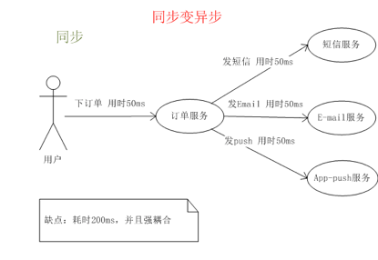
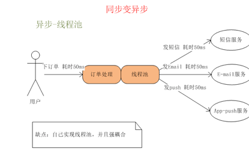
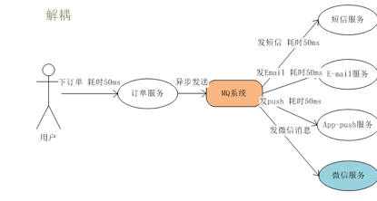
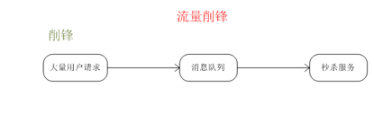

# 为什么要使用 MQ 消息中间件？它解决了什么问题？

## 应用场景

### 1.1 异步处理

场景说明：用户注册后，需要发注册邮件和注册短信,传统的做法有两种

    1.串行的方式
    2.并行的方式

**串行方式:** 将注册信息写入数据库后,发送注册邮件,再发送注册短信,以上三个任务全部完成后才返回给客户端。 这有一个问题是,邮件,短信并不是必须的,它只是一个通知,而这种做法让客户端等待没有必要等待的东西。

**并行方式:** 将注册信息写入数据库后,发送邮件的同时,发送短信,以上三个任务完成后,返回给客户端,并行的方式能提高处理的时间。

假设三个业务节点分别使用50ms,串行方式使用时间150ms,并行使用时间100ms。虽然并行已经提高的处理时间,但是,前面说过,邮件和短信对我正常的使用网站没有任何影响，客户端没有必要等着其发送完成才显示注册成功,因为是写入数据库后就返回.

上图如果采用传统的同步方式处理，系统性能会很慢。

**使用消息队列：**

引入消息队列后，把发送邮件,短信不是必须的业务逻辑异步处理。

由此可以看出,引入消息队列后，用户的响应时间就等于写入数据库的时间+写入消息队列的时间(可以忽略不计),引入消息队列后处理后,响应时间是串行的3倍,是并行的2倍。

### 1.2 应用解耦

**场景：** 双11是购物狂节,用户下单后,订单系统需要通知库存系统,传统的做法就是订单系统调用库存系统的接口.

**这种做法有一个缺点:** 当库存系统出现故障时,订单就会失败。订单系统和库存系统高耦合。

**引入消息队列:**

- 订单系统: 用户下单后,订单系统完成持久化处理,将消息写入消息队列,返回用户订单下单成功。

- 库存系统: 订阅下单的消息,获取下单消息,进行库操作。

就算库存系统出现故障,消息队列也能保证消息的可靠投递,不会导致消息丢失.

### 1.3 流量削峰

流量削峰一般在秒杀活动中应用广泛

**场景:** 秒杀活动，一般会因为流量过大，导致应用挂掉,为了解决这个问题，一般在应用前端加入消息队列。

**作用:**

1.可以控制活动人数，超过此一定阀值的订单直接丢弃

2.可以缓解短时间的高流量压垮应用(应用程序按自己的最大处理能力获取订单)

 - 用户的请求,服务器收到之后,首先写入消息队列,加入消息队列长度超过最大值,则直接抛弃用户请求或跳转到错误页面.

  - 秒杀业务根据消息队列中的请求信息，再做后续处理.