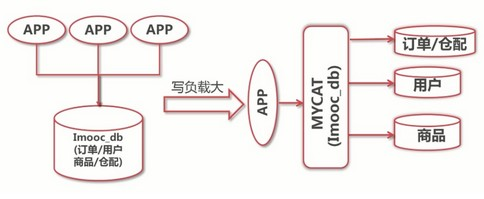
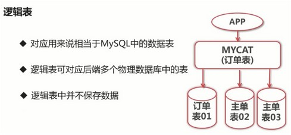

# MyCAT入门

文章基于 MyCAT1.6.5 版本

## 1. 什么是MyCAT

- MyCAT 是一个数据库中间层
- MyCAT 可以实现对后端数据库的分库分表和读写分离
- MyCAT 对前端应用隐藏了后端数据库的存储逻辑
- 一个彻底开源的，面向企业应用开发的大数据库集群
- 支持事务、ACID、可以替代MySQL的加强版数据库
- 一个可以视为MySQL集群的企业级数据库，用来替代昂贵的Oracle集群
- 一个融合内存缓存技术、NoSQL技术、HDFS大数据的新型SQL Server
- 结合传统数据库和新型分布式数据仓库的新一代企业级数据库产品

什么是数据库中间层 ?


## 2. MyCAT的主要作用

#### 2.1 作为分布式数据库中间层使用


#### 2.2 实现后端数据库的读写分离及负载均衡


#### 2.3 对业务数据库进行垂直切分

将一个数据库，按照业务或者模块拆分成多个数据库



#### 2.4 对业务数据库进行水平切分（分库分表）


#### 2.5 控制数据库连接的数量


---

## 3. MyCAT的基本元素

#### 3.1 逻辑库

后端切分的多个物理数据库所组成的一个视图，下图中 `Imooc_db` 就是3个物理数据库所组成的1个逻辑库


#### 3.2 逻辑表

存储在逻辑库中的表



#### 3.3 逻辑表的类别

分片表：就是进行了水平切分的表，分片表具有相同表结构，但数据存储在不同数据库中的表，把所有表中的数据汇总起来，其实完整数据

非分片表

全局表：在所有分片中都存在的表

ER关系表：按 ER 关系进行分片的表

---

## 4. 安装MyCAT

#### 安装步骤图：


#### 4.1 下载并解压 MyCAT

```bash
#下载
wget http://dl.mycat.io/1.6.5/Mycat-server-1.6.5-release-20180122220033-linux.tar.gz

#解压并移动到 /usr/local/ 目录下
mv mycat /usr/local
```

#### 4.2 需要安装 java 运行环境 JDK1.7 及以上

自行百度如何安装 jdk

#### 4.3 新建 MyCAT 运行系统账号

```bash
#添加一个名为 mycat 账号
adduser mycat

#设置 mycat/ 目录权限为 mycat 账号
chown mycat:mycat -R mycat/
```

#### 4.4 配置系统环境变量

```bash
#修改文件
vi /etc/profile

#添加内容
export MYCAT_HOME=/usr/local/mycat
```

#### 4.5 启动MyCAT

```bash
#切换到 mycat 用户
su -mycat

#执行启动脚本 bin 目录下
startup_nowrap.sh
```

如果启动报错，需要修改 MyCAT 参数：

```bash
JAVA_OPTS="-server -Xms1G -Xmx2G -XX:MaxPermSize=64M -XX:+AggressiveOpts -XX:MaxDirectMemorySize=2G"
```


