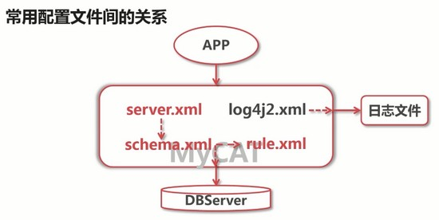

# MyCAT配置文件详解



MyCAT 关键配置文件

- `schema.xml` &emsp;用于配置逻辑库表及数据节点

- `rule.xml` &emsp;&emsp;用于配置表的分片规则

- `server.xml` &emsp;用于配置服务器权限

## 1. server.xml 文件

用于定义系统配置：

- 配置系统相关参数

- 配置用户访问权限

- 配置 SQL 防火墙及 SQL 拦截功能

### 1.1 标签配置结构

- `${key}` &emsp;表示配置属性名

- `${value}` 表示配置属性名

```xml
<system>
    <property name="${key}"> ${value} </property>
</system>
```

#### `<system>` 标签中的属性

|属性名|&emsp;&emsp;属性值&emsp;&emsp;|说明|
| :--- |:----:|----|
|serverPort|8066|MyCAT对外提供的端口号|
|managerPort|9066|MyCAT管理端的端口|
|nonePasswordLogin|0|MyCAT登录密码验证，0需要|
|bindIp|0.0.0.0|监听的ip，0.0.0.0表示监听所有|
|frontWriteQueueSize|4096|写队列的大小|
|charset|utf8|字符集编码|
|txIsolation|2|隔离级别|
|processors|1|MyCA进程数量|
|idleTimeout|300000|过期时间，毫秒|
|sqlExecuteTimeout|300|SQL语句执行超时时间，秒|
|defaultMaxLimit|100|返回数据集的大小，行数|
|maxPacketSize|104857600|MySQL最大包的大小|
|useSqlStat|0|1为开启实时统计、0为关闭|
|useGlobleTableCheck|0|1为开启全加班一致性检测、0为关闭|
|subqueryRelationshipCheck|false|子查询中存在关联查询的情况下,<br>检查关联字段中是否有分片字段 .默认false|
|useCompression|1|1为开启mysql压缩协议|
|fakeMySQLVersion|5.6.20|设置模拟的MySQL版本号|

#### `<user>` 标签

用于定义连接 MyCAT 的用户

```xml
<!-- name 用户名 -->
<user name="root" defaultAccount="true">
    <!-- 密码 -->
    <property name="password">123456</property>
     <!-- 用户可访问的数据库 -->
    <property name="schemas">db_name, db_name2</property>
    <!-- 是否是只读用户 -->
    <property name="readOnly">fasle</property>

    <!-- 表级 数据操纵语言DML 权限设置 -->
    <!-- 定义用户对某些表的权限,chek是否启用 -->		
    <privileges check="false">
        <!-- 指定权限生效的逻辑库 -->
        <schema name="db_name" dml="0110" >
            <!-- dml权限: 1111 = insert,update,select,delete -->
            <table name="tb01" dml="0000"></table>
            <table name="tb02" dml="1111"></table>
        </schema>
    </privileges>		
</user>
```

对 `<user>` 标签中的明文密码进行加密显示，在 `/usr/local/mycat/lib` 目录执行命令

```java
java -cp Mycat-server-1.6.5-release.jar io.mycat.util.DecryptUtil 0:配置的用户名:用户密码
```

生成密码替换：

```xml
<!-- 添加属性：标识启用加密密码 -->
<property name="usingDecrypt">1</>

<property name="password">GO0bnFVWrAuFgr1JMuMZkvfDNyTpoiGU7n/Wlsa151CirHQnANVk3NzE3FErx8v6pAcO0ctX3xFecmSr+976QA==</property>
```

用户名也可用同类方法加密


