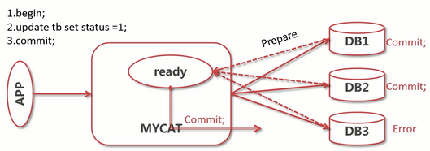

# MyCAT的限制

## 1. 不支持的SQL语句

- `create table like xxx` / `create table select xxx`

- 跨库多表关联查询、子查询

- `select for update` / `select lock in share mode`

- `select info outfile` / `into var_name`

- 多表 `UPDATE` 或是 `UPDATE` 分片键

- 跨分片 `update` / `delete [order by] limit`

## 2. 对事物支持有限

- MyCAT只支持弱分布式事务

- 如事务 `commit` 后某节点失效则无法保证事务的一致性

## 3. MyCAT不适用

- 使用不到支持的 SQL 的场景

- 徐奥跨分片关联查询的场景

- 需要保证跨分片事务强一致性的场景
