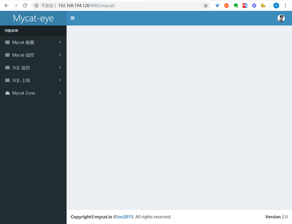

# MyCAT 管理及监控

## 1. MyCAT 管理端口管理

- 管理端口由 `server.xml` 配置，默认 9066 端口

- 管理用户就是在 `server.xml` 中配置的用户

- 登录管理命令: `mysql -u用户名 -p密码 -P9066 -h主机的ip`

```sql
#128主机
mysql -uapp_koax -p123456 -p9066 -h127.0.0.1

# 查看 mycat 的帮助命令
mysql> show @@help;

# 查看逻辑库信息
mysql> show @@databases;
```

MyCAT 管理端口命令通常用于单台管理。

## 2. MyCAT-WEB 管理 MyCAT

运行环境：`jdk-1.7`及以上，zookeerper 集群环境使用

### 2.1下载 `mycat-web` 并解压

下载地址：[http://dl.mycat.io/](http://dl.mycat.io/)

```bash
tar zxf Mycat-web-1.0-SNAPSHOT-20170102153329-linux.tar.gz

mv mycat-web/ /usr/local/
```

修改 `mycat.properties` 中zk 集群地址

```bash
cd /usr/local/mycat-web/mycat-web/WEB-INF/classes

vi mycat.properties
```

```yml
# 修改 zk 集群地址
zookeeper=192.168.194.128:2181
```

启动 mycat-web，默认访问端口 `8082`：

```bash
cd /usr/local/mycat-web/

./start.sh
```

访问地址：http://192.168.194.128:8082/mycat/


