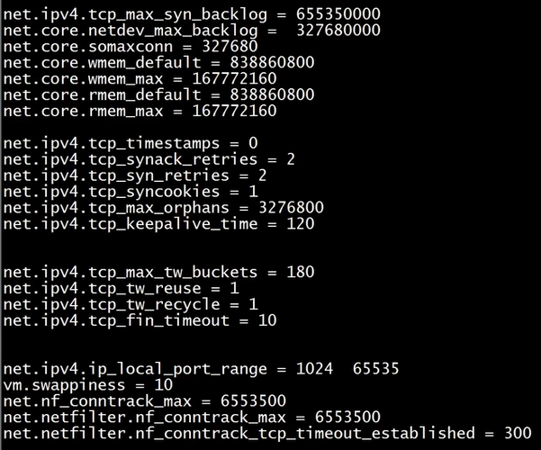
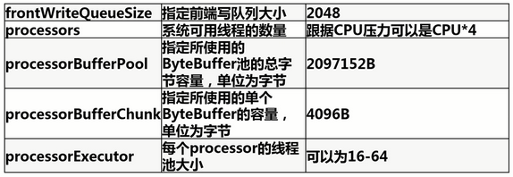

# MyCAT集群优化

## 1. Liunx 系统优化

### 1.1 编辑 `/etc/sysctl.conf` 优化内核相关参数



### 1.2 编辑 `/etc/security/limits.conf` 修改资源限制

文件最后增加内容：

```bash
#控制打开文件数量的显示
* soft nofile 65535
* hard nofile 65535
```

```text
*       表示对所有用户有效
soft    当前系统生效的设置（同一资源soft不能高于hard配置）
hard    系统中能设置的最大值
nofile  限制资源打开文件的最大数目
65535   最大数目值
```

## 2. MyCAT优化

### 2.1 JVM参数优化

`mycat/conf/wrapper.conf`

- 按情况配置大小：wrapper.java.additional.5=-XX:MaxDirectMemorySie=4G
- 对于MYCAT独立服务器而言，建议配置占系统内存的一半

### 2.2 server.xml系统参数优化



### 2.3 log4j2.xml日志级别优化

建议最小高于 `info` 级别日志

## 3. MySQL优化

### 3.1 my.cnf 文件配置

```yml
[client]
prot = 3306
socket = /data/mycal_data/mysql.sock

[mysqld]
# 默认存储引擎
default_storage_engine = InnoDB
max_allowed_packet = 50M

# Replice #
sever-id = 1
# 指定relay_log名称和目录
relay_log = /data/sql_log/relay_log/mysqld-relay-bin
```

