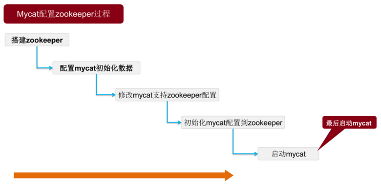

# Zookeerper同步MyCAT配置

## 1. 操作步骤



## 2. 演示环境说明

| 主机名 | IP | 角色 |
| ---- | ---- | ---- |
| Node-128 | 192.168.194.128 | MyCAT, ZK, MySQL, HAProxy, Keepalived |
| Node-129 | 192.168.194.129 | ZK, MySQL |
| Node-130 | 192.168.194.130 | ZK, MySQL |
| Node-131 | 192.168.194.131 | MyCAT, MySQL, HAProxy, Keepalived |

```bash
# 关闭防火墙
systemctl stop firewalld.service
systemctl disable firewalld.service

# 关闭SELINUX
sed -i 's/SELINUX=enforcing/SELINUX=disabled/g' /etc/sysconfig/selinux
setenforce 0
```

## 3. 搭建 zookeerper 集群

以 128 主机节点为例，其余主机操作基本一致。

### 3.1 下载解压

```bash
tar zxf zookeeper-3.4.14\ .tar.gz

mv zookeeper-3.4.14 zookeeper

mv zookeeper /usr/local/

cd /usr/local/zookeeper/conf/

cp zoo_sample.cfg zoo.cfg
```

### 3.2 修改 zookeerper 配置

#### 修改 zoo.cfg 配置文件

```yml
# The number of milliseconds of each tick
tickTime=2000

initLimit=10

syncLimit=5

dataDir=/usr/local/zookeeper/data
dataLogDir=/usr/local/zookeeper/log

clientPort=2181
server.128=192.168.194.128:2888:3888
server.129=192.168.194.129:2888:3888
server.130=192.168.194.130:2888:3888
```

#### 创建 data 目录

```bash
# 在 zookeerper 目录下创建 data 目录
mkdir data

# 在 data 目录下创建 myid 文件,并初始化一个id
# 其他主机中 id 不能相同
echo 128 > myid
```

### 3.3 其他主机节点根据以上操作创建

### 3.4 所有节点启动 zookeerper

```bash
cd /usr/local/zookeerper/bin/

./zkServer.sh start
```

#### 使用 zkCli 查看信息

```bash
cd /usr/local/zookeerper/bin/

./zkCli.sh
```

```bash
ls /mycat/mycat-cluster-1/

[schema, dataNode, dataHost]
```

```bash
get /mycat/mycat-cluster-1/schema/dataHost

[{"balance":1,"maxCon":1000,"minCon":10,"name":"mysql128","writeType":0,"switchType":1,"slaveThreshold":100,"dbType":"mysql","dbDriver":"native","heartbeat":"select user()","writeHost":[{"host":"192.168.194.128","url":"192.168.194.128:3306","password":"123456"
......
{"host":"192.168.194.131","url":"192.168.194.131:3306","password":"123456","user":"im_mycat"}]}]
cZxid = 0x100000018
ctime = Thu Aug 22 21:27:48 CST 2019
mZxid = 0x100000019
mtime = Thu Aug 22 21:27:48 CST 2019
pZxid = 0x100000018
cversion = 0
dataVersion = 1
aclVersion = 0
ephemeralOwner = 0x0
dataLength = 1125
numChildren = 0
```

各个主机节点执行命令都显示信息说明启动运行成功。

---

## 4. MyCAT 配置

### 4.1 将 MyCAT 配置文件复制到 zkconf 目录中

```bash
cd /usr/local/mycat/conf

cp schema.xml server.xml rule.xml sequence_db_conf.properties zkconf/
```

### 4.2 执行 MyCAT 初始化脚本

执行 MyCAT 初始化脚本，将文件初始化到 zookeerper 中

```bash
cd /usr/local/mycat/bin

./init_zk_data.sh
```

### 4.3 配置 MyCAT 支持 zookeerper

```bash
vi /usr/local/mycat/conf/myid.properties
```

```yml
loadZk=true
# zk集群地址, 多个用","隔开
zkURL=192.168.194.128:2181,192.168.194.129:2181,192.168.194.130:2181
# zk集群内mycat集群id
clusterId=mycat-cluster-1
# mycat集群内本实例id,禁止重复
myid=mycat_128
# mycat集群内节点个数(本例中：128，131 两个)
clusterSize=2
clusterNodes=mycat_128,mycat_131
#server  booster  ;   booster install on db same server,will reset all minCon to 2
type=server
boosterDataHosts=dataHost1
```

### 4.4 131节点主机的 MyCAT 配置

- 如果作为子节点只同步128节点的配置文件，就不用初始化 `init_zk_data.sh` 到 `zookeerper` 中。

- 只用配置 `myid.properties` 文件

### 4.5 启动 MyCAT

启动后，131节点的 MyCAT 会同步 128 节点的 MyCAT 配置文件。
