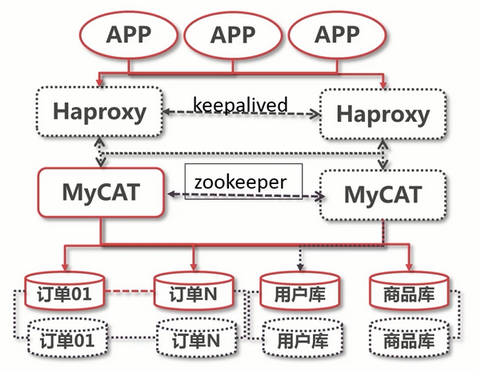

# MyCAT高可用架构

## 高可用系统的基本要求

- 系统架构中不存在单点问题

- 可以最大限度的保障服务的可用性

## 本案例当前架构离高可用还有多远?

- 虚线表示还未实现的功能

- zookeeper：存储 MyCAT 的配置，同步配置信息给多个 MyCAT 节点

- Haproxy：实现 MyCAT 服务器的负载均衡，监控 MyCAT服务器的可用性，当有节点不可用会被踢出集群

- keepalived：保证 Haproxy 的高可用性

