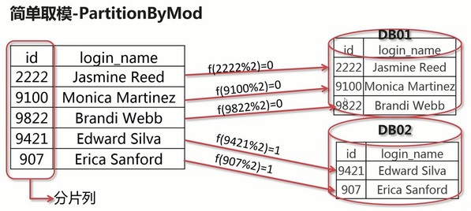
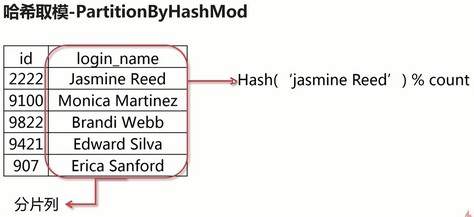
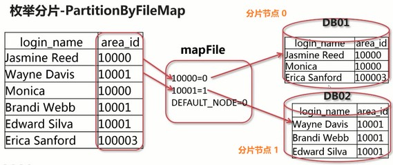
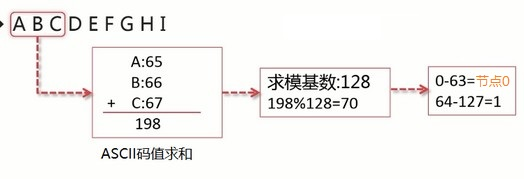
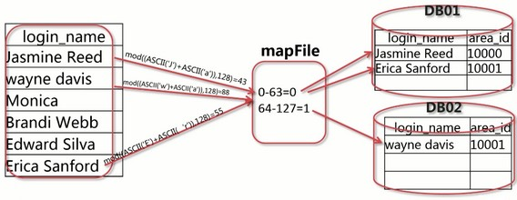

# rule.xml 配置文件

文件用途

- 配置水平分片的分片规则

- 配置分片规则所对应的分片函数

## 文件标签配置

### `<tableRule>` 标签

配置表的分片规则

```xml
<!-- name：分片规则命名 -->
<tableRule name="rule1">
    <rule>
        <!-- 指定表中存在的列名，为分片列 -->
        <columns>id</columns>
        <!-- 指定表的分片算法，值是<function>标签的name属性 -->
        <algorithm>func1</algorithm>
    </rule>
</tableRule>
```

### `<function>` 标签

配置表的分片算法

```xml
<!-- 
    name：分片算法的名字 ；
    class：指定实现分片算的java类
-->
<function name="murmur" class="io.mycat.route.function.PartitionByMurmurHash">
    <!-- 默认是0 -->
    <property name="seed">0</property>

    <!-- 要分片的数据库节点数量，必须指定，否则没法分片 -->
    <property name="count">2</property>

    <!-- 一个实际的数据库节点被映射为这么多虚拟节点，默认是160倍，也就是虚拟节点数是物理节点数的160倍 -->
    <property name="virtualBucketTimes">160</property>

    <!-- 枚举分片算法文件的位置 -->
    <property name="mapFile">partition-hash-int.txt</property>

    <!-- 
        节点的权重，没有指定权重的节点默认是1。
        以从0开始到count-1的整数值也就是节点索引为key，
        以节点权重值为值。所有权重值必须是正整数，否则以1代替
     -->
    <property name="weightMapFile">weightMapFile</property>

    <!-- 
        用于测试时观察各物理节点与虚拟节点的分布情况，
        如果指定了这个属性，会把虚拟节点的murmur hash值与物理节点的映射按行输出到这个文件，
        没有默认值，如果不指定，就不会输出任何东西 
    -->
    <property name="bucketMapPath">/etc/mycat/bucketMapPath</property>
</function>
```

## 常用的分片算法

- 简单取模 PartitionByMod
- 哈希取模 PartitionByHashMod
- 分片枚举 PartitionByFileMod
- 字符串范围取模分片 PartitionByPrefixPattern

### 示例表的结构

|字段|类型|注释|
|---|---|---|
| customer_id | int(10) unsigned | 用户ID |
| login_name | varchar(20) | 用户登陆名 |
| password | char(32) | md5加密的密码 |
| user_stats | tinyint(4) | 用户状态 |
| area_id | int(11) | 用户所在地区 |
| modified_time | timestamp | 最后修改时间 |

### 1. 简单取模 PartitionByMod

只可用于分片列为整数类型的表



#### 简单取模配置

```xml
<tableRule name="customer_login">
    <rule>
        <columns>customer_id</columns>
        <algorithm>mod-long</algorithm>
    </rule>
</tableRule>
```

```xml
<!-- name：分片算法的名字 ；class：指定实现分片算的java类 -->
<function name="mod-long" class="io.mycat.route.function.PartitionByMode">
    <!-- 要分片的数据库节点数量，必须指定，否则没法分片 -->
    <property name="count">2</property>
</function>
```

### 2. 哈希取模 PartitionByHashMod

可以用于多种数据类型如字符串，日期等



#### 哈希取模配置

```xml
<tableRule name="customer_login">
    <rule>
        <columns>login_name</columns>
        <algorithm>mod-long</algorithm>
    </rule>
</tableRule>
```

```xml
<function name="mod-long" class="io.mycat.route.function.PartitionByHashMode">
    <!-- 要分片的数据库节点数量，必须指定，否则没法分片 -->
    <property name="count">2</property>
</function>
```

### 3. 分片枚举 PartitionByFileMod

可以根据枚举值指定数据存储的位置

`$MYCAT/conf` 目录下增加 MapFile 配置枚举值同节点的对应关系



#### 分片枚举配置

```xml
<tableRule name="customer_login">
    <rule>
        <columns>area_id</columns>
        <algorithm>hash-int</algorithm>
    </rule>
</tableRule>
```

```xml
<function name="hash-int" class="io.mycat.route.function.PartitionByFileMode">
    <property name="mapFile">partiton-hash-int.txt</property>
    <property name="type">0</property>
    <!-- >= 0 启动默认节点，<= 0 不启用默认节点 -->
    <property name="defaultNode">0</property>
</function>
```

`partiton-hash-int.txt` 文件存储对应的枚举值，文件位置创建在 `mycat/conf/` 目录下

```yml
10000=0
10001=1
DEFAULT_NODE=0
```

### 4. 字符串范围取模分片 PartitionByPrefixPattern

可以根据指定字符串的前 N 个字符确定存储位置

`$MYCAT/conf` 目录下增加 MapFile 配置文件节点的对应关系





#### 字符串范围取模配置

```xml
<tableRule name="customer_login">
    <rule>
        <columns>login_name</columns>
        <algorithm>sharding-by-prefix-pattern</algorithm>
    </rule>
</tableRule>
```

```xml
<function name="sharding-by-prefix-pattern" class="io.mycat.route.function. PartitionByPrefixPattern">
    <!-- 取模基数 -->
    <property name="patternValue">128</property>
    <!-- 取字符串的长度 -->
    <property name="prefixLength">2</property>
    <property name="mapFile">sharding-by-prefix-pattern.txt</property>
</function>
```

`sharding-by-prefix-pattern.txt` 配置文件

```yml
0-63=0
64-127=1
```

