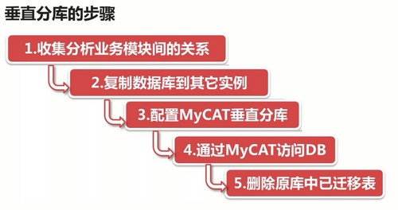

# 垂直分库(一)：收集分析业务模块间的关系

目的：分担数据库的写负载

## 垂直分库步骤

## 1. 收集分析业务模块间的关系

垂直分库前：

- 模块之间都存在相互依赖关系，`订单模块` 同一数据库里关联查询 `商品模块` 和 `用户模块` 信息

垂直分库后：

- 无法关联查询，解决方法 `订单模块` 多存储一些 `商品模块` 的冗余商品信息

- 通过 API 获取 `用户模块` 的所需的少量信息

- `仓配模块` 继续放在 `订单模块` 同一库中

