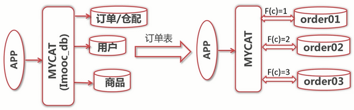
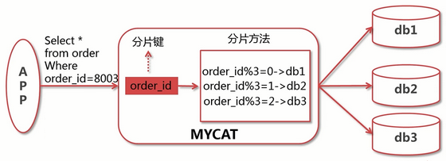
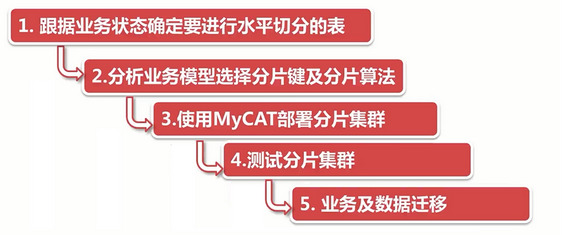

# 水平分库和分片原则

水平切分 也叫 分库分表。

## 1. 分片原则

- 能不切分尽量不要切分

- 选择合适的切分规则和分片键

- 尽量避免跨分片 `JOIN` 操作

## 2. 分片后如何处理查询

以 `简单取模` 方式示例：

---

## 3. 水平分片的步骤

### 3.1 如何选择分片键

- 尽可能的比较均匀分布数据到各个节点上

- 该业务字段是最频繁的或者最重要的查询条件

### 3.2 分析本案例业务模型选择分片键及分片算法

- 对订单相关表进行水平切分

- 以 `customer_id` 作为分片键

- 采用简单取模分片算法

### 3.3 使用 MyCAT 部署分片集群

- 使用 `schema.xml` 配置逻辑库及逻辑表

- 使用 `rule.xml` 配置分片表的分片规则

- 使用 `server.xml` 配置访问用户及权限
