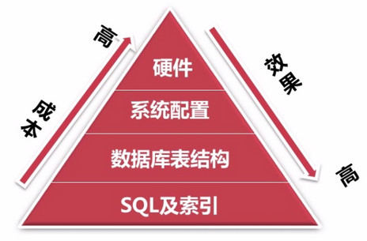

# MySQL优化

## 演示数据库

- 使用MySQL提供的 sakila 数据库  
[https://dev.mysql.com/doc/index-other.html](https://dev.mysql.com/doc/index-other.html)

- sakila数据库的表结构信息可以通过以下网站查看  
[http://dev.mysql.com/doc/sakila/en/sakila-installation.html](http://dev.mysql.com/doc/sakila/en/sakila-installation.html)

## 数据库优化的几个方面



- SQL 及索引优化

  根据需求写出良好的 SQL，并创建有效的索引，实现某一种需求可以多种写法，这时就要选择一种效率最好的写法。

- 数据库表结构优化

  根据数据库的范式、设计表结构，表结构设计的好直接关系到写 SQL 语句。

- 系统配置

  大多数运行在 Linux 机器上，如 TCP 连接数的限制、打开文件数的限制、安全性的限制，因此我们要对这些配置进行相应的优化

- 硬件

  选择合适数据库服务的 CPU，更快的 IO，更高的内存；CPU 并不是越多越好，某些数据库版本有最大的限制，IO 操作并不是减少阻塞。

## 1. SQL 及索引优化

### 1.1 如何发现有问题的 SQL?

#### 使用 mysql 慢查日志对有效率问题的 SQL 进行监控

查看慢查询日志是否开启

```sql
# 查看慢日志查询是否开启
show variables like 'slow_query_log';

+----------------+-------+
| Variable_name  | Value |
+----------------+-------+
| slow_query_log | OFF   |
+----------------+-------+

# 设置慢查询日志的位置
set global slow_query_log_file = '/usr/bin/mysql/sql_log/mysql-slow.log'

# 设置开启，先执行下面的两个步骤在执行开启慢查询
set global slow_query_log = on;
```

查看日志记录是否开启

```sql
# OFF 表示没有开启
show variables like '%log%';
+-------------------------------+-------+
| log_queries_not_using_indexes | OFF   |
+-------------------------------+-------+

# 设置开启
set global log_queries_not_using_indexes = on;
```

查看 "超过查询时间" 的变量

```sql
# 值如果为 0.000000 表示不管什么查询都记录到慢查询日志中
show variables like 'long_query_time';

+-----------------+-----------+
| Variable_name   | Value     |
+-----------------+-----------+
| long_query_time | 10.000000 |
+-----------------+-----------+

set global long_query_time = 10;
```

```sql
# 执行一个查询
select * from store limit 10;

# 获取日志文件的位置
show variables like 'slow%';

+---------------------+------------------------------------------------------+
| Variable_name       | Value                                                |
+---------------------+------------------------------------------------------+
| slow_query_log_file | F:\mysql-5.7.22-winx64\data\DESKTOP-RALESOK-slow.log |
+---------------------+------------------------------------------------------+

# 查询所有 log 信息
show variables like '%log%';
```

慢查询日志的存储格式

| 格式 | 说明 |
| ---- | ---- |
|`# Time: 2019-09-01T15:04:00.039027Z`<br>`# User@Host: root[root] @ localhost []  Id:    28`<br>`# Query_time: 0.000621  Lock_time: 0.000068`<br>`# Rows_sent: 200  Rows_examined: 200`<br>`use sakila;`<br>`SET timestamp=1567350240;`<br>`select * from actor;`|-- 查询执行的时间<br>-- 执行SQL的主机信息<br>-- Query_time: SQL的查询时间 Lock_time:锁定时间<br>-- Rows_sent:锁发送的行数  Rows_examined:锁扫描的行数<br>-- 执行的数据库<br>-- SQL执行的时间<br>-- SQL执行的内容 |

### 1.2 慢查日志的分析工具（mysqldumpslow）

Liunx 安装 MySQL 后，默认安装此工具。

如何进行查看慢查询日志，如果开启了慢查询日志，就会生成很多的数据，然后我们就可以通过对日志的分析，生成分析报表，然后通过报表进行优化。

#### windows 下需要安装 Prel 环境，并配置好环境变量

下载 ActivePerl：[https://www.perl.org/get.html](https://www.perl.org/get.html)

```sql
# liunx 命令查看 mysqldumpslow 有哪些参数命令
mysqldumpslow.pl -h

# 查看 verbose 信息
mysqldumpslow -v

# windows 环境要在 MySQL 的 bin 目录下执行，并且使用 perl 命令
F:\mysql-5.7.22-winx64\bin>perl mysqldumpslow.pl -h
```

#### 查看日志中的记录

```sql
# 查看前3条记录
mysqldumpslow.pl -t 3 ../data/mysql-slow.log | more

# 结果
Reading mysql slow query log from ../data/DESKTOP-RALESOK-slow.log
Count: 1  Time=0.00s (0s)  Lock=0.00s (0s)  Rows=2.0 (2), root[root]@localhost
select * from store limit N

# Count                   sql 执行的次数
# Time                    sql 的执行时间
# Lock                    sql 等待锁的时间
# Rows=2.0                sql 每次返回的记录数
# (2)                     总共返回的记录数
# root[root]@localhost    执行者
# sql                     的具体内容
```

## 2. 慢查日志的分析工具（pt-query-digest）

### 2.1 Windows 安装

windows 下在 mysql/bin 文件夹下打开 git bash 窗口，输入命安装

```bash
curl -o pt-query-digest.pl https://www.percona.com/get/pt-query-digest
```

简单使用

```bash
# 获取使用帮助
perl pt-query-digest.pl --help

# 简单查询
perl pt-query-digest.pl ../data/mysql-slow.log
```

### 2.2 Liunx 下安装

```bash
wget https://www.percona.com/downloads/percona-toolkit/2.2.16/RPM/percona-toolkit-2.2.16-1.noarch.rpm && yum localinstall -y  percona-toolkit-2.2.16-1.noarch.rpm
```

输入命令 `pt-query-digest --help` 查看是否安装成功

```bash
pt-query-digest --help

pt-query-digest analyzes MySQL queries from slow, general, and binary log files.
It can also analyze queries from C<SHOW PROCESSLIST> and MySQL protocol data
from tcpdump.  By default, queries are grouped by fingerprint and reported in
descending order of query time (i.e. the slowest queries first).  If no C<FILES>
are given, the tool reads C<STDIN>.  The optional C<DSN> is used for certain
options like L<"--since"> and L<"--until">.  For more details, please use the
--help option, or try 'perldoc /usr/bin/pt-query-digest' for complete
documentation.

Usage: pt-query-digest [OPTIONS] [FILES] [DSN]
```

### 2.3 使用简介

下载所有 `pt-summary` 命令

```bash
wget http://percona.com/get/pt-summary
```

查看命令帮助

```bash
pt-summary --help
```

查看服务器信息

```bash
pt-summary
```

查看磁盘开销信息

```bash
pt-diskstats
```

查看 MySQL 数据库信息

```bahs
pt-mysql-summary --user=root --password=123456
```

分析慢查询日志

```bash
pt-query-digest /data/mysql/data/db-3-12-slow.log
```

查找 MySQL 的从库和同步状态

```bash
pt-slave-find --host=localhost --user=root --password=123456
```

查看 MySQL 的死锁信息

```bash
pt-deadlock-logger --user=root --password=123456 localhost
```

从慢查询日志中分析索引使用情况

```bash
pt-index-usage slow_20131009.log
```

查找数据库表中重复的索引

```bash
pt-duplicate-key-checker --host=localhost --user=root --password=123456
```

查看 MySQL 表和文件的当前活动 IO 开销

```bash
pt-ioprofile
```

查看不同 MySQL 配置文件的差异

```bash
pt-config-diff /etc/my.cnf /etc/my_master.cnf
```

`pt-finid` 查找 MySQL 表和执行命令，示例如下

```bash
# 查找数据库里大于 2G 的表
pt-find --user=root --password=123456 --tablesize +2G

# 查找 10 天前创建，MySIAM 引擎的表
pt-find --user=root --password=123456 --ctime +10 --engine MySIAM

# 查看表和索引大小并排序
pt-find --user=root --password=123456 --printf "%T\t%D.%N\n" | sort -rn
```

`pt-kill` 杀掉符合标准的 MySQL 进程

```bash
# 显示查询时间大于 60 秒
pt-kill --user=root --password=123456 --busy-time 60 --print

# kill 掉大于 60 秒的查询
pt-kill --user=root --password=123456 --busy-time 60 --kill
```

查看 MySQL 授权

```bash
pt-show-grants --user=root --password=123456

pt-show-grants --user=root --password=123456 --separate -revoke
```

验证数据库复制的完整性

```bash
pt-table-checksum --user=root --password=123456
```

## 3. 如何通过慢查日志发现有问题的 SQL

### 查询次数多且每次查询占用时间长的 SQL

通常为 `pt-query-digest` 分析的前几个查询；该工具可以很清楚的看出每个 SQL 执行的次数及百分比等信息，执行的次数多，占比比较大的 SQL

### IO 大的 SQL

注意 `pt-query-digest` 分析中的 Rows examine 项。扫描的行数越多，IO 越大。

### 未命中的索引的 SQL

注意 `pt-query-digest` 分析中的 Rows examine 和 Rows Send 的对比。说明该 SQL 的索引命中率不高，对于这种 SQL，我们要重点进行关注。

## 4. 通过 explain 查询分析 SQL 的执行计划

### 4.1 使用 explain 查询 SQL 的执行计划

SQL 的执行计划侧面反映出了 SQL 的执行效率，具体执行方式如下所示：在执行的 SQL 前面加上 explain 关键词即可。

### 4.2 每个字段的说明

#### id 字段

列数字越大越先执行，如果说数字一样大，那么就从上往下依次执行，id 列为 null 的就表是这是一个结果集，不需要使用它来进行查询

#### select_type 列常见的有

- `simple`：      表示不需要 union 操作或者不包含子查询的简单 select 查询。有连接查询时，外层的查询为 simple，且只有一个

- `primary`：     一个需要 union 操作或者含有子查询的 select，位于最外层的单位查询的 select_type 即为 primary。且只有一个

- `union`：       union 连接的两个 select 查询，第一个查询是 dervied 派生表，除了第一个表外，第二个以后的表 select_type 都是 union

- `dependent union`：   与 union 一样，出现在 union 或 union all 语句中，但是这个查询要受到外部查询的影响

- `union result`：      包含 union 的结果集，在 union 和 union all 语句中,因为它不需要参与查询，所以 id 字段为 null

- `subquery`：          除了 from 子句中包含的子查询外，其他地方出现的子查询都可能是 subquery

- `dependent subquery`：与 dependent union 类似，表示这个 subquery 的查询要受到外部表查询的影响

- `derived`：           from 字句中出现的子查询，也叫做派生表，其他数据库中可能叫做内联视图或嵌套 select

#### table 字段

显示的查询表名，如果查询使用了别名，那么这里显示的是别名，如果不涉及对数据表的操作，那么这显示为 null，如果显示为尖括号括起来的 <derived N> 就表示这个是临时表，后边的N就是执行计划中的 id，表示结果来自于这个查询产生。如果是尖括号括起来的 <union M,N>，与 <derived N> 类似，也是一个临时表，表示这个结果来自于 union 查询的 id 为 M, N 的结果集。

#### type 字段

依次从好到差：system，const，eq_ref，ref，fulltext，ref_or_null，unique_subquery，index_subquery，range，index_merge，index，ALL，除了 all 之外，其他的 type 都可以使用到索引，除了 index_merge 之外，其他的 type 只可以用到一个索引

- **system：** 表中只有一行数据或者是空表，且只能用于 myisam 和 memory 表。如果是 Innodb 引擎表，type 列在这个情况通常都是 all 或者 index

- **const：** 使用唯一索引或者主键，返回记录一定是1行记录的等值 where 条件时，通常 type 是 const。其他数据库也叫做唯一索引扫描

- **eq_ref：** 出现在要连接过个表的查询计划中，驱动表只返回一行数据，且这行数据是第二个表的主键或者唯一索引，且必须为 not null，唯一索引和主键是多列时，只有所有的列都用作比较时才会出现 eq_ref

- **ref：** 不像 eq_ref 那样要求连接顺序，也没有主键和唯一索引的要求，只要使用相等条件检索时就可能出现，常见与辅助索引的等值查找。或者多列主键、唯一索引中，使用第一个列之外的列作为等值查找也会出现，总之，返回数据不唯一的等值查找就可能出现。

- **fulltext：** 全文索引检索，要注意，全文索引的优先级很高，若全文索引和普通索引同时存在时，mysql 不管代价，优先选择使用全文索引

- **ref_or_null：** 与 ref 方法类似，只是增加了 null 值的比较。实际用的不多。

- **unique_subquery：** 用于 where 中的 in 形式子查询，子查询返回不重复值唯一值

- **index_subquery：** 用于 in 形式子查询使用到了辅助索引或者 in 常数列表，子查询可能返回重复值，可以使用索引将子查询去重。

- **range：** 索引范围扫描，常见于使用 >,<,is null,between ,in ,like 等运算符的查询中。

- **index_merge：** 表示查询使用了两个以上的索引，最后取交集或者并集，常见 and ，or 的条件使用了不同的索引，官方排序这个在 ref_or_null 之后，但是实际上由于要读取所个索引，性能可能大部分时间都不如 range

- **index：** 索引全表扫描，把索引从头到尾扫一遍，常见于使用索引列就可以处理不需要读取数据文件的查询、可以使用索引排序或者分组的查询。

- **all：** 这个就是全表扫描数据文件，然后再在 server 层进行过滤返回符合要求的记录。

#### possible_keys

查询可能使用到的索引都会在这里列出来

#### key

查询真正使用到的索引，select_type 为 index_merge 时，这里可能出现两个以上的索引，其他的 select_type 这里只会出现一个。

#### key_len

用于处理查询的索引长度，如果是单列索引，那就整个索引长度算进去，如果是多列索引，那么查询不一定都能使用到所有的列，具体使用到了多少个列的索引，这里就会计算进去，没有使用到的列，这里不会计算进去。留意下这个列的值，算一下你的多列索引总长度就知道有没有使用到所有的列了。要注意，mysql 的 ICP 特性使用到的索引不会计入其中。另外，key_len 只计算 where 条件用到的索引长度，而排序和分组就算用到了索引，也不会计算到 key_len 中。

#### ref

如果是使用的常数等值查询，这里会显示 const，如果是连接查询，被驱动表的执行计划这里会显示驱动表的关联字段，如果是条件使用了表达式或者函数，或者条件列发生了内部隐式转换，这里可能显示为 func

#### rows

这里是执行计划中估算的扫描行数，不是精确值

#### extra

这个列可以显示的信息非常多，有几十种，常用的有

- **distinct：** 在 select 部分使用了 distinc 关键字

- **no tables used：** 不带 from 字句的查询或者 From dual 查询

- **not in()：** 形式子查询或 not exists 运算符的连接查询，这种叫做反连接。即，一般连接查询是先查询内表，再查询外表，反连接就是先查询外表，再查询内表。

- **using filesort：** 排序时无法使用到索引时，就会出现这个。常见于 order by 和 group by 语句中

- **using index：** 查询时不需要回表查询，直接通过索引就可以获取查询的数据。

- using join buffer（block nested loop），using join buffer（batched key accss）：5.6.x 之后的版本优化关联查询的 BNL，BKA 特性。主要是减少内表的循环数量以及比较顺序地扫描查询。

- using sort_union，using_union，using intersect，using sort_intersection：
  - using intersect：表示使用and的各个索引的条件时，该信息表示是从处理结果获取交集
  - using union：表示使用 or 连接各个使用索引的条件时，该信息表示从处理结果获取并集
  - using sort_union 和 using sort_intersection：与前面两个对应的类似，只是他们是出现在用 and 和 or 查询信息量大时，先查询主键，然后进行排序合并后，才能读取记录并返回。

- **using temporary：** 表示使用了临时表存储中间结果。临时表可以是内存临时表和磁盘临时表，执行计划中看不出来，需要查看 status 变量，used_tmp_table，used_tmp_disk_table 才能看出来。

## 5. 具体慢查询的优化案例

### 5.1 函数 Max() 的优化

查询最后支付时间-优化 `max()` 函数

```sql
select max(payment_date) from payment;

+---------------------+
| max(payment_date)   |
+---------------------+
| 2006-02-14 15:16:03 |
+---------------------+
```

执行计划

```sql
explain select max(payment_date) from payment \G

*************************** 1. row ***************************
           id: 1
  select_type: SIMPLE
        table: payment
   partitions: NULL
         type: ALL
possible_keys: NULL
          key: NULL
      key_len: NULL
          ref: NULL
         rows: 16086
     filtered: 100.00
        Extra: NULL
1 row in set, 1 warning (0.00 sec)
```

可以看到显示的执行计划，并不是很高效，可以拖慢服务器的效率，如何优化？

```sql
# 创建索引
create index inx_paydate on payment(payment_date);

explain select max(payment_date) from payment \G

*************************** 1. row ***************************
           id: 1
  select_type: SIMPLE
        table: NULL
   partitions: NULL
         type: NULL
possible_keys: NULL
          key: NULL
      key_len: NULL
          ref: NULL
         rows: NULL
     filtered: NULL
        Extra: Select tables optimized away
```

索引是顺序操作的，不需要扫描表，执行效率就会比较恒定

### 5.2 函数 Count() 的优化

> 需求：在一条 SQL 中同时查处 2006 年和 2007 年电影数量

错误的方式: 2006 和 2007 年分别是多少，判断不出来

```sql
select count(release_year='2006' or release_year='2007') from film;

select count(*) from film where release_year='2006' or release_year='2007';

+---------------------------------------------------+
| count(release_year='2006' or release_year='2007') |
+---------------------------------------------------+
|                                              1000 |
+---------------------------------------------------+
```

正确的编写方式：

```sql
select count(release_year='2006' or null) as '06films', count(release_year='2007' or null) as '07films' from film;
```

这里就产生了 `count(*)` 和 `count(字段名)` 的区别：

```sql
Count(字段名) -- 查询不包含 null 的值
Count(*)      -- 查询包含 null 的值
```

### 5.3 子查询的优化

子查询是我们在开发过程中经常使用的一种方式，在通常情况下，需要把子查询优化为 join 查询但在优化是需要注意关联键是否有一对多的关系，要注意重复数据。

子查询优化为 join 查询示例：

```sql
# 查询 sandra 出演的所有影片

# 子查询
SELECT title, release_year, LENGTH
FROM film
WHERE film_id IN
  (SELECT film_id FROM film_actor WHERE actor_id IN (SELECT actor_id FROM actor WHERE first_name = 'sandra'));

# join 查询
SELECT
  title, release_year, LENGTH
FROM
  film f
  JOIN film_actor fa
    ON f.`film_id` = fa.`film_id`
  JOIN actor ac
    ON fa.`actor_id` = ac.`actor_id`
WHERE ac.`first_name` = 'sandra';
```

### 5.4 gruop by 的优化

最好使用同一表中的列：

```sql
# 每个演员所参演影片的数量-（影片表和演员表）
EXPLAIN SELECT actor.first_name,actor.last_name,COUNT(*)
FROM sakila.film_actor
INNER JOIN sakila.actor USING(actor_id)
GROUP BY film_actor.actor_id \G

# 执行计划分析中使用了 临时文件 和 文件排序
Extra: Using temporary; Using filesort
```

优化后：

```sql
EXPLAIN SELECT actor.first_name,actor.last_name,c.cnt
FROM sakila.actor INNER JOIN (
SELECT actor_id,COUNT(*) AS cnt FROM sakila.film_actor GROUP BY actor_id
)AS c USING(actor_id) \G

# 执行计划分析
Extra: NULL
```

### 5.5 Limit 查询的优化

Limit 常用于分页处理，时长会伴随 order by 从句使用，因此大多时候回使用 Filesorts 这样会造成大量的 IO 问题。

例子1：查询影片 id 和描述信息，并根据主题进行排序，取出从序号 50 条开始的 5 条数据。

```sql
EXPLAIN SELECT film_id, description FROM film ORDER BY title LIMIT 50, 5 \G

# 执行计划分析中使用了 文件排序
Extra: Using filesort
```

优化：使用有索引的列或主键进行 order by 操作，因为大家知道，innodb 是按照主键的逻辑顺序进行排序的。可以避免很多的 IO 操作。

```sql
EXPLAIN SELECT film_id, description FROM film ORDER BY film_id LIMIT 50, 5 \G

# 执行计划分析
Extra: NULL
```

例子2：查询影片 id 和描述信息，并根据主题进行排序，取出从序号 1000 条开始的 5 条数据。

```sql
EXPLAIN SELECT film_id, description FROM film ORDER BY film_id LIMIT 1000, 5 \G

# 执行计划分析
rows: 1000
```

优化：随着我们翻页越往后，IO 操作会越来越大的，如果一个表有几千万行数据，翻页越后面，会越来越慢，因此我们要进一步的来优化。

```sql
EXPLAIN SELECT film_id, description FROM sakila.film where film_id > 1000 and film_id <= 1005 ORDER BY film_id LIMIT 1, 5 \G

# 执行计划分析
rows: 5
```


