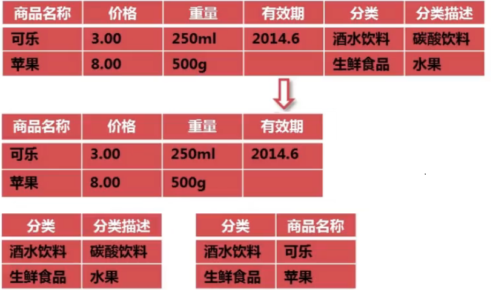

# MySQL数据库设计规范

## 1. MySQL数据库设计规范

### 1.1 数据库命名规范

- 采用26个英文字母(区分大小写)和0-9的自然数(经常不需要)加上下划线 `_` 组成;
- 命名简洁明确(长度不能超过30个字符);  

    例如：user, stat, log 也可以 wifi_user, wifi_stat, wifi_log 给数据库加个前缀;

- 除非是备份数据库可以加0-9的自然数：user_db_20151210;

### 1.2 数据库表名命名规范

- 采用26个英文字母(区分大小写)和0-9的自然数(经常不需要)加上下划线 `_` 组成;
- 命名简洁明确,多个单词用下划线 `_` 分隔;

    例如：user_login, user_role_relation, user_role_right_relation
- 注：表前缀 `user_` 可以有效的把相同关系的表显示在一起;

### 1.3 数据库表字段名命名规范

- 采用26个英文字母(区分大小写)和0-9的自然数(经常不需要)加上下划线 `_` 组成;
- 命名简洁明确,多个单词用下划线 `_` 分隔;

    例如：user_login 表字段 user_id, user_name, eamil, tickit, add_time;
- 每个表中必须有自增主键,add_time(默认系统时间)
- 表与表之间的相关联字段名称要求尽可能的相同;

### 1.4 数据库表字段类型规范

- 用尽量少的存储空间来存数一个字段的数据;
  
    例如：能使用 int 就不要使用 varchar、char，能用 varchar(16) 就不要使用 varchar(256);
- IP 地址最好使用 int 类型;
- 固定长度的类型最好使用 char，例如：邮编;
- 能使用 tinyint 就不要使用 smallint, int;
- 最好给每个字段一个默认值,最好不能为 null;

### 1.5 数据库表索引规范

- 命名简洁明确

    例如：user_login 表 user_name 字段的索引应为 user_name_index 唯一索引;
- 为每个表创建一个主键索引;
- 为每个表创建合理的索引;
- 建立复合索引请慎重;

### 1.6 简单熟悉数据库范式

第一范式(1NF)：字段值具有原子性,不能再分(所有关系型数据库系统都满足第一范式);

    例如：姓名字段,其中姓和名是一个整体,如果区分姓和名那么必须设立两个独立字段;

第二范式(2NF)：一个表必须有主键,即每行数据都能被唯一的区分,必须先满足第一范式;

第三范式(3NF)：一个表中不能包涵其他相关表中非关键字段的信息,即数据表不能有沉余字段,必须先满足第二范式;

    备注：往往我们在设计表中不能遵守第三范式,因为合理的沉余字段将会给我们减少 join 的查询;

    例如：相册表中会添加图片的点击数字段,在相册图片表中也会添加图片的点击数字段;

## 2. MySQL 数据库设计原则

### 2.1 核心原则

- 不在数据库做运算;
- cpu 计算务必移至业务层;
- 控制列数量(字段少而精,字段数建议在20以内);
- 平衡范式与冗余(效率优先；往往牺牲范式)
- 拒绝 3B

    ```text
    拒绝大 sql 语句： big sql
    拒绝大事务：      big transaction
    拒绝大批量：      big batch
    ```

### 2.2 字段类原则

- 用好数值类型(用合适的字段类型节约空间);
- 字符转化为数字(能转化的最好转化,同样节约空间、提高查询性能);
- 避免使用 NULL 字段( NULL 字段很难查询优化、NULL 字段的索引需要额外空间、NULL 字段的复合索引无效);
- 少用 text 类型(尽量使用 varchar 代替 text 字段);

### 2.3 索引类原则

- 合理使用索引(改善查询,减慢更新,索引一定不是越多越好);
- 字符字段必须建前缀索引;
- 不在索引做列运算;
- innodb 主键推荐使用自增列(主键建立聚簇索引,主键不应该被修改,字符串不应该做主键)(理解 Innodb 的索引保存结构就知道了);
- 不用外键(由程序保证约束);

### 2.4 sql 类原则

- sql 语句尽可能简单(一条 sql 只能在一个 cpu 运算,大语句拆小语句,减少锁时间,一条大 sql 可以堵死整个库);
- 简单的事务;
- 避免使用 trig/func (触发器、函数不用客户端程序取而代之);
- 不用 select * ;
- OR 改写为 IN (or 的效率是 n 级别);
- OR 改写为 UNION (mysql 的索引合并很弱智);

    ```sql
    select id from t where phone = '159' or name = 'john';

    # or 优化为 union
    select id from t where phone='159'
    union
    select id from t where name='jonh'
    ```

- 避免负向 `%`;
- 慎用 count(*);
- limit 高效分页( limit 越大，效率越低);
- 使用 union all 替代 union( union 有去重开销);
- 少用连接 join;
- 少用 group by;
- 使用同类型比较;
- 打散批量更新;

## 3. 数据库结构的优化

### 3.1 选择合适的数据类型

**1、数据类型选择**

数据类型的选择，重点在于“合适”二字，如何确定选择的数据类型是否合适了？

1. 使用可以存下你的数据的最小的数据类型。（时间类型数据：可以使用 varchar 类型，可以使用 int 类型，也可以使用时间戳类型）

2. 使用简单的数据类型，int 要比 varchar 类型在 mysql 处理上简单。（int 类型存储时间是最好的选择）

3. 尽可能的使用 not null 定义字段。（innodb 的特性所决定，非 not null 的值，需要额外的在字段存储，同时也会增加 IO 和存储的开销）

4. 尽量少用 text 类型，非用不可时最好考虑分表。

**2、案例**

案例一：int类型存储时间-时间转换

使用 int 来存储日期时间，利用 `FROM_UNIXTIME()` , `UNIX_TIMESTAMP()` 两个函数来进行转换。

>**unix_timestamp()** 函数将日期格式的数据转换为 int 类型  
>**FROM_UNIXTIME()**  函数将 int 类型转换为时间格式

```sql
# 创建表
CREATE TABLE test (
  id INT AUTO_INCREMENT NOT NULL,
  timestr INT,
  PRIMARY KEY (id)
);

# 导入数据
INSERT INTO test (timestr) VALUES ( UNIX_TIMESTAMP ('2018-05-29 16:00:00') );

# 查询数据
select * from test;

+----+------------+
| id | timestr    |
+----+------------+
|  1 | 1527580800 |
+----+------------+

# 时间进行转换
SELECT FROM_UNIXTIME(timestr) FROM test;

+------------------------+
| FROM_UNIXTIME(timestr) |
+------------------------+
| 2018-05-29 16:00:00    |
+------------------------+
```

案例二：ip 地址的存储

在我们的外部应用中，都要记录 ip 地址，大部分场合都是 varchar（15）进行存储，就需要 15 个字节进行存储，但是 bigint 只需要8个字节进行存储，特别是当数据量很大的时候（千万级别的数据）。

使用 bigint(8) 来存储 ip 地址，利用 INET_ATON() , INET_NTOA() 两个函数来进行转换。

>**INET_ATON()** 函数将字符串式的数据转换为 bigint 类型  
>**INET_NTOA()**  函数将 bigint 类型转换为字符串格式

```sql
# 创建表
CREATE TABLE sessions (
  id INT AUTO_INCREMENT NOT NULL,
  ipaddress BIGINT,
  PRIMARY KEY (id)
);

# 导入数据
INSERT INTO sessions (ipaddress) VALUES ( INET_ATON('192.168.0.1') );

# 查询转换
SELECT INET_NTOA(ipaddress) as ip, ipaddress FROM sessions;

+-------------+------------+
| ip          | ipaddress  |
+-------------+------------+
| 192.168.0.1 | 3232235521 |
+-------------+------------+
```

### 3.2 数据库表的范式化优化

**1、表范式化**

范式化是指数据库设计的规范，目前说到范式化一般是指第三设计范式。也就是要求数据表中不存在非关键字段对任意候选关键字段的传递函数依赖则符合第三范式。


存在以下传递函数依赖关系：（商品名称）->（分类）->（分类描述）

也就是说存在非关键字段 “分类描述” 对关键字段 “商品名称” 的传递函数依赖。

不符合第三范式要求的表存在以下问题：

1. 数据冗余：（分类，分类描述）对于每一个商品都会进行记录。
2. 数据的插入异常
3. 数据的更新异常
4. 数据的删除异常（删除所有数据，分类和分类描述都会删除，没有所有的记录）

如何转换成符合第三范式的表（拆分表）：

- 将原来的不符合第三范式的表拆分为3个表
- 商品表、分类表、分类和商品的关系表



**2、反范式化**

反范式化是指为了查询效率的考虑把原本符合第三范式的表“适当”的增加冗余，以达到优化查询效率的目的，反范式化是一种以空间来换取时间的操作。


如何查询订单信息?

```sql
SELECT user.用户名，user.电话，user.地址，user.订单ID, sum（goods.商品价格 * goods.商品数量）as 订单价格
FROM 订单表 AS order
JOIN 用户表 AS user ON order.用户ID = user.用户ID
JOIN 订单商品表 AS goods ON goods.订单ID = order.订单ID
GROUP BY user.用户名, user.电话, user.地址, order.订单ID
```

> 对于这样的表结构，对于sum()，group by 会产生临时表，增加 IO 量。我们怎么优化都效率不高，那我们怎么样才能让它效率高了，就需要一些字段进行冗余。


订单表中增加了冗余字段，那 SQL 该怎么写?

```sql
SELECT order.用户名, order.电话, order.地址, order.订单ID, order.订单价格 FROM 订单表 AS a
```

说明：表结构的设计直接涉及到 SQL 的查询效率及优化。

## 4. 数据库表的拆分

### 4.1 垂直拆分定义

所谓垂直拆分，就是把原来一个有很多列的表拆分成多个表，这解决了表的宽度问题。

### 4.2 垂直拆分原则

通常垂直拆分可以按以下原则进行：

1. 把不常用的字段表单独存放到一个表中。
2. 把大字段独立存放到一个表中。
3. 把经常一起使用的字段放到一起。

例子：以数据库 sakila 的 film 表为例

```sql
CREATE TABLE `film` (
  `film_id` smallint(5) unsigned NOT NULL AUTO_INCREMENT,
  `title` varchar(255) NOT NULL,
  `description` text,
  `release_year` year(4) DEFAULT NULL,
  `language_id` tinyint(3) unsigned NOT NULL,
  `original_language_id` tinyint(3) unsigned DEFAULT NULL,
  `rental_duration` tinyint(3) unsigned NOT NULL DEFAULT '3',
  `rental_rate` decimal(4,2) NOT NULL DEFAULT '4.99',
  `length` smallint(5) unsigned DEFAULT NULL,
  `replacement_cost` decimal(5,2) NOT NULL DEFAULT '19.99',
  `rating` enum('G','PG','PG-13','R','NC-17') DEFAULT 'G',
  `special_features` set('Trailers','Commentaries','Deleted Scenes','Behind the Scenes') DEFAULT NULL,
  `last_update` timestamp NOT NULL DEFAULT CURRENT_TIMESTAMP ON UPDATE CURRENT_TIMESTAMP,
  PRIMARY KEY (`film_id`),
  KEY `idx_title` (`title`),
  KEY `idx_fk_language_id` (`language_id`),
  KEY `idx_fk_original_language_id` (`original_language_id`),
  CONSTRAINT `fk_film_language` FOREIGN KEY (`language_id`) REFERENCES `language` (`language_id`) ON UPDATE CASCADE,
  CONSTRAINT `fk_film_language_original` FOREIGN KEY (`original_language_id`) REFERENCES `language` (`language_id`) ON UPDATE CASCADE
) ENGINE=InnoDB AUTO_INCREMENT=1001 DEFAULT CHARSET=utf8
```

在该表中，title 和 description 这两个字段占空间比较大，况且在使用频率也比较低，因此可以将其提取出来，将上面的一个达标垂直拆分为两个表（film 和 film_ext）：

如下所示：

```sql
CREATE TABLE `film_ext` (
  `film_id` smallint(5) unsigned NOT NULL AUTO_INCREMENT,
  `title` varchar(255) NOT NULL,
  `description` text,
  PRIMARY KEY (`film_id`)
) ENGINE=InnoDB AUTO_INCREMENT=1001 DEFAULT CHARSET=utf8
```

## 5. 数据库表的水平拆分

### 5.1 为什么水平拆分

表的水平拆分是为了解决单表数据量过大的问题，水平拆分的表每一个表的结构都是完全一致的，以下面的 peyment 表为例来说明

```sql
desc payment;

+--------------+----------------------+------+-----+-------------------+-----------------------------+
| Field        | Type                 | Null | Key | Default           | Extra                       |
+--------------+----------------------+------+-----+-------------------+-----------------------------+
| payment_id   | smallint(5) unsigned | NO   | PRI | NULL              | auto_increment              |
| customer_id  | smallint(5) unsigned | NO   | MUL | NULL              |                             |
| staff_id     | tinyint(3) unsigned  | NO   | MUL | NULL              |                             |
| rental_id    | int(11)              | YES  | MUL | NULL              |                             |
| amount       | decimal(5,2)         | NO   |     | NULL              |                             |
| payment_date | datetime             | NO   | MUL | NULL              |                             |
| last_update  | timestamp            | NO   |     | CURRENT_TIMESTAMP | on update CURRENT_TIMESTAMP |
+--------------+----------------------+------+-----+-------------------+-----------------------------+
```

### 5.2 水平不拆分原因

如果单表的数据量达到上亿条，那么这时候我们尽管加了完美的索引，查询效率低，写入的效率也相应的降低。

### 5.3 如何将数据平均分为 N 份

通常水平拆分的方法为：

1. 对 customer_id 进行 hash 运算，如果要拆分为5个表则使用 mod(customer_id,5) 取出0-4个值。

2. 针对不动的 hashid 把数据存储到不同的表中。

### 5.4 水平拆分面临的挑战

1. 夸分区表进行数据查询

    前端业务统计：业务上给不同的用户返回不同的业务信息，对分区表没有大的挑战。

2. 统计及后台报表操作

    但是对后台进行报表统计时，数据量比较大，后台统计时效性比较低，后台就用汇总表，将前后台的表拆分开。


