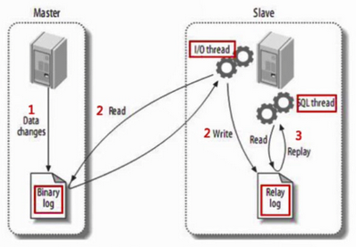
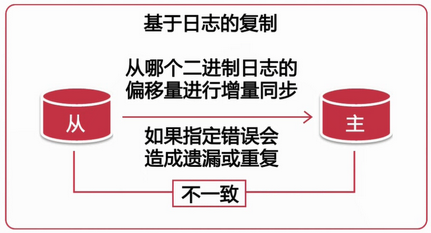
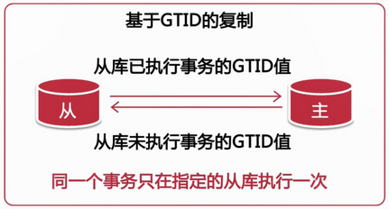
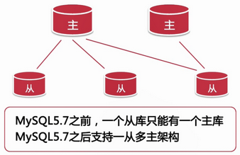
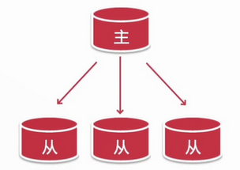
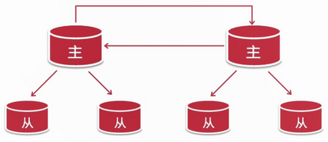
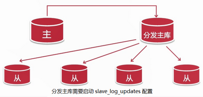

# MySQL二进制日志

## 1. 二进制日志的格式

### 1.1 基于段的格式

```bash
binlog_format=STATEMENT
```

优点：

- 日志记录量相对较小，节约磁盘及网络I/O

缺点：

- 可能造成 MySQL 复制的主备服务器数据不一致
- 特定函数如 UUID(), user(),这样非确定性函数还是无法复制

### 1.2 基于行的日志格式

```bash
binlog_format=ROW
```

优点：

- 使 MySQL 主从复制更安全
- 对每一行数据的修改比基于段的复制高效

缺点：

- 记录日志量较大

    `binlog_row_image = [FULL | MINIMAL | NOBLOG]`

### 1.3 混合日志格式

```bash
binlog_format = MIXED
```

- 根据 SQL 语句由系统决定在基于段和基于行的日志格式中进行选择
- 数据量的大小由所执行的 SQL 语句决定

## 2. MySQL 复制

### 2.1 基于 SQL 语句的复制（SBR）

二进制日志格式使用的是 statement 格式

优点：

- 生成的日志量少，节约网络传输 I/O
- 并不强制要求主从数据库的表定义完全相同
- 相比基于行的的复制方式更灵活

缺点：

- 对于非确定性事件，无法保证主从复制数据的一致性
- 对于存储过程，触发器，自定义函数进行的修改也可能造成数据不一致
- 相比于基于行的复制方式在从上执行时需要更多的行锁

### 2.2 基于行的复制（RBR）

二进制日志格式使用的是 row 格式

优点：

- 可以应用于任何 SQL 的复制包括非确定函数，存储过程等
- 可以减少数据库锁的使用

缺点：

- 要求主从数据库的表结构相同，否则可能会中断复制
- 无法在从上单独执行触发器

### 2.3 混合模式

根据实际内容在以上两者内容切换

## 3. MySQL 复制工作方式



1. 主将变更写入二进制日志
2. 从读取主的二进制日志变更并写入到 relay_log 中
3. 在从上重放 relay_log 中的日志

### 3.1 基于日志点的复制



优点：

- 是 MySQL 最早支持的复制技术，Bug 相对较少
- 对 SQL 查询没有任何限制
- 故障处理比较容易

缺点：

- 故障转移时重新获取新主的日志点信息比较困难

### 3.2 基于 GTID 复制



GTID 即全局事务ID，其保证为每一个在主上提交的事务在复制集群中可以生成一个唯一的 ID。

```bash
GTID = source_id:transaction_id
```

#### GTID 复制步骤

1、在主 DB 服务器上建立复制账号

```sql
create user 'repl'@'ip段' identified by 'password';

grant replication slave on *.* to 'repl'@'ip段';
```

2、配置主数据库服务器

```yml
# my.cnf
bin_log = /..../mysql-bin
server_id = xx
gtid_mode = on #启用gtid模式
enforce-gtid-consiste = on #强制gtid一致性
log-slave-updates = on #从服务器记录主服务器发过来的修改日志,5.7版本可以不启用
```

3、配置从数据库服务器

```yml
# my.cnf
server_id = xx
relay_log = /.../relay_log
gtid_mode = on
enforce-gtid-consistency = on

#其他相关配置
log-slave-updates = on
read_only = on #建议
master_info_repository = TABLE #建议
relay_log_info_repository = TABLE #建议
```

4、初始化从服务器数据

```sql
# 主
mysqldump --master-data=2 --single-transaction --all-databases -uroot -p > 备份.sql

# 从
mysql -uroot -p < 备份.sql
```

5、启动基于 GTID 的复制

```bash
change master to
master_host='master_host_ip',
master_user = 'replname',
master_password='password',
master_auto_position=1;
```

```sql
start slave;

show slave status \G
```

优点：

- 可以很方便的进行故障转移
- 从库不会丢失主库上的任何修改

缺点：

- 故障处理比较复杂
- 对执行的 SQL 有一定的限制

## 4. MySQL 复制拓扑



### 4.1 一主多从的复制拓扑



优点：

- 配置简单
- 可以用多个从库分担读负载

用途：

- 为不同业务使用不同的从库
- 将一台从库放到远程 IDC，用作灾备恢复
- 分担主库的读负载

### 4.2 主主复制拓扑

#### 主 - 主 复制的配置注意事项

- 两个主中所操作的表最好能够分开
- 使用下面两个参数控制自增 ID 的生成
    auto_increment_increment = 2
    auto_increment_offset = 1 | 2

#### 主 - 主备 复制的配置注意实现

- 确保2台服务器上的初始数据相同
- 确保2台服务器上已经启动 binlog 并且有不同的 server_id
- 在2台服务器上启用 log_slave_updates 参数
- 在初始的备库上启用 read_only

只有1台主服务器对外提供服务，1台服务器处于只读状态并且只作为热备使用。

在对外提供服务的主库出现故障或是计划性的维护时才会进行切换，使原来的备库成为主库，而原来的主库会成为新的备库，并处理只读或是下线状态，待维护完成后重新上线

### 4.3 拥有备库的主-主复制拓扑



级联复制



## 5. 复制性能优化

- 控制主库的事务大小，分割大事务
- 对二进制日志使用 mixed 日志格式或者设置 `set binlog_row_image = minimal;`
- 默认情况下从库只有一个 SQL 线程，主库上并发的修改在从库上变成了串行，配置多线程复制

mysql 5.7 配置多线程复制：

```sql
#从库上
stop slave;

set global slave_parallel_type = 'logical_clock';

set global slave_parallel_workers = 4;

start slave;
```
