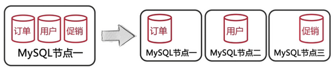
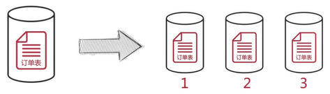
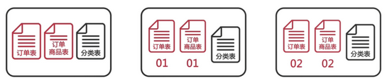

# MySQL分库分表

分库分表的几种方式：

1. 把一个实例中的多个数据库拆分到不同的实例

    

2. 把一个库中的表分离到不同的数据库中

    

3. 对一个库中的相关表进行水平拆分到不同实例的数据库中

    

## 数据库分片前的准备

如何选择分区键?

- 分区键要能尽量避免跨分片查询的发生
- 分区键要能尽量使用各个分片中的数据平均

如何存储无需分片的表?

- 每个分片中存储一份相同的数据
- 使用额外的节点统一存储

如何在节点上部署分片?

- 每个分片使用单一数据库，并且数据库名也相同
- 将多个分片表存储在一个数据库中，并在表名上加入分片号后缀
- 在一个节点中部署多个数据库，每个数据库包含一个分片

如何分配分片中的数据?

- 按分区键的 Hash 值取模来分片数据
- 按分区键的范围来分配分片数据
- 利用分区键和分片的映射表来分配分片数据

如何生成全局唯一ID?

- 使用 auto_increment_increment 和 auto_increment_offset 参数
- 使用全局节点来生成 ID
- 在 Redis 等缓存服务器中创建全局 ID

## 数据库分片演示

演示场景说明：



### oneProxyp 安装和配置

```bash
wget http://www.onexsoft.cn/software/oneproxy-rhel6-linux64-v5.8.1-ga.tar.gz

tar -zxf oneproxy-rhel6-linux64-v5.8.1-ga.tar.gz
```
