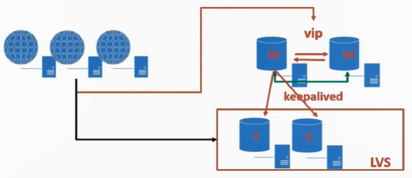

# keepalive + lvs 读写分离

主服务器只要执行写操作，从服务器执行读操作。

## 如何进行读写分离

- 使用 keepalived 进行写 VIP 的迁移

- 使用 lvs 进行多个只读从数据库的负载均衡

### 常用的读服务器负载均衡方式

1. 数据库中间层
2. DNSl轮询（不推荐）
3. LVS / Haproxy
4. 硬件 F5

---

## LVS对读服务器负载均衡

优点：

- 属于四层代理，只进行分发，处理效率更高
- 工作稳定，可进行高可用配置
- 无流量，不会对主机的网络 IO 造成影响



### 演示环境

| 主机名 | IP | 角色 |
| ---- | ---- | ---- |
| localhost151 | 192.168.194.151 | 主DB |
| localhost152 | 192.168.194.152 | 主备DB |
| localhost153 | 192.168.194.153 | slave DB |
| keepalived | 192.168.194.100 | keepalived VIP |
| lvs manager |  192.168.194.151/152 |  |
| lvs vip | 192.168.194.99 | lvs VIP |

### 安装 LVS

`151` ， `152` 安装：

```bash
yum install -y ipvsadm.x86_64
```

`151` , `152` , `153` 安装 ipvs 模块：

```bash
modprobe ip_vs
```

### 配置2个从库的 lvs vip

`152` , `153` 执行此操作：

```bash
# 创建脚本
vi /etc/init.d/lvsrs

chmod a+x lvsrs
```

脚本内容(`VIP=为要绑定的地址`)：

```yml
#!/bin/bash
VIP=192.168.194.99
. /etc/rc.d/init.d/functions
case "$1" in
start)
/sbin/ifconfig lo down
/sbin/ifconfig lo up
echo "1" >/proc/sys/net/ipv4/conf/lo/arp_ignore
echo "2" >/proc/sys/net/ipv4/conf/lo/arp_announce
echo "1" >/proc/sys/net/ipv4/conf/all/arp_ignore
echo "2" >/proc/sys/net/ipv4/conf/all/arp_announce
/sbin/sysctl -p >/dev/null 2>&1
/sbin/ifconfig lo:0 $VIP netmask 255.255.255.255 up
/sbin/route add -host $VIP dev lo:0
echo "LVS-DR real server starts successfully.\n"
;;
stop)
/sbin/ifconfig lo:0 down
/sbin/route del $VIP >/dev/null 2>&1
echo "0" >/proc/sys/net/ipv4/conf/lo/arp_ignore
echo "0" >/proc/sys/net/ipv4/conf/lo/arp_announce
echo "0" >/proc/sys/net/ipv4/conf/all/arp_ignore
echo "0" >/proc/sys/net/ipv4/conf/all/arp_announce
echo "LVS-DR real server stopped."
;;
status)
isLoOn=`/sbin/ifconfig lo:0 | grep "$VIP"`
isRoOn=`/bin/netstat -rn | grep "$VIP"`
if [ "$isLoOn" == "" -a "$isRoOn" == "" ]; then
echo "LVS-DR real server has to run yet."
else
echo "LVS-DR real server is running."
fi
exit 3
;;
*)
echo "Usage: $0 {start|stop|status}"
exit 1
esac
exit 0
```

执行脚本：

```bash
./lvsrs start
LVS-DR real server starts successfully.\n
```

查看是否绑定 lvs vip：

```bash
ip addr

# 绑定成功 192.168.194.99/32
1: lo: <LOOPBACK,UP,LOWER_UP> mtu 65536 qdisc noqueue state UNKNOWN group default qlen 1000
    link/loopback 00:00:00:00:00:00 brd 00:00:00:00:00:00
    inet 127.0.0.1/8 scope host lo
       valid_lft forever preferred_lft forever
    inet 192.168.194.99/32 scope global lo:0
```

### 创建 lvs 监控后端数据库的账号

```sql
create user dba_monitor@'192.168.194.%' identified by '123456';

grant all privileges on *.* to dba_monitor@'192.168.194.%' identified by '123456';

flush privileges;
```

### 151，152 导入脚本

```bash
vi /etc/keepalived/check_slave.sh

chmod a+x check_slave.sh
```

```yml
#/bin/bash
# check_slave.sh
MYSQL=`which mysql`
VIP=192.168.194.99
VPORT=3306
function usage()  
{  
  echo "usage:"  
  echo "example:# mysql -umonitor -pmonitor -P3306 -h192.168.194.151"  
  echo "-p, --password[=name]"  
  echo "-P, --port"  
  echo "-h, --host=name"  
  echo "-u, --user=name"  
}  
  
  
while getopts "u:p:h:P:" option  
do  
    case "$option" in  
        u)  
            dbuser="$OPTARG";;  
        p)  
            dbpwd="$OPTARG";;  
        h)  
            dbhost="$OPTARG";;  
        P)  
            dbport="$OPTARG";;  
        \?)  
            usage  
            exit 1;;  
    esac  
done  
  
if [ "-$dbuser" = "-" ]; then  
    usage  
    exit 1  
fi  
  
if [ "-$dbpwd" = "-" ]; then  
    usage  
    exit 1  
fi  
  
if [ "-$dbhost" = "-" ]; then  
    usage  
    exit 1  
fi  
  
if [ "-$dbport" = "-" ]; then  
    usage  
    exit 1  
fi  
  
$MYSQL -u$dbuser -p$dbpwd -P$dbport -h$dbhost -e "select @@version;" >/dev/null 2>&1
if [ $? = 0 ] ;then
  MySQL_ok=1
else
  /sbin/ipvsadm -d -t $VIP:$VPORT -r $dbhost:$VPORT
  exit 1
fi

slave_status=$(${MYSQL} -u$dbuser -p$dbpwd -P$dbport -h$dbhost -e 'show slave status \G' | awk ' \
  /Slave_IO_Running/{io=$2} \
  /Slave_SQL_Running/{sql=$2} \
  /Seconds_Behind_Master/{printf "%s %s %d\n",io,sql,$2}') >/dev/null 2>&1


arr=($slave_status)
io=${arr[0]}
sql=${arr[1]}
behind=${arr[2]}


if [ "$io" == "No" ]||[ "$sql" == "No" ]; then  
    /sbin/ipvsadm -d -t $VIP:$VPORT -r $dbhost:$VPORT
    exit 1  
elif [ $behind -gt 60 ]; then
    /sbin/ipvsadm -d -t $VIP:$VPORT -r $dbhost:$VPORT
    exit 1
else
    /sbin/ipvsadm -a -t $VIP:$VPORT -r $dbhost:$VPORT -g
    exit 0  
fi  
```

更改 keepalived.cnf 文件：

```bash
# 添加内容
vrrp_instance VI_2 {
    state BACKUP
    interface ens33
    virtual_router_id 202
    priority 99
    advert_int 1
    nopreempt
    authentication {
        auth_type PASS
        auth_pass 1200
    }

   virtual_ipaddress {
      192.168.194.99/24
    }
}

virtual_server 192.168.194.99 3306 {
   #健康坚持时间5s
   delay_loop 5
   #负载均衡调度算法 rr轮询算法
   lb_algo rr
   #负载均衡的机制
   lb_kind DR
   #会话保持时间s
   persistence_timeout 120
   #TCP 协议
   protocol TCP
   sorry_server 192.168.194.100 3306
   real_server 192.168.194.152 3306 {
       weight 1
       MISC_CHECK {
          misc_path "/etc/keepalived/check_slave.sh -udba_monitor -p123456 -h192.168.194.152 -P3306"
          misc_dynamic
       }
   }
   real_server 192.168.194.153 3306 {
       weight 1
       MISC_CHECK {
          misc_path "/etc/keepalived/check_slave.sh -udba_monitor -p123456 -h192.168.194.153 -P3306"
          misc_dynamic
       }
   }
}
```

### 151主服务器导入脚本

```bash
vi /etc/init.d/lvsdr

chmod a+x lvsdr

./lvsdr start
```

```yml
#!/bin/bash
VIP=192.168.194.99
DEV=ens33
. /etc/rc.d/init.d/functions
case "$1" in
start)
echo "1">/proc/sys/net/ipv4/ip_forward
/sbin/ipvsadm -A -t $VIP:3306 -s rr -p 60
/sbin/ipvsadm -a -t $VIP:3306 -r 192.168.194.152:3306 -g
/sbin/ipvsadm -a -t $VIP:3306 -r 192.168.194.153:3306 -g
/sbin/ipvsadm --start-daemon
echo "LVS-DR server starts successfully.\n"
;;
stop)
/sbin/route del $VIP >/dev/null 2>&1
echo "0" >/proc/sys/net/ipv4/ip_forward
/sbin/ipvsadm -C
echo "LVS-DR real server stopped."
;;
status)
isLoOn=`/sbin/ifconfig lo:0 | grep "$VIP"`
isRoOn=`/bin/netstat -rn | grep "$VIP"`
if [ "$isLoOn" == "" -a "$isRoOn" == "" ]; then
echo "LVS-DR real server has to run yet."
else
echo "LVS-DR real server is running."
fi
exit 3
;;
*)
echo "Usage: $0 {start|stop|status}"
exit 1
esac
exit 0
```

### 主、主备服务器启动 keepalived

主查看 ip addr：

```bash
ip addr

1: lo:
    inet 127.0.0.1/8 scope host lo
       valid_lft forever preferred_lft forever

2: ens33:
    link/ether 00:0c:29:af:15:4f brd ff:ff:ff:ff:ff:ff
    inet 192.168.194.151/24 brd 192.168.194.255 scope global noprefixroute ens33
       valid_lft forever preferred_lft forever
```

主备查看 ip addr:

```bash
ip addr

1: lo:
    inet 127.0.0.1/8 scope host lo
       valid_lft forever preferred_lft forever
    inet 192.168.194.99/32 scope global lo:0
       valid_lft forever preferred_lft forever

2: ens33:
    link/ether 00:0c:29:4e:8b:98 brd ff:ff:ff:ff:ff:ff
    inet 192.168.194.152/24 brd 192.168.194.255 scope global noprefixroute ens33
       valid_lft forever preferred_lft forever
    inet 192.168.194.100/24 scope global secondary ens33
       valid_lft forever preferred_lft forever
    inet 192.168.194.99/24 scope global secondary ens33
       valid_lft forever preferred_lft forever
```

slave 查看 ip addr：

```bash
ip addr
1: lo:
    inet 127.0.0.1/8 scope host lo
       valid_lft forever preferred_lft forever
    inet 192.168.194.99/32 scope global lo:0
       valid_lft forever preferred_lft forever

2: ens33:
    link/ether 00:0c:29:50:e8:96 brd ff:ff:ff:ff:ff:ff
    inet 192.168.194.153/24 brd 192.168.194.255 scope global noprefixroute ens33
       valid_lft forever preferred_lft forever
````

### bash 命令查看测试

```sql
#主
mysql -udba_monitor -p123456 -h"192.168.194.99" -e"show variables like 'server_id'";
+---------------+-------+
| Variable_name | Value |
+---------------+-------+
| server_id     | 153   |
+---------------+-------+
```

```sql
#主备
mysql -udba_monitor -p123456 -h"192.168.194.99" -e"show variables like 'server_id'";
+---------------+-------+
| Variable_name | Value |
+---------------+-------+
| server_id     | 153   |
+---------------+-------+
```

```sql
#slave
mysql -udba_monitor -p123456 -h"192.168.194.99" -e"show variables like 'server_id'";
+---------------+-------+
| Variable_name | Value |
+---------------+-------+
| server_id     | 153   |
+---------------+-------+
```

152 主备查看:

```bash
ipvsadm -L -n

IP Virtual Server version 1.2.1 (size=4096)
Prot LocalAddress:Port Scheduler Flags
  -> RemoteAddress:Port           Forward Weight ActiveConn InActConn

TCP  192.168.194.99:3306 rr persistent 120
  -> 192.168.194.152:3306         Route   1      0          0
  -> 192.168.194.153:3306         Route   1      0          0
```

`99` 端口，负载了 `152` 和 `153` 服务器。

测试关闭 153 mysql 服务：

```bash
# 153
systemctl stop mysqld.service
```

在查看 152 :

```bash
ipvsadm -L -n

IP Virtual Server version 1.2.1 (size=4096)
Prot LocalAddress:Port Scheduler Flags
  -> RemoteAddress:Port           Forward Weight ActiveConn InActConn
TCP  192.168.194.99:3306 rr persistent 120
  -> 192.168.194.152:3306         Route   1      0          0
```

已将 153 踢出集群。
