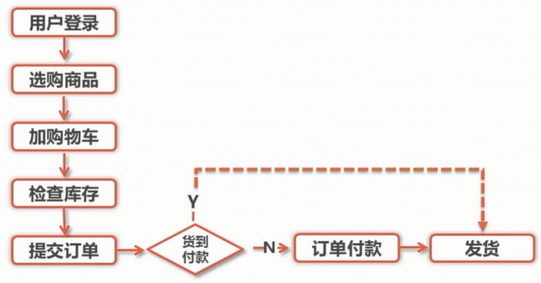
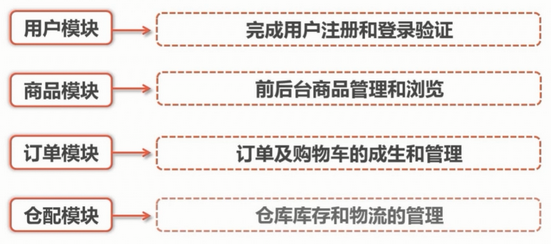

# 项目说明

## 1. 流程图

## 2. 模块功能

## 3. 数据库设计规范

### 3.1 数据库命名规范

1. 所有数据库对象名称必须使用小写字母并用下划线分隔

        不同的数据库名  DbName dbname
        不同的表名     Table   table  tabLe
2. 所有数据库对象名称禁止使用 MySQL 保留关键字
3. 数据库对象的命名要能做到见名知意，最好不要超过32个字符
4. 临时库表必须以 tmp 为前缀并以日期为后缀
5. 备份库，备份表必须以 bak 为前缀并以日期为后缀
6. 所有存储相同数据的列名和列类型必须一致

### 3.2 数据库基本设计规范

1. 所有表必须使用 Innodb 存储引擎
2. 数据库和表的字符集同一使用 UTF-8
3. 所有表和字段都需要添加注释
4. 尽量控制单表数据量的大小，建议控制在500万以内
5. 谨慎使用 MySQL 分区表
6. 尽量做到冷热数据分离，减小表的宽度（最多支持4096列）
    - 减少磁盘 IO，保证热数据的那日村缓存命中率
    - 更有效的利用缓存，避免读入无用的冷数据
7. 禁止在表中建立预留字段
8. 禁止在数据中存储图片、文件等二进制数据

### 3.3 数据库索引设计规范

1. 建议单张表索引不超过5个
2. 每个 Innodb 表必须有一个主键
3. 限制表上索引的数量，避免建立重复和冗余索引
4. 合理选择复合索引键值的顺序
5. 不建议使用外键约束，但一定在标语表之间的关联键上建立索引

### 3.4 数据库字段设计规范

1. 优先选择符合存储需要的最小的数据类型
2. 避免使用 Blob 或是 Text 类型及 ENUM 类型
3. 每个字段尽可能具有 NOT NULL 属性
4. 使用 TIMESTAMP 或 DATETIME 类型存储时间

### 3.5 数据库SQL开发规范

1. 建议使用预编译语句进行数据库操作
2. 避免数据类型的隐式转换
3. 避免使用双 % 号的查询条件(后置 % 可以利用索引)
4. 使用 `left join` 或 `not exists` 来优化 not in 操作
5. 禁止使用 `select *` 必须使用 `select <字段列表>` 查询
6. 禁止使用不含字段列表的 `insert` 语句
7. 避免使用子查询，可以把子查询优化为 `join` 操作
8. 避免 `join` 关联太多的表(mysql 最大支持关联16个表)
9. 使用 `in` 代替 `or` (in 可以有效的利用索引)
10. 将1个大的 sql 语句，拆成多个小的 sql语句。

### 3.6 数据库操作行为规范

1. 超100万行的批量写操作，要分批多次进行操作
2. 对于大表使用 pt-online-schema-change 修改表结构
3. 禁止为程序使用的账号赋予 super 权限
4. 对于程序连接数据库账号，遵循权限最小原则
