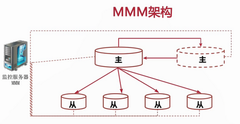
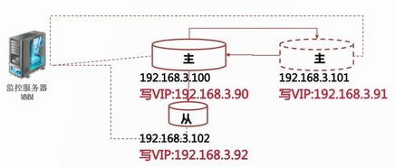

# 高可用：MMM架构

如何解决主服务器的单点问题？

主服务器切换后，入喉通知应用新的主服务器的 IP 地址？

如何检查 MySQL 主服务器是否可用？

如何处理从服务器和新主服务器之间的那种复制关系？

## MMM 架构

监控和管理 MySQL 的主主复制拓扑，并在当前的主服务器失效时，进行主和主备服务器之间的主从切换和故障转移等工作。

MMM 应用于`主-主备`复制模式。监控 MySQL 主从复制健康状况。

在主库出现宕机时进行故障转移并自动配置其它从库对新主库的复制。

提供了主，写虚拟 IP，在主从服务器出现问题时可以自动迁移虚拟 IP。



### MMM 部署所需资源

| 名称资源 | 数量 | 说明 |
| ---- | ---- | ---- |
| 主DB服务器 | 2    | 用于主备模式的主主复制配置 |
| 从DB服务器 | 0-N  | 可以配置0台或堕胎从服务器，但不建议太多 |
| 监控服务器 | 1    | 用于监控 MySQL 复制集群 |
| IP 地址   | 2*(n+1) | n为 MySQL 服务器的数量 |
| 监控用户   | 1      | 用户监控数据库状态的 MySQL 用户（replication client） |
| 代理用户   | 1    | 用户MMM代理的 MySQL 用户（super,replication client,process）|
| 复制用户   | 1    | 用户配置 MySQL 复制的 MySQL 用户（replication slave）|

### MMM 部署步骤

1. 配置主主复制及主从同步集群
2. 安装主从节点所需要的支持包
3. 安装及配置MMM工具集
4. 运行MMM监控服务
5. 测试

## MMM部署



### 安装 MMM

配置 yum 源：

```bash
wget https://dl.fedoraproject.org/pub/epel/7/x86_64/Packages/e/epel-release-7-11.noarch.rpm

#安装
rpm -ivh epel-release-7-11.noarch.rpm

wget http://rpms.remirepo.net/enterprise/remi-release-7.rpm

rpm -ivh remi-release-7.rpm
```

```bash
vi /etc/yum.repos.d/remi.repo

# 修改内容
enabled=1
```

```bash
vi /etc/yum.repos.d/epel.repo

# 去掉注释
baseurl=http://download.fedoraproject.org/pub/epel/7/$basearch

# 注释掉
#metalink=https://mirrors.fedoraproject.org/metalink?repo=epel-7&arch=$basearch
```

### 安装监控服务

所有的 DB 服务器都需要安装：

查看有哪些要安装：

```bash
yum search mmm

======================================= N/S matched: mmm =======================================
mysql-mmm-agent.noarch : MMM Database Server Agent Daemon and Libraries
mysql-mmm-monitor.noarch : MMM Monitor Server Daemon and Libraries
mysql-mmm-tools.noarch : MMM Control Scripts and Libraries
mysql-mmm.noarch : Multi-Master Replication Manager for MySQL
```

监控节点安装（153作为监控节点）：

```bash
#yum install mysql-mmm-monitor
yum -y install mysql-mmm*

# 在monitor启动monitor,配置好后再执行启动
systemctl enable mysql-mmm-monitor
systemctl start mysql-mmm-monitor
```

其他代理节点安装:

```bash
yum install mysql-mmm-agent
#或者
yum install -y mysql-mmm-agent.noarch

# 在数据库服务器上启动agent,配置好后再执行启动
systemctl enable mysql-mmm-agent
systemctl start mysql-mmm-agent
```

卸载方法：

```bash
yum -y remove mysql-mmm*
```

151节点创建用户：

```sql
# 创建监控用户
create user 'mmm_monitor'@'192.168.194.%' identified by '123456';

grant replication client on *.* to mmm_monitor@'192.168.194.%' identified by '123456';

# 创建代理服务用户
grant super,replication client, process on *.* to mmm_agent@'192.168.194.%' identified by '123456';

# 复制用户使用 复制时的用户
```

所有节点修改 `mmm_common.conf` 配置文件：

```bash
#所有节点配置文件相同
vi /etc/mysql-mmm/mmm_common.conf
```

```xml
active_master_role      writer

<host default>
    cluster_interface       ens333
    pid_path                /run/mysql-mmm-agent.pid
    bin_path                /usr/libexec/mysql-mmm/
    replication_user        repl
    replication_password    123456
    agent_user              mmm_agent
    agent_password          123456
</host>

<host db1>
    ip      192.168.194.151
    mode    master
    peer    db2
</host>

<host db2>
    ip      192.168.194.152
    mode    master
    peer    db1
</host>

<host db3>
    ip      192.168.194.153
    mode    slave
</host>

<role writer>
    hosts   db1, db2
    ips     192.168.194.90
    mode    exclusive
</role>

<role reader>
    hosts   db1, db2, db3
    ips     192.168.193.91, 192.168.194.92, 192.168.194.93
    mode    balanced
</role>
```

所有节点修改 `mmm_agent.conf` 配置文件：

```bash
#所有节点配置文件不同
vi /etc/mysql-mmm/mmm_agent.conf
```

```yml
# 主DB
this db1

# 主备DB 配置为
this db2

# slave DB
this db3
```

> 数据库节点配置完成。

---

### 监控节点 

153主机:

```bash
vi /etc/mysql-mmm/mmm_mon.conf
```

```yml
include mmm_common.conf

<monitor>
    ip                  127.0.0.1
    pid_path            /run/mysql-mmm-monitor.pid
    bin_path            /usr/libexec/mysql-mmm
    status_path         /var/lib/mysql-mmm/mmm_mond.status
    ping_ips            192.168.194.151,192.168.194.152,193.168.194.153
    auto_set_online     60

    # The kill_host_bin does not exist by default, though the monitor will
    # throw a warning about it missing.  See the section 5.10 "Kill Host
    # Functionality" in the PDF documentation.
    #
    # kill_host_bin     /usr/libexec/mysql-mmm/monitor/kill_host
    #
</monitor>

<host default>
    monitor_user        mmm_monitor
    monitor_password    123456
</host>
```

启动所有节点 agent：

```bash
systemctl enable mysql-mmm-agent
systemctl start mysql-mmm-agent
```

启动 monitor：

```bash
systemctl enable mysql-mmm-monitor
systemctl start mysql-mmm-monitor
```

```bash
# 查看为 ONLINE 启动成功
mmm_control show
  db1(192.168.194.151) master/ONLINE. Roles: reader(192.168.194.91), writer(192.168.194.90)
  db2(192.168.194.152) master/ONLINE. Roles: reader(192.168.194.92)
  db3(192.168.194.153) slave/ONLINE. Roles: reader(192.168.194.93)
```

```bash
# 查看是否绑定 vip
ip addr
```
