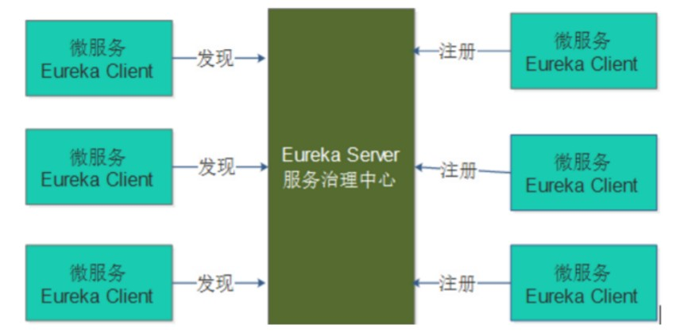
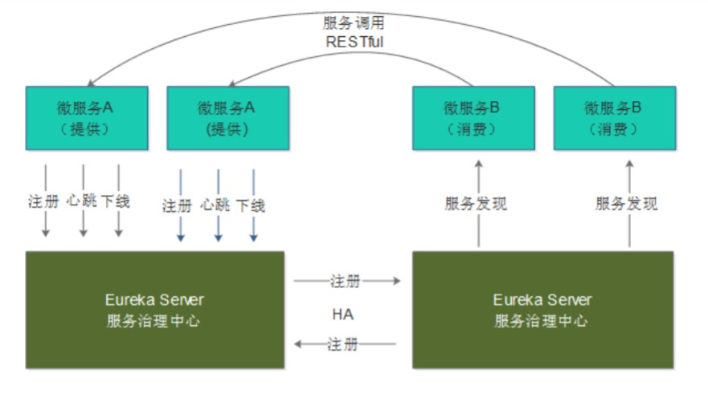
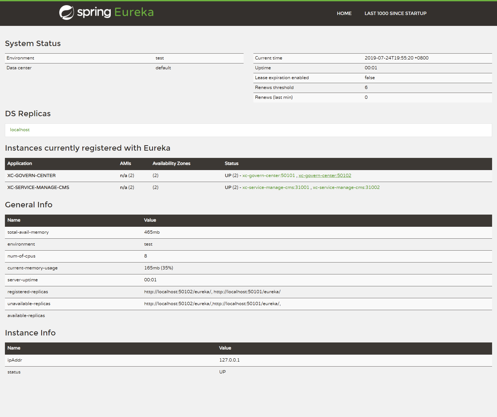
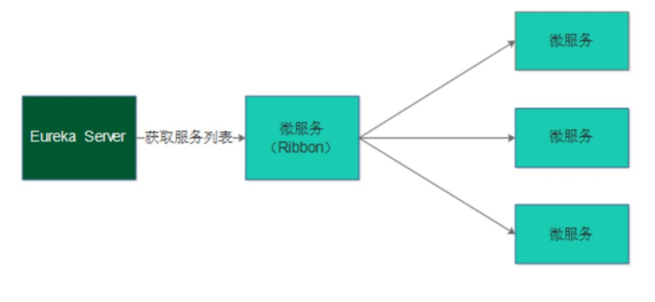

# SpringBoot整合Eureka注册中心

## 1. Eureka介绍

Spring Cloud Eureka 是对 Netflix 公司的 Eureka 的二次封装，它实现了服务治理的功能，Spring Cloud Eureka 提供服务端与客户端，服务端即是 Eureka 服务注册中心，客户端完成微服务向 Eureka 服务的注册与发现。服务端和客户端均采用 Java 语言编写。下图显示了 Eureka Server 与 Eureka Client 的关系：



1、Eureka Server 是服务端，负责管理各各微服务结点的信息和状态。

2、在微服务上部署 Eureka Client 程序，远程访问 Eureka Server 将自己注册在 Eureka Server。

3、微服务需要调用另一个微服务时从 Eureka Server 中获取服务调用地址，进行远程调用。

## 2. Eureka Server高可用环境搭建

Eureka Server 高可用环境需要部署两个Eureka server，它们互相向对方注册。如果在本机启动两个 Eureka 需要注意两个 Eureka Server 的端口要设置不一样，这里我们部署一个 Eureka Server工程，将端口可配置，制作两个 Eureka Server 启动脚本，启动不同的端口，如下图：



1、在实际使用时 Eureka Server 至少部署两台服务器，实现高可用。

2、两台 Eureka Server 互相注册。

3、微服务需要连接两台 Eureka Server 注册，当其中一台 Eureka 死掉也不会影响服务的注册与发现。

4、微服务会定时向 Eureka server 发送心跳，报告自己的状态。

5、微服务从注册中心获取服务地址以 RESTful 方式发起远程调用。

### 2.1 父工程添加依赖

```xml
<dependency>
    <groupId>org.springframework.cloud</groupId>
    <artifactId>spring-cloud-dependencies</artifactId>
    <version>Greenwich.RELEASE</version>
    <type>pom</type>
    <scope>import</scope>
</dependency>
```

### 2.2 创建注册中心工程：添加 Eureka Server 依赖

```xml
<dependencies>
    <!‐‐ 导入Eureka服务的依赖 ‐‐>
    <dependency>
        <groupId>org.springframework.cloud</groupId>
        <artifactId>spring‐cloud‐starter‐netflix‐eureka‐server</artifactId>
    </dependency>
</dependencies>
```

### 2.3 启动类添加注释

```java
@EnableEurekaServer//标识这是一个Eureka服务
@SpringBootApplication
public class GovernCenterApplication {
    public static void main(String[] args) {
        SpringApplication.run(GovernCenterApplication.class, args);
    }
}
```

### 2.4 application.yml 配置文件

```yml
spring:
  application:
    name: xc-govern-center
  profiles:
    active: ${PROFILE:zone1}
```

### 2.5 application-zone1.yml 配置文件

```yml
server:
  port: 50101
eureka:
  instance:
    #hostname: eureka01 #主机名
    prefer-ip-address: true #将自己的ip地址注册到Eureka服务中
    ip-address: ${IP_ADDRESS:127.0.0.1} #配置ip地址
    instance-id: ${spring.application.name}:${server.port} #指定实例id
    #metadata-map:
      #zone: zone-1
  client:
    region: china
    register-with-eureka: true
    fetch-registry: true
    #prefer-same-zone-eureka: true
    service-url:
      #defaultZone: http://eureka02:50102/eureka/
      #zone-1: http://eureka01:50101/eureka/
      #zone-2: http://eureka02:50102/eureka/
      zone-1: http://localhost:50101/eureka/
      zone-2: http://localhost:50102/eureka/
    availability-zones:
      china: zone-1,zone-2
  #server:
    #enable-self-preservation: true e #是否开启自我保护模式
    #eviction-interval-timer-in-ms: 60000 #服务注册表清理间隔（单位毫秒，默认是60*1000）

```

### 2.6 application-zone2.yml 配置文件

```yml
server:
  port: 50102
eureka:
  instance:
    #hostname: eureka02
    prefer-ip-address: true #将自己的ip地址注册到Eureka服务中
    ip-address: ${IP_ADDRESS:127.0.0.1} #配置ip地址
    instance-id: ${spring.application.name}:${server.port} #指定实例id
    #metadata-map:
      #zone: zone-2
  client:
    region: china
    register-with-eureka: true #服务注册，是否将自己注册到Eureka服务中
    fetch-registry: true #服务发现，是否从Eureka中获取注册信息
    #prefer-same-zone-eureka: true
    service-url:
      #defaultZone: http://eureka01:50101/eureka/
      #zone-1: http://eureka01:50101/eureka/
      #zone-2: http://eureka02:50102/eureka/
      zone-1: http://localhost:50101/eureka/
      zone-2: http://localhost:50102/eureka/
    availability-zones:
      china: zone-1,zone-2
  #server:
    #enable-self-preservation: true
    #eviction-interval-timer-in-ms: 60000
```

分别启动两个不同端口的 Eureka Server 访问地址 [http://localhost:50102/](http://localhost:50102/)



---

## 3. 注册服务：将工程注册到 Eureka Server

### 3.1 添加依赖

```xml
<!-- 导入Eureka客户端的依赖 -->
<dependency>
    <groupId>org.springframework.cloud</groupId>
    <artifactId>spring-cloud-starter-netflix-eureka-client</artifactId>
</dependency>
```

### 3.2 application.yml配置

```yml
#---------eureka---------
eureka:
  instance:
    prefer-ip-address: true
    ip-address: ${IP_ADDRESS:127.0.0.1}
    instance-id: ${spring.application.name}:${server.port}
  client:
    region: china
    register-with-eureka: true
    fetch-registry: true
    service-url:
      zone-1: http://localhost:50101/erueka/
      zone-2: http://localhost:50102/eureka/
    availability-zones:
      china: zone-1,zone-2
```

### 3.3 启动类添加注解

```java
@EnableDiscoveryClient //表示它是一个Eureka的客户端

或者下面都可以

@EnableEurekaClient
```

---

## 3. Feign 远程调用

### 3.1 Ribbon介绍

Ribbon 是 Netflix 公司开源的一个负载均衡的项目（https://github.com/Netflix/ribbon），它是一个基于 HTTP、TCP 的客户端负载均衡器。

什么是客户端负载均衡?

客户端负载均衡与服务端负载均衡的区别在于客户端要维护一份服务列表，Ribbon 从 Eureka Server 获取服务列表，Ribbon 根据负载均衡算法直接请求到具体的微服务，中间省去了负载均衡服务。

如下图是 Ribbon 负载均衡的流程图：



1、在消费微服务中使用 Ribbon 实现负载均衡，Ribbon 先从 Eureka Server 中获取服务列表。

2、Ribbon 根据负载均衡的算法去调用微服务。

Spring Cloud 引入 Ribbon 配合 MVC 的 restTemplate 实现客户端负载均衡。Java 中远程调用的技术有很多，如：webservice、socket、rmi、Apache HttpClient、OkHttp 等，互联网项目使用基于 http 的客户端较多，本项目使用 OkHttp。

#### ribbon 依赖

```xml
<dependency>
    <groupId>org.springframework.cloud</groupId>
    <artifactId>spring‐cloud‐starter‐ribbon</artifactId>
</dependency>

<dependency>
    <groupId>com.squareup.okhttp3</groupId>
    <artifactId>okhttp</artifactId>
</dependency>
```

#### ribbon 配置

```yml
ribbon:
  MaxAutoRetries: 2 #最大重试次数，当Eureka中可以找到服务，但是服务连不上时将会重试
  MaxAutoRetriesNextServer: 3 #切换实例的重试次数
  OkToRetryOnAllOperations: false #对所有操作请求都进行重试，如果是get则可以，如果是post，put等操作  没有实现幂等的情况下是很危险的,所以设置为false
  ConnectTimeout: 5000 #请求连接的超时时间
  ReadTimeout: 6000 #请求处理的超时时间
```

#### 启动类中定义 RsetTemplate

```java
@Bean
@LoadBalanced
public RestTemplate restTemplate() {
    return new RestTemplate(new OkHttp3ClientHttpRequestFactory());
}
```

>**@LoadBalanced注解：**  
> restTemplate 会走 LoadBalancerInterceptor 拦截器，此拦截器中会通过 RibbonLoadBalancerClient 查询服务地址，可以在此类打断点观察每次调用的服务地址和端口，两个cms服务会轮
流被调用。

#### 启动后测试

```java
@Autowired
RestTemplate restTemplate;


@Test
public void testRibbon() {
    //服务id
    String serviceId = "xc-service-manage-cms";

    //通过服务id调用
    ResponseEntity<Map> forEntity = restTemplate.getForEntity("http://" + serviceId + "/cms/page/get/5a754adf6abb500ad05688d9", Map.class);
    Map body = forEntity.getBody();
    System.err.println(body);
}
```

### 3.2 Feign 介绍

Feign 是 Netflix 公司开源的轻量级 rest 客户端，使用 Feign 可以非常方便的实现 Http 客户端。Spring Cloud引入 Feign 并且集成了 Ribbon 实现客户端负载均衡调用。

#### Feign 依赖

```xml
<!-- Feign 集成了 Ribbon，所以去掉 Ribbon 的依赖 -->
<dependency>
<groupId>org.springframework.cloud</groupId>
<artifactId>spring‐cloud‐starter‐openfeign</artifactId>
</dependency>
<dependency>
<groupId>com.netflix.feign</groupId>
<artifactId>feign‐okhttp</artifactId>
</dependency>
```

#### 定义 Feign Client 接口

接口定义的Url、请求参数类型、返回值类型与要调用的接口的定于相同

```java
@FeignClient(value = "XC-SERVICE-MANAGE-CMS")
public interface CmsPageClient {

    //根据页面id查询页面信息，远程调用cms请求
    @GetMapping("/cms/page/get/{id}") //标识远程调用http请求是什么请求类型
    public CmsPage findCmsPageById(@PathVariable("id") String id);

}
```

#### 启动类添加 @EnableFeignClients 注解

```java
@EnableFeignClients
```

#### 测试

```java
@Autowired
CmsPageClient cmsPageClient;

@Test
public void testFegin(){
    CmsPage cmsPage = cmsPageClient.findCmsPageById("5a754adf6abb500ad05688d9");
    System.err.println(cmsPage);
}
```

Feign 工作原理如下：

1、启动类添加 `@EnableFeignClients` 注解，Spring 会扫描标记了 `@FeignClient` 注解的接口，并生成此接口的代理对象

2、`@FeignClient(value = XcServiceList.XC_SERVICE_MANAGE_CMS)` 即指定了 cms 的服务名称，Feign 会从注册中心获取 cms 服务列表，并通过负载均衡算法进行服务调用。

3、在接口方法 中使用注解 `@GetMapping("/cms/page/get/{id}")`，指定调用的 url，Feign 将根据 url 进行远程调用。

Feign注意点：

SpringCloud 对 Feign 进行了增强兼容了 SpringMVC 的注解 ，我们在使用 SpringMVC 的注解时需要注意：

1、feignClient 接口有参数在参数必须加 `@PathVariable("XXX")` 和 `@RequestParam("XXX")`

2、feignClient 返回值为复杂对象时其类型必须有`无参构造函数`。


