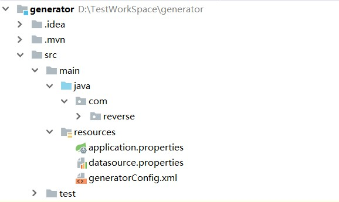
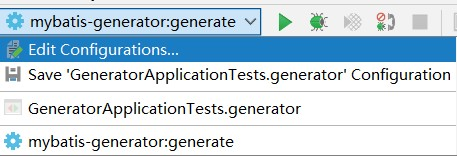
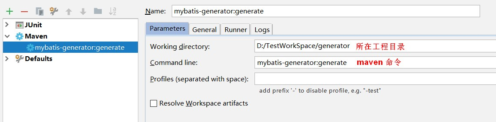

# SpringBoot整合Mybatis逆向工程

项目结构：



## pom依赖

```xml
<dependencies>
    <dependency>
        <groupId>org.springframework.boot</groupId>
        <artifactId>spring-boot-starter</artifactId>
    </dependency>

    <dependency>
        <groupId>org.springframework.boot</groupId>
        <artifactId>spring-boot-starter-test</artifactId>
        <scope>test</scope>
    </dependency>

    <dependency>
        <groupId>mysql</groupId>
        <artifactId>mysql-connector-java</artifactId>
        <version>8.0.15</version>
    </dependency>

    <dependency>
        <groupId>com.alibaba</groupId>
        <artifactId>druid-spring-boot-starter</artifactId>
        <version>1.1.18</version>
    </dependency>

    <dependency>
        <groupId>org.mybatis.spring.boot</groupId>
        <artifactId>mybatis-spring-boot-starter</artifactId>
        <version>2.1.0</version>
    </dependency>

    <dependency>
        <groupId>org.mybatis.generator</groupId>
        <artifactId>mybatis-generator-core</artifactId>
        <version>1.3.7</version>
    </dependency>
</dependencies>

<build>
    <plugins>
        <plugin>
            <groupId>org.springframework.boot</groupId>
            <artifactId>spring-boot-maven-plugin</artifactId>
            <configuration>
                <fork>true</fork>
            </configuration>
        </plugin>
        <!-- mybatis逆向工程插件 -->
        <plugin>
            <groupId>org.mybatis.generator</groupId>
            <artifactId>mybatis-generator-maven-plugin</artifactId>
            <version>1.3.7</version>
            <configuration>
                <verbose>true</verbose>
                <overwrite>true</overwrite>
                <!--配置文件的路径 -->
                <configurationFile>${basedir}/src/main/resources/generatorConfig.xml</configurationFile>
            </configuration>
            <dependencies>
                <dependency>
                    <groupId>mysql</groupId>
                    <artifactId>mysql-connector-java</artifactId>
                    <version>8.0.15</version>
                </dependency>
            </dependencies>
        </plugin>
    </plugins>
</build>
```

## 配置

### application.properties

```yml
#连接数据库
spring.datasource.url=jdbc:mysql://localhost:3306/xc_course?characterEncoding=utf-8&serverTimezone=GMT%2B8&amp;useSSL=false
spring.datasource.driver-class-name=com.mysql.jdbc.Driver
spring.datasource.username=root
spring.datasource.password=root

#mybatis
#mybatis.mapper-locations=classpath:/mapper/*.xml
#实体扫描，多个package用逗号或者分号分隔
#mybatis.type-aliases-package=com.reverse.generator.entity
```

### datasource.properties

```yml
db.driverLocation=D:/Maven3/repository/mysql/mysql-connector-java/5.1.45/mysql-connector-java-5.1.45.jar

db.driverClassName=com.mysql.jdbc.Driver

db.url=jdbc:mysql://localhost:3306/xc_course?allowMultiQueries=true&useUnicode=true&characterEncoding=UTF-8&useSSL=false&serverTimezone=GMT%2B8

db.username=root

db.password=root
```

### generatorConfig.xml

```xml
<?xml version="1.0" encoding="UTF-8"?>
<!DOCTYPE generatorConfiguration
		PUBLIC "-//mybatis.org//DTD MyBatis Generator Configuration 1.0//EN"
		"http://mybatis.org/dtd/mybatis-generator-config_1_0.dtd">

<generatorConfiguration>
	<!--导入属性配置-->
	<properties resource="datasource.properties"></properties>

	<!--指定特定数据库的jdbc驱动jar包的位置-->
	<!--<classPathEntry location="${db.driverLocation}"/>-->

	<context id="default" targetRuntime="MyBatis3">

		<!-- 一些工具 生成的实体类时的一些方法 -->
		<!--<plugin type="org.mybatis.generator.plugins.EqualsHashCodePlugin"></plugin>-->
		<plugin type="org.mybatis.generator.plugins.SerializablePlugin"></plugin>
		<!--<plugin type="org.mybatis.generator.plugins.ToStringPlugin"></plugin>-->

		<!-- optional，旨在创建class时，对注释进行控制 -->
		<commentGenerator>
			<!-- 插入一个日期字段 -->
			<property name="suppressDate" value="true"/>
			<!-- 是否去除自动生成的注释 true：是 ： false:否 -->
			<property name="suppressAllComments" value="true"/>
		</commentGenerator>

		<!--jdbc的数据库连接 -->
		<jdbcConnection
				driverClass="${db.driverClassName}"
				connectionURL="${db.url}"
				userId="${db.username}"
				password="${db.password}">
			<!--生成update、delete方法-->
			<property name="useInformationSchema" value="true"/>
		</jdbcConnection>

		<!-- 非必需，类型处理器，在数据库类型和java类型之间的转换控制-->
		<javaTypeResolver>
			<!-- 默认false，把JDBC DECIMAL 和 NUMERIC 类型解析为 Integer，为 true时把JDBC DECIMAL 和 NUMERIC 类型解析为java.math.BigDecimal -->
			<property name="forceBigDecimals" value="false"/>
		</javaTypeResolver>


		<!-- Model模型生成器,用来生成含有主键key的类，记录类 以及查询Example类
			targetPackage     指定生成的model生成所在的包名
			targetProject     指定在该项目下所在的路径
		-->
		<javaModelGenerator targetPackage="com.xuecheng.framework.domain.course" targetProject="./src/main/java">
			<!-- 是否允许子包，即targetPackage.schemaName.tableName -->
			<property name="enableSubPackages" value="false"/>
			<!-- 是否对model添加 构造函数 -->
			<!--<property name="constructorBased" value="false"/>-->
			<!-- 是否对类CHAR类型的列的数据进行trim操作 -->
			<property name="trimStrings" value="true"/>
			<!-- 建立的Model对象是否 不可改变  即生成的Model对象不会有 setter方法，只有构造方法 -->
			<!--<property name="immutable" value="false"/>-->
		</javaModelGenerator>

		<!--mapper映射文件生成所在的目录 为每一个数据库的表生成对应的SqlMap文件 -->
		<sqlMapGenerator targetPackage="mapper" targetProject=".\src\main\resources">
			<property name="enableSubPackages" value="false"/>
		</sqlMapGenerator>

		<!-- 客户端代码，生成易于使用的针对Model对象和XML配置文件 的代码
				type="ANNOTATEDMAPPER",生成Java Model 和基于注解的Mapper对象
				type="MIXEDMAPPER",生成基于注解的Java Model 和相应的Mapper对象
				type="XMLMAPPER",生成SQLMap XML文件和独立的Mapper接口
		-->

		<!-- targetPackage：mapper接口dao生成的位置 -->
		<javaClientGenerator type="XMLMAPPER" targetPackage="com.xuecheng.framework.domain.course"
		                     targetProject="./src/main/java">
			<!-- enableSubPackages:是否让schema作为包的后缀 -->
			<property name="enableSubPackages" value="false"/>
		</javaClientGenerator>


		<!-- 要生成哪些表 -->
		<!--
		<table tableName="t_archive" domainObjectName="Archive" enableCountByExample="false" enableUpdateByExample="false"
			   enableDeleteByExample="false" enableSelectByExample="false" selectByExampleQueryId="false">
			<columnRenamingRule searchString="C_" replaceString=""/>
		</table>

		 <table tableName="sys_user_role" domainObjectName="SysUserRole" enableCountByExample="false"
		       enableUpdateByExample="false"
		       enableDeleteByExample="false" enableSelectByExample="false" selectByExampleQueryId="false">
		    //生成的实体类去除掉 sys_ 开头
			<columnRenamingRule searchString="^sys_" replaceString=""/>
		</table>
		 -->


		<table tableName="course_base" domainObjectName="SysConfig" enableCountByExample="false"
		       enableUpdateByExample="false"
		       enableDeleteByExample="false" enableSelectByExample="false" selectByExampleQueryId="false">
			<!--<columnRenamingRule searchString="^sys_" replaceString=""/>-->
		</table>

	</context>

</generatorConfiguration>
```

## 添加maven启动运行





## 启动方式二

测试方法启动：

```java
@RunWith(SpringRunner.class)
@SpringBootTest
public class GeneratorApplicationTests {

    @Test
    public void contextLoads() {
    }

    @Test
    public void generator() {
        try {
            List<String> warnings = new ArrayList<>();
            boolean overwrite = true;

            File configFile = new File("D:\\TestWorkSpace\\generator\\src\\main\\resources\\generatorConfig.xml");

            ConfigurationParser cp = new ConfigurationParser(warnings);
            Configuration config = cp.parseConfiguration(configFile);
            DefaultShellCallback callback = new DefaultShellCallback(overwrite);
            MyBatisGenerator myBatisGenerator = new MyBatisGenerator(config, callback, warnings);

            myBatisGenerator.generate(null);
        } catch (Exception e) {
            e.printStackTrace();
        }
    }

}
```
